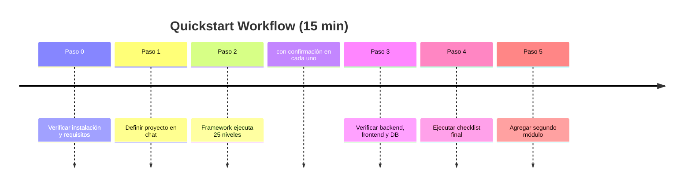

# Quickstart — Tu Primer Módulo en 15 Minutos

Esta guía te llevará desde cero hasta tener tu primer módulo funcionando con el Framework Agéntico de TIVIT Digital.

---

## Paso 0: Verificación de Instalación

### Checklist Pre-Requisitos

Antes de comenzar, verifica que tienes:

- [ ] **VS Code** instalado con **GitHub Copilot** activo
- [ ] **Node.js 18+** instalado
  ```bash
  node --version  # Debe mostrar v18.x o superior
  ```
- [ ] **Git** configurado con credenciales TIVIT
  ```bash
  git config user.name
  git config user.email
  ```
- [ ] Este **workspace abierto** en VS Code
- [ ] Conexión a **internet** (para GitHub Copilot)

### Verificar que el Framework está Activo

1. **Abre el chat de VS Code**:
   - Windows/Linux: `Ctrl + I`
   - macOS: `Cmd + I`

2. **Escribe en el chat**:
   ```
   ¿Qué skills tienes disponibles?
   ```

3. **Respuesta esperada**:
   - Deberías ver una lista de skills del framework
   - Menciones a "58 skills", "framework agéntico", o skills específicas

**Si funciona**: El framework está activo automáticamente. Continúa al Paso 1.  
**Si no funciona**: Verifica que Copilot esté activo. Si persiste, ve a [TROUBLESHOOTING.md](TROUBLESHOOTING.md).

---

## Paso 1: Tu Primer Proyecto Agéntico

### ¿Qué vamos a construir?

Un proyecto agéntico completo con el módulo de **Gestión de Tareas** como primer módulo funcional:

- **Gobierno y diseño**: Reglas base, vertical, capacidades, arquitectura
- **Scaffold**: Estructura de repositorio y configuración del proyecto
- **Database**: Tabla `Tasks` + Stored Procedures (List, Get, Create, Update, Delete)
- **Backend**: API REST con endpoints `/api/tasks/*`
- **Frontend**: Lista de tareas con formulario de creación/edición
- **Tests**: E2E básicos con Playwright
- **PR**: Pull Request listo para revisión

### Campos de una Tarea:

| Campo | Tipo | Descripción |
|-------|------|-------------|
| `Id` | int | Identificador único |
| `Titulo` | string | Título de la tarea |
| `Descripcion` | string | Descripción detallada |
| `Estado` | enum | `Pendiente` o `Completada` |
| `FechaCreacion` | datetime | Fecha de creación |

---

## Paso 2: Qué Escribir en el Chat

Copia este texto **exactamente** en el chat de VS Code Copilot:

```
Quiero crear un nuevo proyecto agéntico.

Vertical: Productividad / Gestión interna de tareas.

Tecnologías:
- Backend: .NET 8
- Frontend: React con TypeScript
- Base de datos: SQL Server

El primer módulo es Gestión de Tareas:
- ID (entero, auto-generado)
- Título (texto, requerido, máximo 200 caracteres)
- Descripción (texto, opcional, máximo 1000 caracteres)
- Estado (enum: Pendiente, Completada)
- Fecha de creación (datetime, auto-generado)
```

### Diagrama del flujo completo



---

## ⚙️ Paso 3: Qué Va a Pasar

El framework ejecutará los 25 niveles en orden, pidiéndote confirmación en cada uno:

| Nivel | Skill | Qué hace |
|-------|-------|----------|
| 1 | `framework-governance` | Establece reglas base: multi-tenancy, principios, excepciones |
| 2 | `framework-discovery` | Delimita el vertical: actores, procesos, datos, restricciones |
| 3 | `framework-conception` | Define capacidades, agentes, flujos y alcance del MVP |
| 4 | `framework-pack-design` | Empaqueta el vertical como producto reutilizable |
| 5 | `framework-architecture` | Mapea la solución a las 7 capas y define contratos |
| 6 | `framework-core-design` | Diseña el SDK, orquestación y router model-agnostic |
| 7 | `framework-data-memory-compliance` | Diseña memoria, stores, retención y cifrado |
| 8 | `framework-security` | Diseña RBAC, guardrails, secretos y límites de autonomía |
| 9 | `framework-platform` | Diseña Kubernetes, multi-tenant y observabilidad |
| 10 | `framework-scaffold-implementation` | Crea la estructura de repos y el primer vertical slice |
| 11 | `project-bootstrap` | Establece el contexto concreto del proyecto (stack, equipo) |
| 12 | `repo-structure` | Define nombre y convenciones del repositorio |
| 13 | `project-architecture` | Elige estilo: Vertical Slice o Modular Monolith |
| 14 | `api-first-spec` | Define ERD, endpoints, DTOs y reglas del módulo |
| 15 | `database-sp` | Crea tabla `Tasks` + 5 stored procedures |
| 16 | `data-access` | Crea `TaskHandler.cs` (capa de acceso a datos) |
| 17 | `backend-api` | Crea `TaskEndpoints.cs` con 5 endpoints REST |
| 18 | `swagger` | Documenta la API en OpenAPI/Swagger |
| 19 | `typescript` | Genera `TaskTypes.ts` (interfaces TypeScript) |
| 20 | `react-hooks` | Crea hooks: `useTasksQuery`, `useCreateTask`, `useUpdateTask`, `useDeleteTask` |
| 21 | `react` | Crea componentes: `TaskList`, `TaskForm`, `TaskCard` |
| 22 | `framework-qa-validation` | Define estrategia de pruebas y criterios go/no-go |
| 23 | `playwright` | Crea tests E2E para crear, editar y eliminar tareas |
| 24 | `framework-operations-evolution` | Define SLOs, monitoreo y ciclo de mejora |
| 25 | `pull-request` | Prepara PR con conventional commits y changelog |

**Importante**: El framework te pedirá confirmación después de cada nivel. Puedes aprobar, modificar o pausar en cualquier punto.

**Para el segundo módulo** del mismo proyecto, los Niveles 1-13 ya están hechos: se arranca directamente en Nivel 14.

### ¿Qué haces mientras tanto?

- **Revisar** las propuestas del agente
- **Aprobar** cuando te pregunte
- **Clarificar** si algo no es claro
- El agente puede hacer **preguntas** para refinar la solución

---

## Paso 4: Verificar que Funcionó

### 4.1 Backend (API)

```bash
# Ir a la carpeta del backend (puede variar según estructura)
cd backend/
# O cd src/Api/ según el proyecto

# Restaurar dependencias
dotnet restore

# Ejecutar el backend
dotnet run
```

**Verificación**:
1. Abre en navegador: `http://localhost:8080/swagger` (el puerto puede variar)
2. Deberías ver endpoints:
   - `GET /api/tasks` — Listar tareas
   - `GET /api/tasks/{id}` — Obtener tarea
   - `POST /api/tasks` — Crear tarea
   - `PUT /api/tasks/{id}` — Actualizar tarea
   - `DELETE /api/tasks/{id}` — Eliminar tarea

**Si funciona**: Backend operativo.

---

### 4.2 Frontend (UI)

```bash
# Ir a la carpeta del frontend
cd frontend/
# O cd src/Web/ según el proyecto

# Instalar dependencias
npm install

# Ejecutar en modo desarrollo
npm run dev
```

**Verificación**:
1. Abre en navegador: `http://localhost:3000` (el puerto puede variar)
2. Deberías ver:
   - Lista de tareas (vacía inicialmente)
   - Botón "Nueva Tarea"
   - Formulario para crear tareas
   - Acciones: Editar, Eliminar, Marcar como completada

**Si funciona**: Frontend operativo.

---

### 4.3 Database (Verificación SQL)

```sql
-- Conectarse a la base de datos (SQL Server / PostgreSQL / MySQL)
-- Según la configuración del proyecto

-- Verificar que la tabla existe
SELECT * FROM Tasks;

-- Verificar stored procedures
-- SQL Server:
SELECT name FROM sys.procedures WHERE name LIKE 'Task%';

-- PostgreSQL:
SELECT routine_name FROM information_schema.routines 
WHERE routine_name LIKE 'task%';
```

**Si funciona**: Tabla y SPs creados correctamente.

---

### 4.4 Tests E2E

```bash
# Ir a la carpeta de tests
cd tests/e2e/

# Instalar dependencias (si es necesario)
npm install

# Ejecutar tests
npx playwright test

# Ver reporte
npx playwright show-report
```

**Si funciona**: Tests pasan correctamente.

---

## Paso 5: ¡Módulo Completo!

### Checklist Final

Marca todo lo que funcionó:

- [ ] Backend corre sin errores (`dotnet run`)
- [ ] Swagger/OpenAPI visible en navegador
- [ ] Frontend corre sin errores (`npm run dev`)
- [ ] UI muestra lista de tareas
- [ ] Puedo crear una tarea desde la UI
- [ ] Puedo editar una tarea
- [ ] Puedo eliminar una tarea
- [ ] Puedo marcar como completada
- [ ] Tabla `Tasks` existe en la base de datos
- [ ] Stored procedures creados
- [ ] Tests E2E pasan
- [ ] README del módulo actualizado
- [ ] PR preparado

---

## Paso 6: Agregar un Segundo Módulo

**La gran pregunta: ¿Tengo que repetir todo esto?**

**Respuesta: NO.**

Para agregar un segundo módulo, simplemente escribe en el chat:

```
Ahora quiero agregar el módulo de Gestión de Usuarios.

Debe poder listar, crear, editar y eliminar usuarios.

Cada usuario tiene:
- ID
- Nombre completo
- Email
- Rol (Admin, Usuario, Invitado)
- Fecha de registro
```

Y el framework ejecuta **el mismo flujo automáticamente** para el nuevo módulo.

**No necesitas repetir comandos ni pasos**. El framework es inteligente y modular.

---

## Próximos Pasos

### 1. Personaliza tu módulo

Prueba pedirle al framework que modifique el módulo:

```
"En el módulo de Tareas, agrega un campo 'Prioridad' (Baja, Media, Alta)"
```

El framework **solo actualizará lo necesario** (DB, API, UI), no repetirá todo el módulo.

---

### 2. Aprende workflows avanzados

Lee [WORKFLOW-GUIDE.md](WORKFLOW-GUIDE.md) para aprender:
- Cómo crear solo backend (sin frontend)
- Cómo crear solo frontend (backend ya existe)
- Cómo actualizar módulos existentes
- Cómo hacer fixes de bugs
- Regla de oro: Incremental, no repetitivo

---

### 3. Explora el catálogo de skills

Lee [SKILLS-MANIFEST.md](../framework/SKILLS-MANIFEST.md) para ver:
- Las 58 skills disponibles
- Qué hace cada una
- Cuándo se activa automáticamente
- Skills de seguridad, Docker, testing, etc.

---

### 4. Haz preguntas

Consulta [FAQ.md](FAQ.md) para respuestas a:
- ¿Cómo sé qué skills se activaron?
- ¿Existe skill de Angular?
- ¿Existe skill de seguridad?
- ¿Cómo funciona la validación?
- Y más...

---

## ¿Algo no Funcionó?

### Problemas comunes:

| Problema | Solución |
|----------|----------|
| El framework no responde | Verifica que Copilot esté activo (ícono en la barra inferior) |
| Backend no arranca | Verifica variables de entorno, conexión a DB |
| Frontend no arranca | `npm install` primero, verifica puerto no en uso |
| Tests fallan | Asegúrate de que backend y frontend estén corriendo |
| DB no existe | Ejecutar migraciones o scripts SQL generados |

**Para más detalles**: Ver [TROUBLESHOOTING.md](TROUBLESHOOTING.md)

---

## Consejos Finales

### Buenas Prácticas

1. **Lee las propuestas del agente** antes de aprobar
2. **Haz preguntas** si algo no es claro
3. **Verifica después de cada paso** (backend → frontend → tests)
4. **Commit frecuente**: Un módulo = Un PR
5. **Usa lenguaje natural**: No necesitas conocer comandos técnicos

### Evita

1. No intentes crear todo de una vez (varios módulos juntos)
2. No omitas el `api-first-spec` (define la estructura primero)
3. No hardcodees valores (usa variables de entorno)
4. No saltes la revisión de código antes del PR

---

## ¿Necesitas Ayuda?

- **Documentación técnica**: Ver carpeta [.opencode/](../)
- **Problemas técnicos**: [Manuel Aliaga](mailto:manuel.aliaga@tivit.com)
- **Revisión de diseño**: [Miguel Martinez](mailto:miguel.martinez@tivit.com)

---

## Has Completado el Quickstart

**Felicitaciones**, ya sabes cómo:
- Verificar que el framework está activo
- Crear tu primer módulo completo
- Verificar que todo funciona
- Agregar módulos adicionales sin repetir pasos

**Siguiente paso**: Lee [WORKFLOW-GUIDE.md](WORKFLOW-GUIDE.md) para workflows avanzados.

---

**Tiempo promedio de este quickstart**: 15-20 minutos  
**Módulos creados**: 1 completo (DB + Backend + Frontend + Tests)  
**Líneas de código generadas**: ~2000-3000  
**Tiempo que ahorras vs manual**: ~2-3 días de desarrollo
