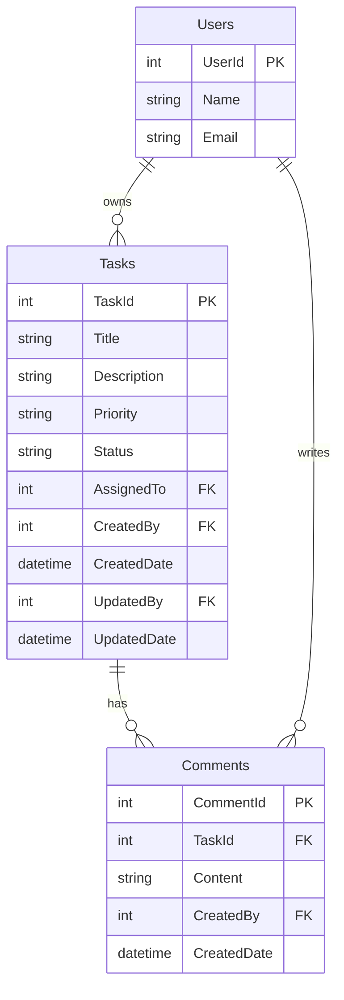

# API Specification: Task Management

## 1. Scope

### Included
- CRUD operations for Tasks
- Comments on tasks (create, list, delete)
- User reference (identity service integration)
- Paginated task listing with search and sorting
- Task status workflow (Draft → Active → Closed)

### Excluded
- User management (handled by identity service)
- File attachments on comments
- Recurring tasks

## 2. Data Model



### Tables

| Entity | Description | Key Fields |
|--------|-------------|------------|
| `Tasks` | Work items with assignee, priority, and status | `TaskId` (PK), `Title`, `Status`, `AssignedTo` (FK→Users) |
| `Comments` | Notes attached to tasks | `CommentId` (PK), `TaskId` (FK→Tasks), `Content` |
| `Users` | System users | `UserId` (PK), `Email` (UK) |

## 3. Required Catalogs

| Code | Name | Description |
|------|------|-------------|
| `TASK_PRIORITY_LOW` | Low | Low priority |
| `TASK_PRIORITY_MEDIUM` | Medium | Medium priority |
| `TASK_PRIORITY_HIGH` | High | High priority |
| `TASK_PRIORITY_CRITICAL` | Critical | Critical priority |

## 4. State Flow

| Current State | Action | Next State | Conditions |
|---------------|--------|------------|------------|
| Draft | Activate | Active | Title and assigned user required |
| Active | Complete | Closed | — |
| Active | Cancel | Closed | — |
| Active | Reopen | Active | — |
| Closed | Reopen | Active | — |

## 5. REST Endpoints

### Tasks

#### `GET /api/v1/tasks` — List Tasks

| Param | Type | Required | Description |
|-------|------|----------|-------------|
| `page` | int | No | Page number (default: 1) |
| `pageSize` | int | No | Items per page (default: 20) |
| `sortBy` | string | No | Sort column: Title, CreatedDate, Priority, Status |
| `sortOrder` | string | No | ASC/DESC (default: DESC) |
| `searchFilter` | string | No | Search in Title and Description |
| `status` | string | No | Filter by status |
| `assignedTo` | int | No | Filter by assignee |

**Response `200`:**

```json
{
  "data": {
    "items": [
      {
        "taskId": 1,
        "title": "Fix login bug",
        "priority": "HIGH",
        "status": "ACTIVE",
        "assignedTo": 5,
        "assignedToName": "John Doe",
        "createdDate": "2025-03-01T10:00:00Z"
      }
    ],
    "pagination": {
      "page": 1,
      "pageSize": 20,
      "totalRecords": 42,
      "totalPages": 3
    }
  }
}
```

| DB Object | Type |
|-----------|------|
| `Tasks.ListTasks` | SP |

#### `GET /api/v1/tasks/{id}` — Get Task

**Response `200`:**

```json
{
  "data": {
    "taskId": 1,
    "title": "Fix login bug",
    "description": "Users cannot log in with SSO",
    "priority": "HIGH",
    "status": "ACTIVE",
    "assignedTo": 5,
    "assignedToName": "John Doe",
    "createdBy": 1,
    "createdDate": "2025-03-01T10:00:00Z",
    "updatedBy": 5,
    "updatedDate": "2025-03-02T14:30:00Z"
  }
}
```

**Errors:** `TSK_001` — Task not found

#### `POST /api/v1/tasks` — Create Task

**Request:**

```json
{
  "title": "string (required, max 200)",
  "description": "string (optional, max 2000)",
  "priority": "string (catalog, default: MEDIUM)",
  "assignedTo": "int (optional)"
}
```

**Response `201`:**

```json
{
  "data": { "taskId": 10, "title": "...", "status": "DRAFT" }
}
```

| DB Object | Type |
|-----------|------|
| `Tasks.CreateTask` | SP |

#### `PUT /api/v1/tasks/{id}` — Update Task

**Request:**

```json
{
  "title": "string (optional, max 200)",
  "description": "string (optional, max 2000)",
  "priority": "string (optional, catalog)",
  "assignedTo": "int (optional)"
}
```

**Response `200`:** Returns updated task

#### `DELETE /api/v1/tasks/{id}` — Delete Task

**Response `200`:**

```json
{
  "data": { "result": true }
}
```

#### `POST /api/v1/tasks/{id}/activate` — Activate Task

**Response `200`:** Returns task with status ACTIVE

#### `POST /api/v1/tasks/{id}/complete` — Complete Task

**Response `200`:** Returns task with status CLOSED

### Comments (Sub-resource of Tasks)

#### `GET /api/v1/tasks/{taskId}/comments` — List Comments

**Response `200`:**

```json
{
  "data": {
    "items": [
      {
        "commentId": 1,
        "content": "Working on this now",
        "createdBy": 5,
        "createdByName": "John Doe",
        "createdDate": "2025-03-02T14:00:00Z"
      }
    ]
  }
}
```

#### `POST /api/v1/tasks/{taskId}/comments` — Add Comment

**Request:**

```json
{
  "content": "string (required, max 2000)"
}
```

**Response `201`**

#### `DELETE /api/v1/tasks/{taskId}/comments/{commentId}` — Delete Comment

**Response `200`**

## 6. Database Objects

| Endpoint | SP/Query | Parameters |
|----------|----------|------------|
| List Tasks | `Tasks.ListTasks` | `@Page`, `@PageSize`, `@SortBy`, `@SortOrder`, `@SearchFilter`, `@Status`, `@AssignedTo` |
| Get Task | `Tasks.GetTask` | `@TaskId` |
| Create Task | `Tasks.CreateTask` | `@Title`, `@Description`, `@Priority`, `@AssignedTo`, `@CurrentUserId` |
| Update Task | `Tasks.UpdateTask` | `@TaskId`, `@Title`, `@Description`, `@Priority`, `@AssignedTo`, `@CurrentUserId` |
| Delete Task | `Tasks.DeleteTask` | `@TaskId`, `@CurrentUserId` |
| Activate Task | `Tasks.UpdateTaskStatus` | `@TaskId`, `@NewStatus`, `@CurrentUserId` |
| List Comments | `Tasks.ListComments` | `@TaskId` |
| Create Comment | `Tasks.CreateComment` | `@TaskId`, `@Content`, `@CurrentUserId` |
| Delete Comment | `Tasks.DeleteComment` | `@CommentId`, `@CurrentUserId` |

## 7. Shared DTOs

### ApiResponse

```json
{
  "data": {},
  "success": true,
  "message": null
}
```

### Pagination

```json
{
  "page": 1,
  "pageSize": 20,
  "totalRecords": 100,
  "totalPages": 5
}
```

## 8. Business Rules

| ID | Rule | Category |
|----|------|----------|
| `BUS_001` | Cannot activate a task without title and assigned user | State |
| `BUS_002` | Only the creator can delete a task | Authorization |
| `BUS_003` | Comments cannot be added to closed tasks | State |
| `BUS_004` | Task title must be unique per user | Validation |

## 9. Error Codes

| Code | HTTP | Message | When |
|------|------|---------|------|
| `VAL_001` | 400 | {Field} is required | Required field missing |
| `VAL_008` | 400 | {Field} max length exceeded | Field too long |
| `TSK_001` | 404 | Task not found | Invalid task ID |
| `TSK_002` | 409 | Task title already exists | Duplicate title |
| `TSK_003` | 422 | Cannot {action} in {state} | Invalid state transition |
| `TSK_004` | 403 | Only the creator can delete this task | Authorization |
| `AUTH_001` | 403 | Unauthorized | Missing or invalid token |
