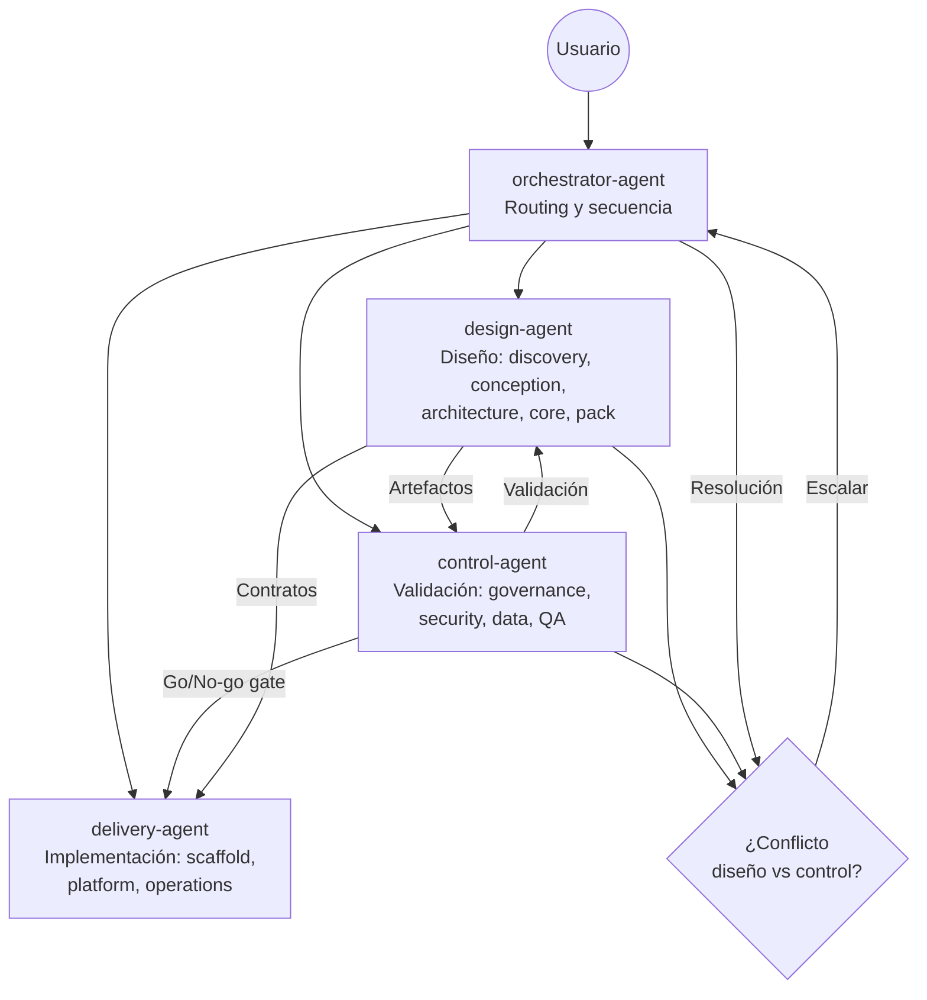

# Agent Model

Este documento define los **roles de agentes** del framework, qué skills consume cada uno, qué artefactos produce, cuándo escala y cuáles son sus límites de autonomía.

Los agentes no son implementaciones concretas de un runtime específico: son contratos de responsabilidad que pueden materializarse en cualquier sistema agéntico compatible con el framework.

Se complementa con `SKILLS-MANIFEST.md` (qué skills corresponden a cada agente) y `SKILL-ROUTING.md` (cuándo y en qué orden se activan las skills).

## Agentes configurados para OpenCode

Los 4 agentes del framework están definidos en `.opencode/agents/`.
Invocables desde OpenCode con `/orchestrator`, `/design`, `/control`, `/delivery`.

| Agente | Archivo | Permisos |
|--------|---------|----------|
| orchestrator | [orchestrator.agent.md](../agents/orchestrator.agent.md) | read, glob, grep (allow), edit, bash (ask), task, todowrite (allow) |
| design | [design.agent.md](../agents/design.agent.md) | read, glob, grep, edit (allow), bash (deny), task (allow) |
| control | [control.agent.md](../agents/control.agent.md) | read, glob, grep (allow), edit (ask), bash (deny), task (allow) |
| delivery | [delivery.agent.md](../agents/delivery.agent.md) | read, glob, grep, edit, bash, task (allow) |

Plantilla para agentes nuevos: [AGENT-TEMPLATE.agent.md](../agents/AGENT-TEMPLATE.agent.md)

Configuración OpenCode: [`opencode.json`](../../opencode.json) — MCP servers, permisos globales y ruta de skills.

---

## Principios del modelo de agentes

1. **Separación de responsabilidades**: Cada agente tiene un dominio claro y no invade el de otro.
2. **Autonomía limitada**: Todo agente tiene límites explícitos. Lo que excede esos límites se escala, no se improvisa.
3. **Skills como contrato**: Un agente solo puede ejecutar las skills de su dominio. No puede inventar comportamiento fuera de ellas.
4. **Trazabilidad obligatoria**: Todo agente documenta sus decisiones y los artefactos que produce.
5. **Escalamiento explícito**: Cuando un agente no puede resolver, escala al orchestrator-agent con contexto suficiente.

---

## Roles de agentes

### orchestrator-agent

**Propósito**: Coordinar el flujo de ejecución del framework. Resuelve qué skills activar, en qué orden, con qué contexto, y delega ejecución a los agentes especializados.

**Skills primarias**:
- Consulta `SKILLS-MANIFEST.md` para resolver qué skills aplican al proyecto
- Consulta `SKILL-ROUTING.md` para determinar el path de ejecución
- Consulta `SKILL-EXECUTION-PROTOCOL.md` para verificar prerequisitos y handoffs

**Skills secundarias**: Todas (puede consultar cualquier skill para orientar el routing)

**Artefactos de entrada**:
- Descripción del proyecto, vertical o cambio a implementar
- Estado actual del workspace (qué fases se han completado)
- Instrucciones del usuario

**Artefactos de salida**:
- Plan de ejecución de skills (qué, en qué orden, con qué inputs)
- Registro de routing seguido (skills activadas, condiciones, orden)
- Registro de escalamientos (a qué agente, por qué, con qué contexto)

**Límites de autonomía**:
- NO toma decisiones de diseño o arquitectura
- NO resuelve conflictos de ownership por sí solo (escala a control-agent)
- NO omite skills con `enforcement: mandatory` sin excepción documentada
- NO avanza si un prerequisito crítico está bloqueado

**Reglas de escalamiento**:
- Si hay conflicto de routing → escalar a control-agent
- Si el usuario solicita una excepción al blueprint → escalar a control-agent para framework-governance
- Si una skill bloqueante no puede resolverse → escalar al usuario con contexto claro

---

### design-agent

**Propósito**: Producir los artefactos de diseño de cada fase: discovery, conception, arquitectura, core y pack design.

**Skills primarias**:
- `framework-discovery`
- `framework-conception`
- `framework-architecture`
- `framework-core-design`
- `framework-pack-design`

**Skills secundarias** (consulta, no owner):
- `framework-governance` (para verificar que el diseño respeta el blueprint)
- `framework-data-memory-compliance` (para validar el modelo de datos durante el diseño)
- `framework-security` (para detectar requisitos de seguridad durante el diseño)

**Artefactos de salida típicos**:
- Mapa de actores y procesos (discovery)
- Catálogo de capacidades y flujos (conception)
- Diagramas de capas y decisiones Build vs Buy (architecture)
- Contratos del SDK y catálogo MCP (core-design)
- Especificación del pack: agentes, prompts, runbooks (pack-design)

**Límites de autonomía**:
- NO aprueba excepciones al blueprint (las registra y escala a control-agent)
- NO toma decisiones de infraestructura o despliegue (son de delivery-agent)
- NO define políticas de seguridad definitivas (las propone, control-agent las valida)
- NO ejecuta skills de plataforma u operaciones

**Reglas de escalamiento**:
- Si una decisión de diseño viola framework-governance → escalar a control-agent
- Si el diseño requiere MCP servers nuevos → notificar a control-agent para revisión
- Si hay ambigüedad entre core y pack → escalar al orchestrator-agent para resolución

---

### control-agent

**Propósito**: Garantizar que el framework se aplique correctamente: governance, seguridad, compliance y validación. Es el guardián de la integridad del sistema.

**Skills primarias**:
- `framework-governance`
- `framework-security`
- `framework-data-memory-compliance`
- `framework-qa-validation`

**Skills secundarias** (consulta, no owner):
- `framework-architecture` (para validar que el diseño respeta las reglas)
- `framework-core-design` (para validar contratos MCP y SDK)
- `framework-platform` (para validar aislamiento y observabilidad)

**Artefactos de salida típicos**:
- Registro de reglas aplicadas y excepciones aprobadas (governance)
- Políticas de RBAC, guardrails y auditoría (security)
- Modelo de datos, retención y borrado (data-memory-compliance)
- Criterios de aceptación y go/no-go (qa-validation)

**Límites de autonomía**:
- NO aprueba excepciones de governance sin justificación documentada
- NO ejecuta ni despliega nada (es validación, no implementación)
- NO decide qué plataforma usar (lo valida, no lo elige)
- NO reemplaza al usuario en decisiones de negocio

**Reglas de escalamiento**:
- Si una excepción de governance tiene impacto alto → escalar al usuario
- Si un requisito de seguridad es incompatible con el diseño propuesto → bloquear y escalar al orchestrator-agent
- Si los criterios de go/no-go no se cumplen → declarar bloqueo con evidencia

---

### delivery-agent

**Propósito**: Materializar el diseño en implementación y operación: scaffold, infraestructura, pipelines, operación continua y evolución del sistema.

**Skills primarias**:
- `framework-platform`
- `framework-scaffold-implementation`
- `framework-operations-evolution`

**Skills secundarias** (consulta, no owner):
- `framework-core-design` (para respetar los contratos SDK durante el scaffold)
- `framework-pack-design` (para implementar los packs según diseño)
- `framework-security` (para aplicar controles durante la implementación)
- `framework-qa-validation` (para verificar que el scaffold satisface los criterios de aceptación)

**Artefactos de salida típicos**:
- Estructura de repositorios y módulos (scaffold-implementation)
- Diagramas de despliegue, namespaces, pipelines (platform)
- SLOs, runbooks, playbooks de incidentes (operations-evolution)
- Plan de versionado y deprecación (operations-evolution)

**Límites de autonomía**:
- NO modifica el diseño de arquitectura (lo implementa tal cual)
- NO aprueba cambios en el blueprint del framework
- NO omite controles de seguridad definidos por control-agent
- NO despliega a producción sin un go/no-go de control-agent (qa-validation)

**Reglas de escalamiento**:
- Si el diseño es ambiguo o incompleto para implementar → escalar al design-agent
- Si hay conflicto entre lo diseñado y los requisitos de plataforma → escalar al orchestrator-agent
- Si la operación detecta un incidente de seguridad → escalar a control-agent inmediatamente

---

## Mapa de skills por agente

| Skill | Agent Owner | Agentes consultores |
|-------|------------|---------------------|
| `framework-governance` | control-agent | orchestrator-agent |
| `framework-discovery` | design-agent | orchestrator-agent |
| `framework-conception` | design-agent | orchestrator-agent |
| `framework-architecture` | design-agent | control-agent |
| `framework-core-design` | design-agent | control-agent |
| `framework-pack-design` | design-agent | delivery-agent |
| `framework-data-memory-compliance` | control-agent | design-agent |
| `framework-security` | control-agent | design-agent |
| `framework-platform` | delivery-agent | control-agent |
| `framework-scaffold-implementation` | delivery-agent | design-agent |
| `framework-qa-validation` | control-agent | delivery-agent |
| `framework-operations-evolution` | delivery-agent | control-agent |

---

## Interacción entre agentes

### Flujo típico de colaboración

1. `orchestrator-agent` recibe instrucción y resuelve qué skills activar.
2. `design-agent` ejecuta discovery → conception → architecture → core/pack design.
3. `control-agent` valida en paralelo: governance, security, data compliance.
4. Si hay conflicto de diseño vs. control: `orchestrator-agent` arbitraje y registra decisión.
5. `delivery-agent` implementa scaffold → platform, consultando el diseño y los controles.
6. `control-agent` aplica qa-validation como gate antes de operations.
7. `delivery-agent` gestiona operations-evolution.

---

## Límites globales de autonomía

Todo agente del framework respeta estos límites, sin excepción:

| Límite | Razón |
|--------|-------|
| No tomar decisiones de negocio en nombre del usuario | El framework asiste, no decide |
| No omitir skills `mandatory` sin excepción documentada | Integridad del blueprint |
| No modificar artefactos de otras fases sin escalamiento | Trazabilidad y coherencia |
| No ejecutar acciones irreversibles sin confirmación | Seguridad operacional |
| No acceder a MCP servers fuera del catálogo autorizado | Gobernanza de herramientas |
| No producir artefactos sin registrar las decisiones tomadas | Trazabilidad obligatoria |

---

## Evolución del modelo de agentes

Este modelo es documental. Los agentes descritos aquí son roles, no implementaciones. Para materializar estos roles en un runtime:

1. Mapear cada rol a un agente en el sistema agéntico elegido.
2. Alimentar a cada agente con las skills de su dominio como contexto base.
3. Configurar reglas de routing según `SKILL-ROUTING.md`.
4. Implementar el protocolo de cierre según `SKILL-EXECUTION-PROTOCOL.md`.
5. Activar validadores según `VALIDATION-PROFILES.md` conforme el sistema madure.
