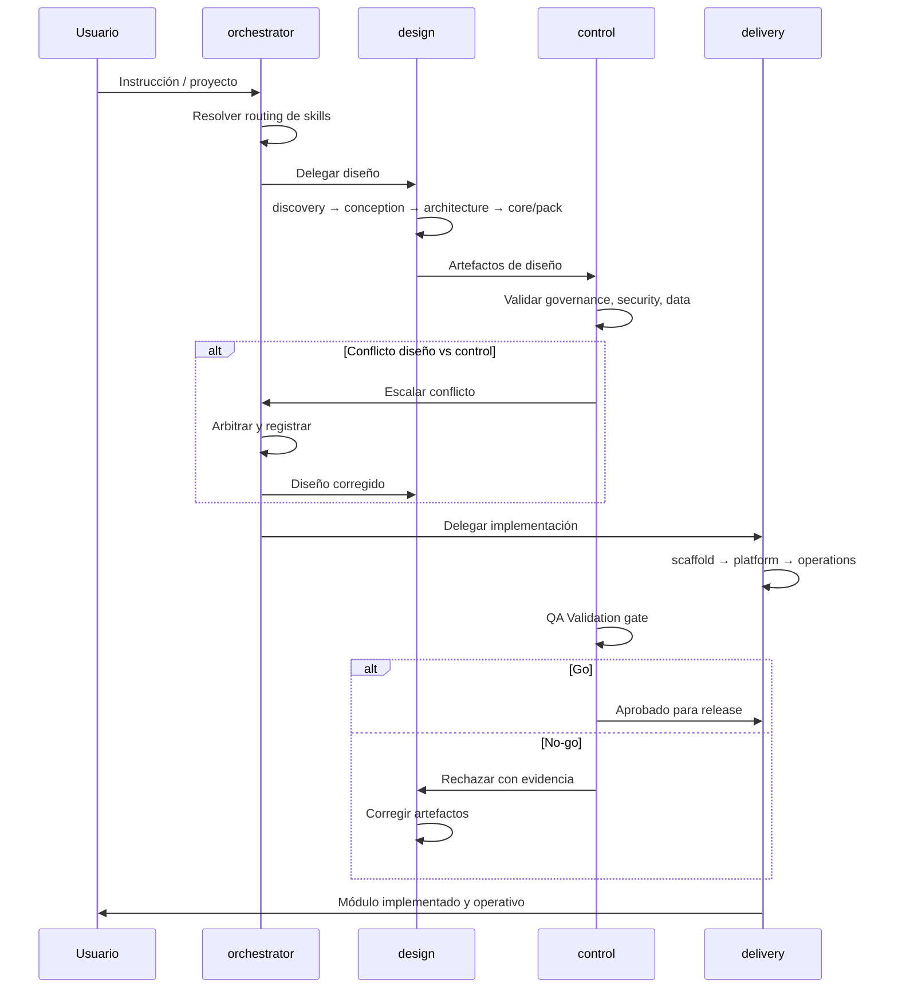

# Skill Flow del Framework Agéntico

Este documento explica cómo se encadenan las skills del framework usando un recorrido end-to-end. El objetivo es que cualquier persona pueda ver qué entra en cada fase, qué decisión se toma y qué artefacto debería salir hacia la siguiente.

## Cuándo usar este documento

Usa esta guía cuando necesites:

- entender el orden real de uso entre skills;
- revisar handoffs entre fases;
- validar si una salida está suficientemente madura para pasar a la siguiente skill;
- explicar el framework con un caso concreto y no solo con definiciones abstractas.

## Flujo resumido (25 niveles obligatorios)

```
FASE A — GOBIERNO Y DOMINIO
  Nivel 1:  framework-governance
  Nivel 2:  framework-discovery
  Nivel 3:  framework-conception
  Nivel 4:  framework-pack-design

FASE B — ARQUITECTURA AGÉNTICA
  Nivel 5:  framework-architecture
  Nivel 6:  framework-core-design
  Nivel 7:  framework-data-memory-compliance
  Nivel 8:  framework-security
  Nivel 9:  framework-platform

FASE C — SCAFFOLD Y PROYECTO
  Nivel 10: framework-scaffold-implementation
  Nivel 11: project-bootstrap
  Nivel 12: repo-structure
  Nivel 13: project-architecture

FASE D — ESPECIFICACIÓN DEL MÓDULO
  Nivel 14: api-first-spec

FASE E — IMPLEMENTACIÓN BACKEND
  Nivel 15: database-sp
  Nivel 16: data-access
  Nivel 17: backend-api
  Nivel 18: swagger

FASE F — IMPLEMENTACIÓN FRONTEND
  Nivel 19: typescript
  Nivel 20: react-hooks
  Nivel 21: react

FASE G — CALIDAD
  Nivel 22: framework-qa-validation
  Nivel 23: playwright

FASE H — OPERACIÓN Y RELEASE
  Nivel 24: framework-operations-evolution
  Nivel 25: pull-request
```



Los **Niveles 1-13** se ejecutan **una vez por vertical**. Para módulos adicionales del mismo pack se arranca en Nivel 14 y se ejecuta 14→25.

A partir de `framework-architecture` (Nivel 5), los Niveles 6-9 pueden trabajarse en paralelo, pero deben consumir la misma arquitectura aprobada y dejar artefactos compatibles para scaffold y QA.

## Handoff esperado entre skills

| Nivel | Skill | Entrada mínima | Decisión principal | Salida esperada | Siguiente consumidor |
| --- | --- | --- | --- | --- | --- |
| 1 | `framework-governance` | Objetivo del proyecto o vertical | Reglas obligatorias, estándar, variable o excepción | Marco de gobierno | Discovery, architecture, security, operations |
| 2 | `framework-discovery` | Contexto del vertical | Qué problema vale la pena resolver primero | Perfil del vertical, proceso, riesgos, foco inicial | Conception |
| 3 | `framework-conception` | Discovery validado | Qué solución funcional se construye y qué entra al MVP | Capacidades, agentes funcionales, flujos, criterios de aceptación | Pack design, architecture, QA |
| 4 | `framework-pack-design` | Conception validada | Cómo se empaqueta el vertical como producto | Activos del pack, integraciones, métricas, configuración por tenant | Architecture, scaffold |
| 5 | `framework-architecture` | Solución funcional y pack definidos | Cómo se reparte la solución entre las 7 capas | Arquitectura lógica, contratos, handoff por capa | Core, data, security, platform |
| 6 | `framework-core-design` | Arquitectura aprobada | Qué contrato y runtime expone el core | SDK, runtime, router, tools, tracing | Scaffold, QA |
| 7 | `framework-data-memory-compliance` | Arquitectura aprobada | Cómo se clasifican, persisten y gobiernan los datos | Taxonomía, memorias, stores, retención, borrado | Scaffold, security, operations |
| 8 | `framework-security` | Arquitectura y datos definidos | Qué controles, guardrails y límites aplican | Modelo de acceso, auditoría, billing, límites de autonomía | Scaffold, platform, operations |
| 9 | `framework-platform` | Arquitectura y controles base | Cómo corre y se observa el framework | Topología, CI/CD, observabilidad, resiliencia | Scaffold, QA, operations |
| 10 | `framework-scaffold-implementation` | Diseños de capa consistentes | Qué se implementa primero y cómo se estructura | Base de código, entorno local, vertical slice | project-bootstrap |
| 11 | `project-bootstrap` | Scaffold base del framework | Stack tecnológico, equipo, contexto del cliente | Ficha del proyecto concreto | repo-structure |
| 12 | `repo-structure` | Contexto del proyecto | Nombre, tipo y convenciones del repositorio | Repositorio creado con estructura base | project-architecture |
| 13 | `project-architecture` | Repo creado | Estilo arquitectónico del proyecto | Decisión de arquitectura y estructura de carpetas | api-first-spec |
| 14 | `api-first-spec` | Arquitectura del proyecto | Contratos del módulo: ERD, endpoints, DTOs, reglas | Especificación completa del módulo | database-sp |
| 15 | `database-sp` | Especificación del módulo | Tablas, índices, stored procedures y catálogos | SQL completo del módulo | data-access |
| 16 | `data-access` | SPs creados | Handlers de datos y mapeo de resultados | Capa de acceso a datos | backend-api |
| 17 | `backend-api` | Handlers y spec | Endpoints, servicios y validaciones del módulo | Controllers y servicios del módulo | swagger |
| 18 | `swagger` | Endpoints implementados | Documentación OpenAPI del módulo | Spec OpenAPI publicada | typescript |
| 19 | `typescript` | Spec OpenAPI | Tipos y contratos TypeScript del módulo | Types y DTOs en frontend | react-hooks |
| 20 | `react-hooks` | Types y endpoints disponibles | Hooks de query y mutation del módulo | Hooks reutilizables de datos | react |
| 21 | `react` | Hooks y types | Componentes y pantallas del módulo | UI funcional del módulo | framework-qa-validation |
| 22 | `framework-qa-validation` | UI y backend implementados | Estrategia de pruebas por capa y criterios go/no-go | Plan de validación con guardrails | playwright |
| 23 | `playwright` | Estrategia de QA definida | Qué flujos E2E cubrir | Tests E2E del módulo | framework-operations-evolution |
| 24 | `framework-operations-evolution` | Sistema validado | SLOs, monitoreo, versionado y ciclo de mejora | Modelo operativo del pack | pull-request |
| 25 | `pull-request` | Todo el trabajo del módulo | Convención de commits, changelog, checklist | PR listo para revisión | — |

## Ejemplo end-to-end

### Caso: pack NOC para triage y diagnóstico inicial

El caso de ejemplo es un pack para un NOC que recibe alertas y tickets, clasifica incidentes, sugiere runbooks y decide si puede resolver, recomendar o escalar.

### 1. Governance

Pregunta central:
- ¿Qué reglas no pueden romperse en este vertical?

Decisiones:
- multi-tenancy obligatorio desde el ingreso;
- aislamiento estricto entre clientes;
- trazabilidad completa de tool calls y decisiones;
- core model-agnostic;
- acciones con impacto externo requieren control y posible HITL.

Salida:
- baseline de gobierno para el pack NOC.

### 2. Discovery

Pregunta central:
- ¿Qué problema concreto del NOC conviene atacar primero?

Hallazgos posibles:
- exceso de tickets L1 repetitivos;
- runbooks dispersos y no siempre actualizados;
- múltiples herramientas: ITSM, observabilidad, CMDB;
- alto costo de clasificación manual;
- riesgo de escalamiento tardío.

Salida:
- foco inicial recomendado: triage y diagnóstico inicial de alertas de infraestructura.

### 3. Conception

Pregunta central:
- ¿Qué solución funcional resuelve ese foco?

Definición funcional:
- capacidad 1: clasificar alertas y tickets;
- capacidad 2: sugerir diagnóstico inicial;
- capacidad 3: recomendar runbook;
- capacidad 4: escalar a operador cuando el riesgo supere el umbral.

Flujo funcional:
1. entra alerta o ticket;
2. se identifica tenant y contexto;
3. el agente clasifica;
4. consulta conocimiento y sistemas necesarios;
5. propone diagnóstico y acción;
6. resuelve o escala.

Salida:
- backlog funcional del MVP del pack NOC.

### 4. Pack Design

Pregunta central:
- ¿Cómo se convierte esta solución en un producto vendible?

Definición del pack:
- agentes: triage agent, diagnostics agent, escalation agent;
- activos: prompts de clasificación, runbooks curados, políticas de severidad;
- integraciones nativas: ITSM, observabilidad, CMDB;
- configuración por tenant: catálogos, thresholds, herramientas habilitadas.

Salida:
- definición del pack NOC como producto reusable.

### 5. Architecture

Pregunta central:
- ¿Cómo se reparte la solución en las 7 capas?

Ejemplo de reparto:
- interfaces: webhook, API o cola de eventos;
- pack: lógica vertical de triage y diagnóstico;
- core: runtime, router, tools, HITL;
- modelos: selección por costo y sensibilidad;
- datos: sesión, RAG de runbooks, CMDB y metadatos;
- seguridad: RBAC, guardrails, auditoría;
- plataforma: Kubernetes, cola, observabilidad, CI/CD.

Salida:
- arquitectura lógica y handoff por capa.

### 6. Core Design

Pregunta central:
- ¿Qué debe dar el core al pack NOC?

Definición:
- contrato pack-core;
- runtime con estados claros;
- router model-agnostic;
- tool registry;
- soporte HITL y fallback;
- tracing de cada paso.

Salida:
- diseño del core consumible por scaffold y QA.

### 7. Data, Memory and Compliance

Pregunta central:
- ¿Qué datos guarda y consulta el pack?

Definición:
- sesión efímera para contexto de ejecución;
- vector store para runbooks y documentos del tenant;
- grafo o CMDB para relaciones entre activos si aporta valor;
- metadatos relacionales para configuración del tenant y auditoría;
- políticas de retención y borrado por tipo de dato.

Salida:
- diseño de memorias, stores y compliance.

### 8. Security

Pregunta central:
- ¿Qué puede hacer el agente y con qué controles?

Definición:
- tools read-only vs write vs critical;
- guardrails para outputs y acciones;
- límites de autonomía por severidad;
- auditoría de acciones y acceso a datos;
- control de costos por tenant.

Salida:
- política de seguridad y control para el pack.

### 9. Platform

Pregunta central:
- ¿Cómo corre esto en operación real?

Definición:
- workloads en Kubernetes;
- cola para eventos y workflows largos;
- observabilidad con métricas, logs y traces;
- pipeline CI/CD;
- estrategia de aislamiento por tenant regulado o premium.

Salida:
- topología operable de plataforma.

### 10. Scaffold Implementation

Pregunta central:
- ¿Qué se implementa primero para demostrar el framework?

Slice inicial sugerido:
1. ingesta de ticket;
2. resolución de tenant;
3. ejecución del agente de triage;
4. consulta a una tool read-only;
5. acceso a runbook en memoria;
6. respuesta trazable con recomendación o escalamiento.

Salida:
- vertical slice ejecutable del pack NOC.

### 11. Project Bootstrap

Pregunta central:
- ¿Cuál es el stack, equipo y contexto del proyecto concreto?

Definición:
- stack tecnológico: .NET 8, React, PostgreSQL;
- equipo, cliente y contexto de despliegue;
- restricciones específicas del cliente.

Salida:
- ficha del proyecto concreto sobre el scaffold base.

### 12. Repo Structure

Pregunta central:
- ¿Cómo se llama y organiza el repositorio?

Definición:
- nombre del repo según convención del framework;
- tipo de proyecto (API, frontend, fullstack);
- estructura base de carpetas.

Salida:
- repositorio creado con estructura base.

### 13. Project Architecture

Pregunta central:
- ¿Qué estilo arquitectónico usa el proyecto?

Decisión:
- Vertical Slice o Modular Monolith;
- convenciones de carpetas, módulos y naming.

Salida:
- decisión de arquitectura y estructura de carpetas.

### 14. API First Spec

Pregunta central:
- ¿Qué contratos define el módulo?

Definición (ejemplo: módulo Incidentes):
- ERD: tablas incidente, categoria, estado;
- 6 endpoints: list, get, create, update, delete, search;
- DTOs de request y response;
- reglas de negocio y validaciones.

Salida:
- especificación completa del módulo.

### 15. Database SP

Pregunta central:
- ¿Qué tablas y stored procedures necesita el módulo?

Definición:
- tablas con columnas, tipos, constraints e índices;
- stored procedures para cada operación CRUD;
- datos seed de catálogos.

Salida:
- SQL completo del módulo.

### 16. Data Access

Pregunta central:
- ¿Cómo se consumen los SPs desde el backend?

Definición:
- handlers por operación;
- mapeo de resultados a modelos de dominio;
- manejo de errores de DB.

Salida:
- capa de acceso a datos del módulo.

### 17. Backend API

Pregunta central:
- ¿Cómo se exponen los endpoints del módulo?

Definición:
- controllers o minimal API endpoints;
- validaciones de request;
- inyección de dependencias.

Salida:
- endpoints funcionales del módulo.

### 18. Swagger

Pregunta central:
- ¿Cómo se documenta el API del módulo?

Definición:
- anotaciones OpenAPI por endpoint;
- ejemplos de request y response;
- códigos de error documentados.

Salida:
- spec OpenAPI publicada y navegable.

### 19. TypeScript

Pregunta central:
- ¿Qué tipos necesita el frontend para consumir el API?

Definición:
- interfaces y tipos por entidad;
- DTOs de request y response tipados;
- enums y constantes del módulo.

Salida:
- types y contratos TypeScript del módulo.

### 20. React Hooks

Pregunta central:
- ¿Cómo consume el frontend los endpoints del módulo?

Definición:
- hooks de query para listados y detalle;
- hooks de mutation para create, update, delete;
- manejo de loading, error y cache.

Salida:
- hooks reutilizables de datos del módulo.

### 21. React

Pregunta central:
- ¿Qué pantallas y componentes necesita el módulo?

Definición:
- lista con filtros y paginación;
- formulario de creación y edición;
- detalle del registro;
- componentes de feedback (loading, error, vacío).

Salida:
- UI funcional del módulo.

### 22. QA Validation

Pregunta central:
- ¿Cómo se valida que el módulo cumple los criterios de aceptación?

Definición:
- contract tests del API;
- pruebas de guardrails y seguridad;
- validación de aislamiento por tenant;
- criterios de go/no-go.

Salida:
- plan de validación con evidencia requerida.

### 23. Playwright

Pregunta central:
- ¿Qué flujos E2E cubre el módulo?

Definición:
- flujo de creación completo;
- flujo de edición;
- flujo de eliminación;
- validación de errores y estados vacíos.

Salida:
- tests E2E del módulo ejecutables en CI.

### 24. Operations Evolution

Pregunta central:
- ¿Cómo se opera y mejora el módulo en producción?

Definición:
- SLOs de latencia y disponibilidad;
- alertas y dashboards del módulo;
- política de versionado y deprecación;
- feedback loop hacia backlog.

Salida:
- modelo operativo del módulo y del pack.

### 25. Pull Request

Pregunta central:
- ¿Está el trabajo listo para revisión?

Definición:
- título con conventional commits;
- descripción de cambios;
- changelog actualizado;
- checklist de code review aplicado.

Salida:
- PR listo para revisión y merge.

## Señales de que un handoff está incompleto

No conviene pasar a la siguiente skill si ocurre alguna de estas condiciones:

- discovery no priorizó un caso de uso claro;
- conception no definió MVP ni criterios de aceptación;
- pack-design no separó activo global del pack frente a configuración por tenant;
- architecture no dejó contratos ni reparto claro por capa;
- core, data, security y platform no consumen la misma arquitectura;
- scaffold no produce un slice real de punta a punta;
- QA no puede emitir go/no-go con evidencia objetiva;
- operations no tiene ownership claro de releases, incidentes y compatibilidad.

## Checklist de uso rápido

Antes de dar por cerrada una fase, verificar:

1. ¿La salida está escrita como artefacto reutilizable y no solo como texto narrativo?
2. ¿La siguiente skill puede consumir esa salida sin reinterpretar el problema desde cero?
3. ¿Quedó claro qué decisiones se tomaron y cuáles siguen abiertas?
4. ¿Quedó claro quién consume el resultado?
5. ¿Se mantuvieron las restricciones de gobierno, multi-tenancy, seguridad y trazabilidad?
