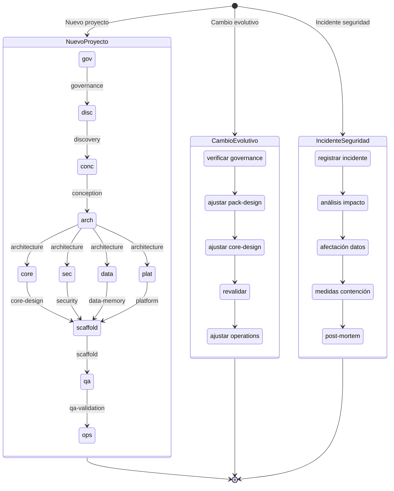

# Skill Routing

Este documento define **cuándo activar una skill**, cómo combinar varias, cómo resolver skills cross-cutting y qué hacer cuando dos skills compiten por ownership de una decisión.

Se complementa con `SKILLS-MANIFEST.md` (catálogo y metadata), `SKILL-EXECUTION-PROTOCOL.md` (cómo ejecutar una skill) y `AGENT-MODEL.md` (qué agente lidera cada skill).

---

## Reglas de activación

### Activación directa — Framework skills

Una skill se activa de forma directa cuando:

| Condición | Skill a activar |
|-----------|----------------|
| Se inicia un nuevo proyecto o pack vertical | `framework-governance` (siempre primero) |
| Se delimita un nuevo vertical de negocio | `framework-discovery` |
| Se diseñan capacidades funcionales y flujos | `framework-conception` |
| Se mapea la solución a capas técnicas | `framework-architecture` |
| Se diseña el SDK y la orquestación del core | `framework-core-design` |
| Se diseña un pack vertical como producto | `framework-pack-design` |
| Se diseña la capa de datos y memoria | `framework-data-memory-compliance` |
| Se diseñan controles de seguridad y acceso | `framework-security` |
| Se diseña la infraestructura y despliegue | `framework-platform` |
| Se implementa la estructura del repositorio | `framework-scaffold-implementation` |
| Se define la estrategia de pruebas | `framework-qa-validation` |
| Se define la operación post-lanzamiento | `framework-operations-evolution` |

---

### Activación directa — Stack skills

Skills para implementación de proyectos de software concretos:

| Condición | Skill a activar |
|-----------|----------------|
| Arrancar un proyecto nuevo o hacer onboarding | `project-bootstrap` |
| Nombrar o crear un repositorio | `repo-structure` |
| Elegir arquitectura de la aplicación | `project-architecture` |
| Diseñar tablas o schemas de base de datos | `database-modeling` |
| Crear stored procedures o queries | `database-sp` |
| Agregar auditoría o soft delete | `database-audit` |
| Definir convenciones SQL del proyecto | `database` |
| Prevenir inyección SQL o validar inputs en DB | `database-security` |
| Crear o modificar endpoints REST | `backend-api` |
| Implementar handlers / data access | `data-access` |
| Conectar SP con endpoints (mapeo errores/paginación) | `api-integration` |
| Configurar API Gateway (Ocelot, Kong, Nginx) | `dotnet-gateway` |
| Registrar servicios/middleware en Program.cs o equivalente | `app-bootstrap` |
| Usar librerías compartidas (ApiResponse, excepciones) | `shared-libs` |
| Implementar manejo de errores entre capas | `error-handling` |
| Documentar APIs con OpenAPI/Swagger | `swagger` |
| Diseñar un módulo API desde cero (spec completa) | `api-first-spec` |
| Generar backend desde spec OpenAPI | `api-first-backend` |
| Generar frontend desde spec OpenAPI | `api-first-frontend` |
| Generar tests E2E desde spec OpenAPI | `api-first-testing` |
| Inventariar todos los endpoints de un sistema | `api-catalog` |
| Crear feature folders en React/Angular/Vue | `react` |
| Implementar hooks de query/mutation/lógica | `react-hooks` |
| Configurar Module Federation | `microfrontend` |
| Aplicar tokens de color, tipografía, spacing | `design-system` |
| Escribir TypeScript estricto | `typescript` |
| Implementar exportación a Excel | `export-excel` |
| Aplicar controles OWASP, validación, CORS | `security` |
| Implementar login, tokens, sesión | `authentication` |
| Implementar permisos, roles, RBAC | `authorization` |
| Implementar paginación, caché, optimización | `performance` |
| Configurar Docker local o docker-compose | `docker-local` |
| Implementar notificaciones (email, push, in-app) | `notifications` |
| Escribir tests E2E con Playwright | `playwright` |
| Crear o actualizar Pull Request | `pull-request` |
| Escribir changelog | `changelog` |
| Revisar código antes de PR | `code-review` |
| Escribir User Stories | `hu-template` |
| Crear README de módulo | `readme` |
| Generar prototipo HTML para stakeholders | `html-prototype` |
| Crear una nueva skill para el framework | `skill-creator` |
| Sincronizar metadata de skills al SKILLS-MANIFEST.md | `skill-sync` |
| Implementar feature backend completo (DB → API) | `agent-backend` |
| Implementar feature frontend completo (types → UI) | `agent-frontend` |
| Implementar feature full-stack completo | `agent-fullstack` |
| Crear plan de QA y tests | `agent-qa` |

---

### Activación condicional (cross-cutting)

Las skills cross-cutting se inyectan según el contexto del proyecto, independientemente de la fase actual:

```
if proyecto tiene multi-tenancy:
    INYECTAR framework-security
    INYECTAR framework-data-memory-compliance

if proyecto tiene datos sensibles o regulados (PII, financiero, salud):
    INYECTAR framework-data-memory-compliance
    INYECTAR framework-security

if proyecto introduce MCP servers nuevos:
    INYECTAR framework-core-design (catálogo MCP, contratos)
    INYECTAR framework-security (allowlists, scopes, auditoría)
    INYECTAR framework-platform (operación y observabilidad)

if se propone una excepción al blueprint del framework:
    INYECTAR framework-governance (revalidación)

if se introduce un nuevo pack vertical:
    INYECTAR framework-pack-design
    INYECTAR framework-governance (verificación de reglas)

if proyecto va a producción:
    INYECTAR framework-platform
    INYECTAR framework-operations-evolution
```

---

### Activación en cadena (dependencias implícitas)

Cuando se activa una skill, sus `depends_on` se activan implícitamente si no han sido ejecutadas:

```
framework-architecture activada
    → verificar framework-conception (ejecutada?)
    → verificar framework-governance (ejecutada?)
    → si no: activar primero en ese orden
```

El orchestrator-agent es responsable de resolver la cadena de dependencias antes de delegar ejecución a un agente específico.

---

## Combinación de skills

### Cuándo combinar skills en paralelo

Algunas skills de la fase de **diseño** pueden trabajarse en paralelo si sus entradas ya están disponibles:

| Combinación paralela | Condición |
|---------------------|-----------|
| `framework-security` + `framework-data-memory-compliance` | Ambas tienen como input artefactos de `framework-architecture` |
| `framework-core-design` + `framework-pack-design` | Separadas por ownership (core vs. pack), pueden progresar en paralelo |

**Regla**: Dos skills solo pueden ejecutarse en paralelo si no tienen dependencia directa entre sí (ni en `depends_on` ni en `consumed_by`).

### Cuándo combinar skills en secuencia estricta

| Secuencia obligatoria | Razón |
|----------------------|-------|
| `framework-discovery` → `framework-conception` | Conception depende del mapa de actores y procesos |
| `framework-architecture` → `framework-core-design` | Core design depende de las decisiones de capas |
| `framework-scaffold-implementation` → `framework-qa-validation` | QA valida lo que se ha scaffolded |

---

## Resolución de conflictos de ownership

Cuando dos skills parecen reclamar ownership de la misma decisión:

### Tabla de resolución canónica

| Decisión | Owner | Skill que consulta |
|----------|-------|-------------------|
| Qué capa arquitectónica corresponde a X | `framework-architecture` | Todas las demás |
| Qué entra en el core vs. en el pack | `framework-core-design` | `framework-pack-design` |
| Qué datos se retienen y por cuánto tiempo | `framework-data-memory-compliance` | `framework-security` |
| Qué controles de acceso aplican | `framework-security` | `framework-data-memory-compliance` |
| Qué pasa con los datos de un tenant borrado | `framework-data-memory-compliance` | `framework-security` consulta |
| Qué infraestructura de observabilidad usar | `framework-platform` | `framework-operations-evolution` consulta |
| Qué métricas de negocio monitorear | `framework-operations-evolution` | `framework-platform` implementa |
| Si una propuesta viola el blueprint | `framework-governance` | Cualquier skill que detecte conflicto |
| Cómo se despliega el MCP server | `framework-platform` | `framework-core-design` define contrato |
| Qué MCP servers están autorizados | `framework-security` + `framework-governance` | `framework-core-design` aplica |

### Protocolo de resolución cuando hay conflicto

1. **Identificar**: ¿Qué decisión está en conflicto?
2. **Consultar tabla canónica**: ¿Cuál es la skill owner según la tabla de arriba?
3. **Escalar si no está en tabla**: El control-agent decide y registra la resolución en el artefacto de `framework-governance`.
4. **Documentar**: Toda resolución de conflicto de ownership se registra como decisión arquitectónica.

---

## Routing por tipo de cambio

### Cambio nuevo (proyecto o pack desde cero)

```
framework-governance → framework-discovery → framework-conception
    → framework-architecture
        → framework-core-design
        → framework-data-memory-compliance
        → framework-security
        → framework-platform
            → framework-scaffold-implementation
                → framework-qa-validation
                    → framework-operations-evolution
```

### Cambio evolutivo (modificación de un pack existente)

```
framework-governance (verificar impacto en blueprint)
    → framework-pack-design (ajustar diseño del pack)
    → framework-core-design (si el contrato SDK cambia)
    → framework-qa-validation (revalidar)
    → framework-operations-evolution (si cambia el SLO)
```

### Cambio transversal (afecta al core o al blueprint del framework)

```
framework-governance (obligatorio, scope de impacto)
    → framework-architecture (si cambia el mapa de capas)
    → framework-core-design (si cambia el SDK)
    → framework-security + framework-data-memory-compliance (si cambian controles)
    → framework-platform (si cambia infraestructura)
    → TODOS los packs afectados (vía framework-pack-design)
```

### Incidente de seguridad o compliance

```
framework-governance (registro de incidente)
    → framework-security (análisis de impacto)
    → framework-data-memory-compliance (afectación de datos)
    → framework-platform (medidas de contención)
    → framework-operations-evolution (post-mortem y mejora)
```

### Diagrama de routing por tipo de cambio



---

## Reglas de routing para el orchestrator-agent

1. Siempre verificar `framework-governance` antes de autorizar un cambio estructural.
2. Nunca ejecutar una skill sin verificar sus `depends_on`.
3. Si una skill tiene `enforcement: mandatory` y no se puede ejecutar, registrar el bloqueante antes de avanzar.
4. Si hay un conflict de ownership no cubierto por la tabla canónica, escalar a control-agent para resolución.
5. Documentar el path de routing seguido para cada fase: qué skills se activaron, en qué orden y por qué condición.

---

## Routing de stack skills — Secuencias estándar

### Nuevo proyecto agéntico desde cero (flujo completo)

```
fase A: framework-governance → framework-discovery → framework-conception → framework-pack-design
fase B: framework-architecture → framework-core-design → framework-data-memory-compliance
         → framework-security → framework-platform
fase C: framework-scaffold-implementation → project-bootstrap → repo-structure → project-architecture
fase D: api-first-spec (por módulo)
fase E: database-sp → data-access → backend-api → swagger
fase F: typescript → react-hooks → react
fase G: framework-qa-validation → playwright
fase H: framework-operations-evolution → pull-request
```

**Reuso**: Las fases A-C (Niveles 1-13) se ejecutan una vez por vertical.
Para módulos adicionales del mismo pack, se arranca en fase D (Nivel 14) y se ejecuta D-H.

### Feature backend incremental

```
api-first-spec → database-modeling → database-sp → data-access
    → backend-api → api-integration → error-handling → swagger
```

### Feature frontend incremental

```
typescript → react → react-hooks → (export-excel si aplica)
    → performance (staleTime, placeholderData)
```

### Feature full-stack

Usar `agent-fullstack` — activa ambas secuencias con backend primero.

### Solo tests / QA

```
api-first-spec (como fuente de casos) → api-first-testing → playwright
```

### Meta-skills — stack

| Meta-skill | Activa |
|------------|--------|
| `agent-backend` | `database` → `database-modeling` → `database-sp` → `data-access` → `backend-api` → `api-integration` → `error-handling` → `swagger` |
| `agent-frontend` | `typescript` → `design-system` → `react` → `react-hooks` → `performance` |
| `agent-fullstack` | `api-first-spec` → `agent-backend` → `agent-frontend` → `agent-qa` |
| `agent-qa` | `api-first-testing` → `playwright` → `code-review` |
