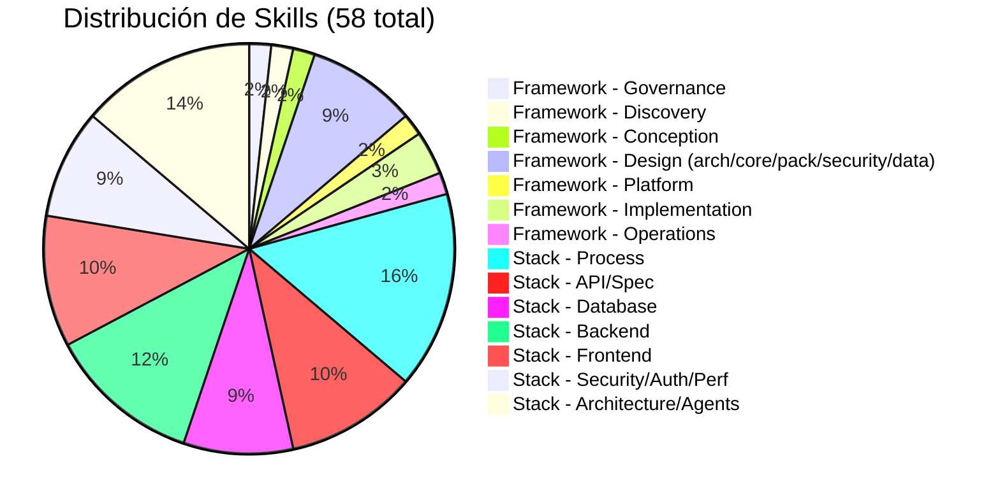

# Skills Manifest — Framework Agéntico

**Versión**: 2.0  
**Skills activas**: 58 (12 framework + 46 stack)  
**Última actualización**: 2026-05-22

---



---

## Cómo usar este manifiesto

1. Antes de ejecutar cualquier fase de diseño, consulta la columna **Phase** para saber qué skills son relevantes.
2. Carga el `SKILL.md` correspondiente antes de producir artefactos de esa fase.
3. Las skills **cross-cutting** se inyectan condicionalmente según el contexto del proyecto (ver tabla de condicionales).
4. Usa el **enforcement level** para saber si la skill es obligatoria o recomendable.
5. Consulta `SKILL-FLOW.md` para el flujo end-to-end y `SKILL-EXECUTION-PROTOCOL.md` para el protocolo de uso.

---

## Mapa de Skills por Fase y Capa

### Phase: GOVERNANCE (Transversal)

| Skill | ID | Layer | Enforcement | Propósito resumido |
|-------|----|-------|-------------|-------------------|
| framework-governance | `framework-governance` | governance | **mandatory** | Reglas maestras, clasificación obligatorio/estándar/variable, gestión de excepciones |

> Se activa al inicio de cualquier proyecto nuevo y se revalida cuando hay cambios estructurales.

---

### Phase: DISCOVERY

| Skill | ID | Layer | Enforcement | Propósito resumido |
|-------|----|-------|-------------|-------------------|
| framework-discovery | `framework-discovery` | business | **mandatory** | Delimitar el vertical: problema, actores, procesos, datos, integraciones, restricciones |

**Entradas mínimas**: Descripción del vertical o caso de uso.  
**Artefactos de salida**: Mapa de actores, procesos críticos, datos sensibles, integraciones, restricciones, métricas de éxito.  
**Consumidores**: `framework-conception`

---

### Phase: CONCEPTION

| Skill | ID | Layer | Enforcement | Propósito resumido |
|-------|----|-------|-------------|-------------------|
| framework-conception | `framework-conception` | business | **mandatory** | Capacidades funcionales, agentes, flujos, herramientas, HITL, alcance MVP |

**Entradas mínimas**: Artefactos de discovery.  
**Artefactos de salida**: Catálogo de capacidades, agentes funcionales, flujos de conversación, criterios de aceptación del MVP.  
**Consumidores**: `framework-architecture`, `framework-pack-design`

---

### Phase: DESIGN

| Skill | ID | Layer | Enforcement | Propósito resumido |
|-------|----|-------|-------------|-------------------|
| framework-architecture | `framework-architecture` | design | **mandatory** | Mapeo a 7 capas, decisiones Build vs Buy, routing de modelos, multi-tenancy |
| framework-core-design | `framework-core-design` | design | **mandatory** | SDK interno, orquestación, router model-agnostic, catálogo MCP, estado, fallback |
| framework-pack-design | `framework-pack-design` | design | **mandatory** | Pack vertical como producto: agentes especializados, prompts, runbooks, herramientas |
| framework-data-memory-compliance | `framework-data-memory-compliance` | design | **mandatory** | Taxonomía de datos, tipos de memoria, retención, borrado, cifrado, compliance |
| framework-security | `framework-security` | design | **mandatory** | RBAC, guardrails, secretos, trazabilidad, auditoría, límites de autonomía |

**Nota**: `framework-security` y `framework-data-memory-compliance` son **cross-cutting** y se activan siempre que haya multi-tenancy, datos sensibles o requisitos regulatorios.

---

### Phase: PLATFORM

| Skill | ID | Layer | Enforcement | Propósito resumido |
|-------|----|-------|-------------|-------------------|
| framework-platform | `framework-platform` | infrastructure | **mandatory** | Cómputo, Kubernetes, mensajería, observabilidad, CI/CD, resiliencia multi-tenant |

**Entradas mínimas**: Decisiones de architecture + security + data.  
**Artefactos de salida**: Diagramas de despliegue, namespaces por tenant, pipelines, playbooks de operación.  
**Consumidores**: `framework-scaffold-implementation`, `framework-operations-evolution`

---

### Phase: IMPLEMENTATION

| Skill | ID | Layer | Enforcement | Propósito resumido |
|-------|----|-------|-------------|-------------------|
| framework-scaffold-implementation | `framework-scaffold-implementation` | implementation | **mandatory** | Estructura de repos, módulos, contratos SDK, plantillas de packs, primer vertical slice |
| framework-qa-validation | `framework-qa-validation` | implementation | **mandatory** | Estrategia de pruebas por capa, contract tests, integración, E2E, criterios go/no-go |

---

### Phase: OPERATIONS (Post-launch)

| Skill | ID | Layer | Enforcement | Propósito resumido |
|-------|----|-------|-------------|-------------------|
| framework-operations-evolution | `framework-operations-evolution` | operations | **recommended** | Monitoreo, soporte, incidentes, SLOs, versionado, deprecación, mejora continua |

---

## Dependencias entre Skills

```
framework-governance
    └─► (cualquier skill que toque reglas del framework)

framework-discovery
    └─► framework-conception

framework-conception
    ├─► framework-architecture
    └─► framework-pack-design

framework-architecture
    ├─► framework-core-design
    ├─► framework-data-memory-compliance  
    ├─► framework-security
    └─► framework-platform

framework-core-design
    └─► framework-scaffold-implementation

framework-platform
    ├─► framework-scaffold-implementation
    └─► framework-operations-evolution

framework-scaffold-implementation
    └─► framework-qa-validation

framework-qa-validation
    └─► framework-operations-evolution
```

---

## Condicionales de Inyección Cross-Cutting

| Condición del proyecto | Skills cross-cutting a cargar |
|------------------------|------------------------------|
| Multi-tenancy requerido | `framework-security` + `framework-data-memory-compliance` |
| Datos sensibles o regulados | `framework-data-memory-compliance` + `framework-security` |
| Operación productiva planificada | `framework-platform` + `framework-operations-evolution` |
| Cambios estructurales en el framework | `framework-governance` (revalidación) |
| MCP servers nuevos | `framework-core-design` + `framework-security` + `framework-platform` |
| Nuevo pack vertical | `framework-pack-design` + `framework-governance` (verificación de reglas) |

---

## Perfiles de Validación por Skill

> Los perfiles de validación son un contrato documental para futura implementación de validadores deterministas.  
> Ver `VALIDATION-PROFILES.md` para definición completa de cada perfil.

| Skill | Validation Profile | Validates With |
|-------|--------------------|----------------|
| framework-governance | `governance-review` | governance-checker |
| framework-discovery | `documentation` | doc-completeness |
| framework-conception | `documentation` + `skill-contract` | doc-completeness, conception-checker |
| framework-architecture | `architecture-consistency` | arch-consistency-checker |
| framework-core-design | `architecture-consistency` + `skill-contract` | core-design-checker |
| framework-pack-design | `skill-contract` | pack-contract-checker |
| framework-data-memory-compliance | `tenant-isolation` + `security-review` | compliance-checker |
| framework-security | `security-review` | security-checker |
| framework-platform | `architecture-consistency` | platform-checker |
| framework-scaffold-implementation | `skill-contract` + `documentation` | scaffold-checker |
| framework-qa-validation | `release-gate` | qa-gate-checker |
| framework-operations-evolution | `documentation` | ops-checker |

---

## Mapa de Agentes por Skill

> Definición completa de roles en [AGENT-MODEL.md](AGENT-MODEL.md). Archivos de agente en `.opencode/agents/`.

| Skill | Agente primario | Agentes secundarios |
|-------|----------------|---------------------|
| framework-governance | [control-agent](../agents/control.agent.md) | [orchestrator-agent](../agents/orchestrator.agent.md) |
| framework-discovery | [design-agent](../agents/design.agent.md) | [orchestrator-agent](../agents/orchestrator.agent.md) |
| framework-conception | [design-agent](../agents/design.agent.md) | [orchestrator-agent](../agents/orchestrator.agent.md) |
| framework-architecture | [design-agent](../agents/design.agent.md) | [control-agent](../agents/control.agent.md) |
| framework-core-design | [design-agent](../agents/design.agent.md) | [control-agent](../agents/control.agent.md) |
| framework-pack-design | [design-agent](../agents/design.agent.md) | [delivery-agent](../agents/delivery.agent.md) |
| framework-data-memory-compliance | [control-agent](../agents/control.agent.md) | [design-agent](../agents/design.agent.md) |
| framework-security | [control-agent](../agents/control.agent.md) | [design-agent](../agents/design.agent.md) |
| framework-platform | [delivery-agent](../agents/delivery.agent.md) | [control-agent](../agents/control.agent.md) |
| framework-scaffold-implementation | [delivery-agent](../agents/delivery.agent.md) | [design-agent](../agents/design.agent.md) |
| framework-qa-validation | [delivery-agent](../agents/delivery.agent.md) | [control-agent](../agents/control.agent.md) |
| framework-operations-evolution | [delivery-agent](../agents/delivery.agent.md) | [control-agent](../agents/control.agent.md) |

---

## Enforcement Levels

| Nivel | Significado |
|-------|-------------|
| `mandatory` | La skill DEBE cargarse y sus decisiones DEBEN documentarse en el artefacto correspondiente. Omitir requiere excepción aprobada en governance. |
| `recommended` | La skill DEBERÍA cargarse. Puede omitirse con justificación explícita en el contexto del proyecto. |
| `optional` | La skill PUEDE cargarse según necesidad del proyecto. No se exige documentación de excepción. |

---

## Cómo agregar una skill nueva

1. Crear carpeta `framework-{nombre}/` dentro de `.opencode/skills/`.
2. Copiar `SKILL-TEMPLATE.md` y completar todos los campos.
3. Añadir la skill a este manifiesto: tabla de fase, dependencias, condicionales, validación y agentes.
4. Actualizar `README.md` y `SKILL-FLOW.md` si la skill altera el flujo estándar.
5. Si la skill es `mandatory`, documentar en `framework-governance` su posición en el blueprint.

---

## Skills de Stack — Proceso y Workflow

> Skills de gestión de proceso aplicables a cualquier proyecto independiente del stack.

| Skill | ID | Layer | Enforcement | Propósito resumido |
|-------|----|-------|-------------|-------------------|
| Changelog | `changelog` | process | **mandatory** | Formato keepachangelog con prefijos emoji y versionado semántico |
| Code Review | `code-review` | process | **mandatory** | Checklists de revisión por capa (DB, Backend, Frontend) |
| Pull Request | `pull-request` | process | **mandatory** | Plantilla de PR con conventional commits |
| Historia de Usuario | `hu-template` | process | **mandatory** | Plantilla de HU con criterios SMART y criterios de aceptación |
| README | `readme` | process | **recommended** | Plantilla de README por tipo de módulo |
| HTML Prototype | `html-prototype` | process | **recommended** | Generación de mockups HTML interactivos |
| Project Bootstrap | `project-bootstrap` | process | **recommended** | Checklist de onboarding de proyecto |
| Skill Creator | `skill-creator` | process | **optional** | Guía para crear nuevas skills |
| Skill Sync | `skill-sync` | process | **optional** | Sincronización de metadata de skills al AGENTS.md |

---

## Skills de Stack — API y Especificación

| Skill | ID | Layer | Enforcement | Propósito resumido |
|-------|----|-------|-------------|-------------------|
| Swagger | `swagger` | backend | **mandatory** | Generación de documentación OpenAPI/Swagger |
| API First Spec | `api-first-spec` | backend | **mandatory** | Documento de especificación API con 9 secciones |
| API First Backend | `api-first-backend` | backend | **mandatory** | Implementación backend desde especificación (SP-first) |
| API First Frontend | `api-first-frontend` | frontend | **mandatory** | Código frontend desde especificación (types, hooks, componentes) |
| API First Testing | `api-first-testing` | testing | **mandatory** | Tests E2E desde especificación (Playwright) |
| API Catalog | `api-catalog` | backend | **recommended** | Inventario de APIs: SP→endpoint→serviceID→pantalla |

---

## Skills de Stack — Base de Datos

| Skill | ID | Layer | Enforcement | Propósito resumido |
|-------|----|-------|-------------|-------------------|
| Database | `database` | database | **mandatory** | Convenciones SQL: schemas, naming, params, errores, paginación |
| Database Audit | `database-audit` | database | **mandatory** | Columnas de auditoría, soft delete, logging tables |
| Database Modeling | `database-modeling` | database | **mandatory** | Diseño de tablas, constraints, indexes, transacciones |
| Database Security | `database-security` | database | **mandatory** | Prevención de inyección, validación de palabras reservadas, catálogo de errores |
| Database SP | `database-sp` | database | **mandatory** | Plantillas de SPs (List/Get/Create/Update/Delete/Search/Merge), paginación |

---

## Skills de Stack — Backend

| Skill | ID | Layer | Enforcement | Propósito resumido |
|-------|----|-------|-------------|-------------------|
| Backend API | `backend-api` | backend | **mandatory** | Estructura de módulo, endpoints, multi-stack (.NET/Java/Python) |
| Data Access | `data-access` | backend | **mandatory** | Patrón handler, SP constants, mapeo de resultados |
| API Integration | `api-integration` | backend | **mandatory** | Conexión DB→API, manejo de errores de validación |
| API Gateway | `dotnet-gateway` | backend | **recommended** | API Gateway (Ocelot/Kong/Nginx), auth flow, middleware |
| App Bootstrap | `app-bootstrap` | backend | **mandatory** | Registro de servicios y middleware (startup) |
| Shared Libs | `shared-libs` | backend | **mandatory** | ApiResponse, excepciones, contexto de identidad, rate limiting |
| Error Handling | `error-handling` | backend | **mandatory** | Flujo de errores completo desde DB hasta frontend |

---

## Skills de Stack — Frontend

| Skill | ID | Layer | Enforcement | Propósito resumido |
|-------|----|-------|-------------|-------------------|
| React | `react` | frontend | **mandatory** | Feature folders, tipos, componentes, routing (React/Angular/Vue) |
| React Hooks | `react-hooks` | frontend | **mandatory** | Query/Mutation/Logic hooks, TanStack Query, estado |
| Microfrontend | `microfrontend` | frontend | **recommended** | Module Federation, Host/Child, shared deps, naming |
| Design System | `design-system` | frontend | **mandatory** | Tokens de color, tipografía, spacing, catálogo de componentes |
| TypeScript | `typescript` | frontend | **mandatory** | Patrones strict TypeScript: const types, interfaces planas, no any |
| Export Excel | `export-excel` | frontend | **recommended** | Exportación Excel: SP con IsExport, handler, endpoint, hook frontend |

---

## Skills de Stack — Seguridad, Auth y Performance

| Skill | ID | Layer | Enforcement | Propósito resumido |
|-------|----|-------|-------------|-------------------|
| Security | `security` | backend | **mandatory** | OWASP Top 10, SQL injection, XSS, CORS, branch protection |
| Authentication | `authentication` | backend | **mandatory** | JWT/OAuth2/OIDC, propagación de identidad, sesión |
| Authorization | `authorization` | backend | **mandatory** | RBAC/ABAC, verificación de permisos, renderizado por rol |
| Performance | `performance` | backend | **recommended** | Paginación, SELECT selectivo, caché, TanStack placeholderData |
| Docker Local | `docker-local` | backend | **recommended** | Docker local dev, multi-stage Dockerfile, docker-compose |

---

## Skills de Stack — Arquitectura y Agentes

| Skill | ID | Layer | Enforcement | Propósito resumido |
|-------|----|-------|-------------|-------------------|
| Project Architecture | `project-architecture` | backend | **mandatory** | Vertical Slice, Modular Monolith, Microservices, URL patterns, ApiResponse |
| Repo Structure | `repo-structure` | backend | **mandatory** | Codificación de repos, tipos de proyecto, sufijos, naming |
| Playwright | `playwright` | testing | **mandatory** | Page Object Model, selectores, MCP workflow, tags de prueba |
| Agent Backend | `agent-backend` | backend | **recommended** | Meta-skill: activa todos los skills backend en secuencia |
| Agent Frontend | `agent-frontend` | frontend | **recommended** | Meta-skill: activa todos los skills frontend en secuencia |
| Agent Fullstack | `agent-fullstack` | backend | **recommended** | Meta-skill: activa todos los skills para features full-stack |
| Agent QA | `agent-qa` | testing | **recommended** | Meta-skill: activa todos los skills de testing |
| Notifications | `notifications` | backend | **recommended** | Notificaciones: in-app, email, push, webhook, templates |
