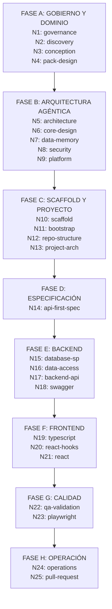

# Framework Agéntico — Instrucciones base para OpenCode

Este workspace contiene el **Framework Agéntico**: un sistema de skills, agentes y protocolos para diseñar, implementar y operar aplicaciones con agentes AI.

El framework tiene **58 skills** divididas en dos grupos:
- **12 framework skills** — diseño, arquitectura, seguridad y operación del propio framework agéntico.
- **46 stack skills** — patrones de implementación para proyectos concretos (backend, frontend, DB, testing, proceso).

## Cómo trabajar en este framework

- Antes de ejecutar cualquier tarea, consulta qué skill corresponde en [SKILLS-MANIFEST.md](.opencode/framework/SKILLS-MANIFEST.md).
- Carga el `SKILL.md` de la skill activa antes de producir artefactos.
- Sigue el protocolo de 7 pasos de [SKILL-EXECUTION-PROTOCOL.md](.opencode/framework/SKILL-EXECUTION-PROTOCOL.md).
- Consulta [SKILL-ROUTING.md](.opencode/framework/SKILL-ROUTING.md) para saber cuándo combinar skills.
- Usa los agentes especializados (`/orchestrator`, `/design`, `/control`, `/delivery`) según el dominio de trabajo.

## Modo de ejecución por niveles

**IMPORTANTE**: El framework trabaja nivel por nivel, nunca ejecuta todo de golpe.

### Reglas de ejecución:

1. **Una skill a la vez**: Ejecuta UNA sola skill por turno, nunca múltiples skills en secuencia automática.

2. **Confirmación explícita**: Al completar cada skill, muestra:
   ```
   [Nivel X: nombre-skill] - COMPLETADO

   Resumen:
   - Artefacto creado 1
   - Artefacto creado 2
   - Decisión tomada 3

   ¿Deseas continuar con [Nivel X+1: siguiente-skill]?
   ```

3. **Esperar aprobación**: NO continuar a la siguiente skill sin confirmación explícita del usuario.

4. **Sugerir meta-skill solo al final**: Cuando se completen TODAS las skills individuales de un flujo, entonces y solo entonces, sugerir:
   ```
   Todas las skills individuales completadas.
   ¿Quieres que active agent-backend/agent-frontend/agent-fullstack para automatizar futuros módulos?
   ```

5. **Nunca invocar meta-skills automáticamente**: `agent-backend`, `agent-frontend`, `agent-fullstack`, `agent-qa` SOLO se invocan si el usuario lo solicita explícitamente.

### Meta-skills — Cuándo usarlas:

Las meta-skills (`agent-backend`, `agent-frontend`, `agent-fullstack`, `agent-qa`) ejecutan TODO en secuencia automática.

**Úsalas SOLO cuando el usuario:**
- Ya conoce el flujo completo
- Confía en que la especificación está correcta
- No necesita revisar paso a paso
- Dice explícitamente: "usa agent-backend" o "hazlo todo de golpe"

**NO las uses cuando:**
- Es la primera vez que implementan un módulo
- El usuario dice "implementa X" sin más contexto
- No ha visto el resultado de cada skill antes

## Flujo único — Proyecto agéntico desde cero

**El framework ejecuta SIEMPRE el mismo flujo de 25 niveles obligatorios.** Las skills `framework-*` NO son opcionales: definen multi-tenancy, memoria, guardrails, router de modelos y observabilidad.

```
═══ FASE A — GOBIERNO Y DOMINIO ═══
Nivel 1:  framework-governance              → Constitución y reglas base
Nivel 2:  framework-discovery               → Vertical, actores, procesos, datos
Nivel 3:  framework-conception              → Capacidades, agentes, flujos, MVP
Nivel 4:  framework-pack-design             → Pack como producto comercializable

═══ FASE B — ARQUITECTURA AGÉNTICA ═══
Nivel 5:  framework-architecture            → 7 capas, contratos, Build vs Buy
Nivel 6:  framework-core-design             → SDK, orquestación, router, MCP tools
Nivel 7:  framework-data-memory-compliance  → Datos, memoria, retención, cifrado
Nivel 8:  framework-security                → RBAC, guardrails, secretos, límites
Nivel 9:  framework-platform                → K8s, multi-tenant, observabilidad

═══ FASE C — SCAFFOLD Y PROYECTO ═══
Nivel 10: framework-scaffold-implementation → Estructura de repos, primer slice
Nivel 11: project-bootstrap                 → Contexto del proyecto específico
Nivel 12: repo-structure                    → Nombre de repo, convenciones
Nivel 13: project-architecture              → Estilo (Vertical Slice / Monolith)

═══ FASE D — ESPECIFICACIÓN ═══
Nivel 14: api-first-spec                    → ERD, endpoints, DTOs, reglas

═══ FASE E — BACKEND ═══
Nivel 15: database-sp                       → Tablas y stored procedures
Nivel 16: data-access                       → Handlers de datos
Nivel 17: backend-api                       → Endpoints y controllers
Nivel 18: swagger                           → Documentación OpenAPI

═══ FASE F — FRONTEND ═══
Nivel 19: typescript                        → Tipos y contratos TS
Nivel 20: react-hooks                       → Hooks query/mutation
Nivel 21: react                             → Componentes y pantallas

═══ FASE G — CALIDAD ═══
Nivel 22: framework-qa-validation           → Estrategia por capa, guardrails
Nivel 23: playwright                        → Tests E2E

═══ FASE H — OPERACIÓN Y RELEASE ═══
Nivel 24: framework-operations-evolution    → SLOs, monitoreo, versionado
Nivel 25: pull-request                      → PR + changelog
```

### Diagrama de flujo de los 25 niveles



### Reuso entre módulos del mismo vertical

Los **Niveles 1-13** se ejecutan **una vez por vertical**. Para módulos adicionales del mismo pack, se arranca directo en **Nivel 14**.

Ver [EXECUTION-MODES.md](.opencode/docs/EXECUTION-MODES.md) para detalles completos.

## Agentes disponibles

| Agente | Cuándo usarlo | Invocación |
|--------|--------------|------------|
| `orchestrator` | Para planificar qué skills activar y en qué orden | `/orchestrator` |
| `design` | Para discovery, conception, arquitectura, core y pack design | `/design` |
| `control` | Para governance, seguridad, compliance y validación | `/control` |
| `delivery` | Para scaffold, plataforma, pipelines y operación | `/delivery` |

## Reglas que aplican a todo el workspace

- Toda decisión relevante debe quedar documentada en el artefacto correspondiente.
- Las skills con `enforcement: mandatory` no pueden omitirse sin excepción registrada.
- Los secretos nunca van en texto plano en ningún archivo del workspace.
- Antes de cualquier cambio estructural al framework, verificar con [framework-governance](.opencode/skills/framework-governance/SKILL.md).
- El MCP server `context7` está disponible para consultar documentación actualizada.

## Documentos clave

### Documentación de usuario (docs/)
- [README.md](.opencode/docs/README.md) — índice completo
- [QUICKSTART.md](.opencode/docs/QUICKSTART.md) — inicio rápido (15 min)
- [WORKFLOW-GUIDE.md](.opencode/docs/WORKFLOW-GUIDE.md) — guías de workflow
- [EXECUTION-MODES.md](.opencode/docs/EXECUTION-MODES.md) — modos de ejecución
- [FAQ.md](.opencode/docs/FAQ.md) — preguntas frecuentes
- [TROUBLESHOOTING.md](.opencode/docs/TROUBLESHOOTING.md) — solución de problemas

### Configuración del framework (framework/)
- [SKILLS-MANIFEST.md](.opencode/framework/SKILLS-MANIFEST.md) — catálogo de 58 skills
- [SKILL-EXECUTION-PROTOCOL.md](.opencode/framework/SKILL-EXECUTION-PROTOCOL.md) — protocolo de 7 pasos
- [SKILL-ROUTING.md](.opencode/framework/SKILL-ROUTING.md) — cuándo activar cada skill
- [SKILL-FLOW.md](.opencode/framework/SKILL-FLOW.md) — flujo end-to-end
- [AGENT-MODEL.md](.opencode/framework/AGENT-MODEL.md) — roles y límites de agentes
- [MCP-GOVERNANCE.md](.opencode/framework/MCP-GOVERNANCE.md) — gobernanza MCP
- [VALIDATION-PROFILES.md](.opencode/framework/VALIDATION-PROFILES.md) — perfiles de validación
- [HOOKS-AND-GUARDRAILS.md](.opencode/framework/HOOKS-AND-GUARDRAILS.md) — interceptores y guardrails
