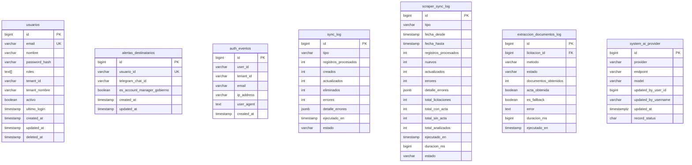

# API Specification: Administración (Centro de Administración)

> Módulo `MPM.Modules.Administracion` — migraciones V131 (SPs de usuarios), V132 (logs
> unificados) y fixes V133–V135 (columnas OUT sin prefijo `p_` para mapeo Dapper, alias
> del UNION ALL y casts de tipos `text`→`VARCHAR(20)`; validados en BD fresca V001→V135).
> Primera versión: 2026-08-12. Agrega al sistema la gestión de usuarios y la
> visibilidad de logs que hasta ahora solo se escribían en BD (auth_eventos,
> sync_log, scraper_sync_log, extraccion_documentos_log, system_ai_provider).

## 1. Scope

### Included
- Listado paginado de usuarios con búsqueda por nombre/email
- Creación de usuarios con contraseña temporal y rol inicial
- Activación/desactivación de cuentas (bloquea el login)
- Cambio de rol (jerarquía SuperAdmin > Admin > Analista/Usuario)
- Marcar/desmarcar account manager de gobierno (`alertas_destinatarios.es_account_manager_gobierno`)
- Lectura unificada de logs: auth, sync, scraper, extraccion, ai_provider

### Excluded
- Eliminación física de usuarios (soft delete vía `deleted_at` solo por BD)
- Cambio de contraseña de otro usuario directamente (se usa el flujo
  `forgot-password` existente; el usuario define su nueva contraseña)
- Multi-tenant estricto (el sistema es de un solo tenant operativo hoy; el
  `tenant_id` se conserva por compatibilidad)
- Auditoría de cambios de la propia administración (trail de quién creó/desactivó — futura fase)

## 2. Modelo de roles (jerarquía)

| Rol | Qué puede hacer | Quién lo gestiona |
|-----|----------------|-------------------|
| **SuperAdmin** | Todo: usuarios (incl. Admins/SuperAdmins), logs, switch de proveedor IA | Solo otro SuperAdmin |
| **Admin** | Crea/gestiona Analistas y Usuarios; ve logs y resumen del sistema | Solo SuperAdmin |
| **Analista** | Toda la plataforma (licitaciones, análisis, alertas, competidores, mensajería) | Admin y SuperAdmin |
| **Usuario** | Toda la plataforma (hoy con los mismos permisos que Analista) | Admin y SuperAdmin |

Reglas transversales (implementadas en `AdminRoleRules.cs` + controllers):
- Nadie puede desactivar su propia cuenta ni cambiarse el rol a sí mismo.
- Un Admin no puede crear, asignar o modificar usuarios con rol Admin/SuperAdmin.
- El backend rechaza con 400 cualquier operación fuera de jerarquía (la UI además
  oculta/deshabilita las opciones correspondientes).

## 3. Data Model



## 4. Endpoints

### 4.1 Usuarios — `[Authorize(Roles = "Admin,SuperAdmin")]`

#### `GET /api/v1/admin/usuarios`
Lista paginada con búsqueda.

| Query | Tipo | Default | Descripción |
|-------|------|---------|-------------|
| `search` | string | — | Filtra por nombre o email (ILIKE) |
| `pagina` | int | 1 | Número de página |
| `paginaSize` | int | 20 | Tamaño (1–100) |

Respuesta `data`: array de `AdminUsuarioItemDto`:
```json
{
  "id": 5,
  "email": "ana@tivit.cl",
  "nombre": "Ana López",
  "roles": ["Analista"],
  "activo": true,
  "ultimoLogin": "2026-08-12T15:30:00Z",
  "tenantNombre": "TIVIT Chile",
  "esAccountManager": false,
  "totalCount": 42
}
```

#### `POST /api/v1/admin/usuarios`
Crea un usuario con contraseña temporal (bcrypt factor 11) y rol inicial.

Body:
```json
{
  "email": "ana@tivit.cl",
  "nombre": "Ana López",
  "password": "Cambiar123",
  "rol": "Analista",
  "tenantNombre": "TIVIT Chile"
}
```

Reglas:
- `rol` ∈ {SuperAdmin, Admin, Analista, Usuario}
- Un actor `Admin` solo puede crear Analista/Usuario → 400 en caso contrario
- Email único (incluye usuarios borrados lógicamente)
- Password ≥ 6 caracteres

#### `PUT /api/v1/admin/usuarios/{id}/estado`
Body: `{ "activo": false }`. Desactiva/activa el login. No permite auto-desactivación.

#### `PUT /api/v1/admin/usuarios/{id}/rol`
Body: `{ "rol": "Usuario" }`. Cambia el rol (jerarquía aplicada). No permite auto-cambio.

#### `PUT /api/v1/admin/usuarios/{id}/account-manager`
Body: `{ "esAccountManager": true }`. UPSERT en `alertas_destinatarios` (crea la fila si el usuario aún no tiene canales configurados).

### 4.2 Logs — `[Authorize(Roles = "Admin,SuperAdmin")]`

#### `GET /api/v1/admin/logs`
Logs unificados (función `usp_Admin_ListarLogs`, V132), ordenados por fecha desc.

| Query | Tipo | Descripción |
|-------|------|-------------|
| `tipo` | string | `auth` \| `sync` \| `scraper` \| `extraccion` \| `ai_provider` (default: todos) |
| `desde` / `hasta` | datetime | Rango de fechas |
| `estado` | string | Filtro por estado del origen |
| `limite` | int | 1–500 (default 100) |

Respuesta `data`: array de `AdminLogItemDto`:
```json
{
  "id": 123,
  "tipo": "auth",
  "fecha": "2026-08-12T15:30:00Z",
  "estado": "exito",
  "detalle": "Inicio de sesión de admin@tivit.cl",
  "extra": "{\"email\":\"admin@tivit.cl\",\"ip\":\"190.1.1.1\",\"user_agent\":\"Mozilla/5.0...\"}"
}
```

Estados por origen:
| Tipo | Estados posibles |
|------|-----------------|
| auth | `exito` |
| sync | `EN_PROGRESO`, `EXITO`, `PARCIAL`, `FALLO` |
| scraper | `iniciado`, `completado`, `error` |
| extraccion | `exito`, `fallo`, `sin_adjuntos` |
| ai_provider | `activo`, `historial` |

## 5. Stored procedures (V131–V132)

| SP | Tipo | Descripción |
|----|------|-------------|
| `usp_Admin_CrearUsuario` | PROCEDURE | Valida email/nombre/password/rol, unicidad, inserta con `crypt()` |
| `usp_Admin_ListarUsuarios` | FUNCTION | Paginado + `COUNT(*) OVER()` + flag account manager |
| `usp_Admin_ActualizarEstado` | PROCEDURE | `activo` + `updated_at` |
| `usp_Admin_ActualizarRol` | PROCEDURE | Reemplaza `roles` por el nuevo rol |
| `usp_Admin_SetAccountManager` | PROCEDURE | UPSERT en `alertas_destinatarios` |
| `usp_Admin_ListarLogs` | FUNCTION | UNION ALL de los 5 orígenes, normalizado a filas homogéneas |

## 6. Códigos de error (400)

| Mensaje | Causa |
|---------|-------|
| `El email es requerido` / `El email no tiene un formato válido` | Email vacío o mal formado |
| `Ya existe un usuario con ese correo` | Email duplicado |
| `El nombre es requerido` | Nombre vacío |
| `La contraseña debe tener al menos 6 caracteres` | Password corto |
| `El rol no es válido` | Rol fuera del allowlist |
| `El usuario no existe` | id inexistente o borrado |
| `No puedes desactivar tu propia cuenta` / `No puedes cambiar tu propio rol` | Auto-operación |
| `No tienes permisos para modificar usuarios con rol privilegiado (Admin/SuperAdmin)` | Admin tocando Admin/SuperAdmin |
| `No tienes permisos para crear usuarios con el rol '...'` | Admin creando Admin/SuperAdmin |
| `Tipo inválido...` | `tipo` de log fuera del allowlist |
| `La fecha 'desde' no puede ser posterior a 'hasta'` | Rango invertido |

## 7. Frontend

- Rutas: `/admin/usuarios` (AdminUsuariosPage), `/admin/logs` (AdminLogsPage),
  `/admin/config-ia` (AdminConfiguracionIaPage, movida de `/admin/ia` con redirect).
- Menú lateral: sección "Administración" visible para roles `Admin` y `SuperAdmin`.
- Hooks: `useAdminUsuarios` (list + mutations con invalidación de cache),
  `useAdminLogs` (query por tipo/estado/limite).
- La UI oculta opciones que el backend rechazaría (p. ej. un Admin no ve
  los roles Admin/SuperAdmin en el selector).
- E2E: `e2e/specs/admin-usuarios.spec.ts`, `e2e/specs/admin-logs.spec.ts`.
