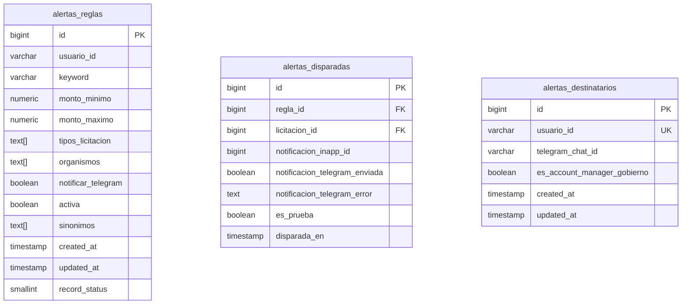

# API Specification: Alertas

> Módulo `MPM.Modules.Alertas` — reglas de alerta por keyword con expansión
> semántica vía IA (Gemini/Qwen), matching diario y entrega multicanal
> (in-app, Telegram, email). Tablas base: V079 (alertas_reglas, alertas_disparadas,
> alertas_destinatarios), V096/V099 (canales Telegram/email), V117 (broadcast admin).

## 1. Scope

### Included
- CRUD de reglas de alerta: keyword, montos min/max, tipos de licitación, organismos
- Expansión automática de keyword a sinónimos/conceptos vía IA (`SinonimosIaService`)
- Matching periódico de licitaciones contra reglas activas (background service)
- Registro de disparos (`alertas_disparadas`) y notificación in-app
- Configuración de canales personales: Telegram (chat id o link de inicio) y email
- Prueba de una regla (`POST /{id}/probar`) y webhook de Telegram
- Cuenta el flag `es_account_manager_gobierno` para elegir destinatarios de
  alertas de cuentas de gobierno (ver módulo Administración)

### Excluded
- Canal WhatsApp / SMS (futuro)
- Priorización de reglas (todas las activas se evalúan)
- Dashboard de métricas de alertas (futuro)

## 2. Data Model

## 3. Endpoints — `[Authorize]` (usuario autenticado)

| Método | Ruta | Descripción |
|--------|------|-------------|
| GET | `/api/v1/alertas` | Lista las reglas del usuario |
| POST | `/api/v1/alertas` | Crea regla (expande keyword a sinónimos vía IA) |
| PUT | `/api/v1/alertas/{id}` | Actualiza regla (re-expande si cambia keyword) |
| DELETE | `/api/v1/alertas/{id}` | Elimina regla (soft delete) |
| POST | `/api/v1/alertas/mi-telegram` | Guarda `telegram_chat_id` del usuario |
| POST | `/api/v1/alertas/mi-email` | Guarda email de alertas del usuario (auto-crea destinatario) |
| POST | `/api/v1/alertas/mi-telegram/link` | Genera link de inicio para el bot de Telegram |
| GET | `/api/v1/alertas/{id}/historial` | Historial de disparos de la regla |
| POST | `/api/v1/alertas/{id}/probar` | Dispara una notificación de prueba |

Público (validado por token del bot):
| Método | Ruta | Descripción |
|--------|------|-------------|
| POST | `/api/v1/telegram/webhook` | Webhook de Telegram (comandos del bot) |

## 4. Reglas de negocio

- La keyword se normaliza (minúsculas, trim) antes de guardar.
- La expansión de sinónimos llama al proveedor de IA activo (resuelto por
  `LlmClientResolver`); si falla, la regla queda con la keyword literal.
- El matching corre como background service y sobre nuevas licitaciones;
  `UNIQUE (regla_id, licitacion_id)` evita disparos duplicados.
- Una prueba (`/probar`) marca `es_prueba = TRUE` y entrega por los canales
  configurados sin afectar el histórico real.
- Los destinatarios de gobierno se obtienen de `alertas_destinatarios` con
  `es_account_manager_gobierno = TRUE`.

## 5. Códigos de error

| Mensaje | Causa |
|---------|-------|
| `La keyword es requerida` | Keyword vacía |
| `INVALID_MONTO` | Monto mínimo > máximo |
| `Regla no encontrada` | id inexistente o borrada |
| `Chat de Telegram no configurado` | No hay `telegram_chat_id` para probar |
