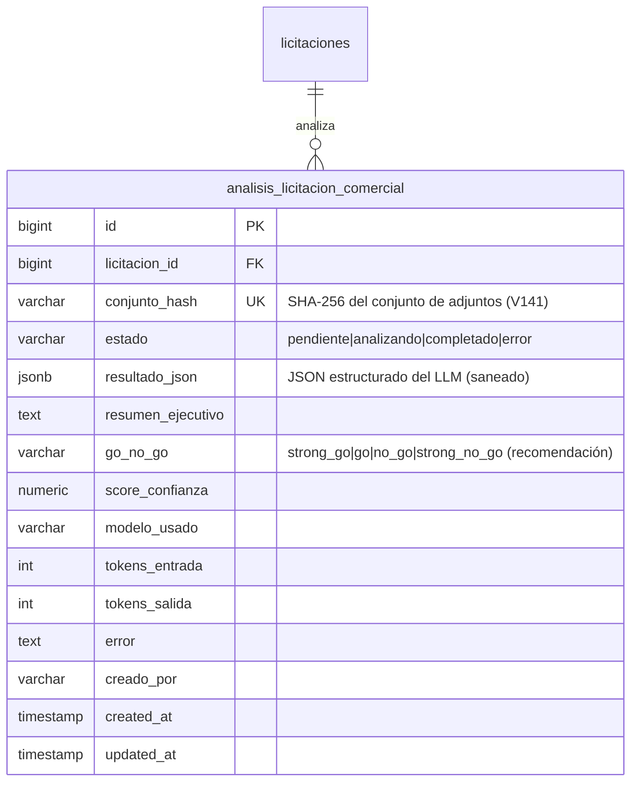

# API Spec — Análisis Comercial con IA (ANC)

**Versión**: 1.0
**Módulo**: Licitaciones — Análisis Comercial (zona IA on-demand)
**Generado por**: api-first-spec
**Fecha**: 2026-08-16
**Rama**: `036-flujo-comercial-ofertas`
**Diseño origen**: [docs/design/flujo-ofertas.md](../design/flujo-ofertas.md) (Fase 1.3)

---

## 1. Scope

### Included
- Análisis de los documentos descargados de una licitación (V141) con el proveedor IA
  activo de MPM (`LlmClientResolver`: gcloud/Qwen), bajo demanda (botón "Analizar con IA").
- Resultado estructurado: identificación, montos/duración, fechas clave, criterios de
  evaluación, requisitos (administrativos/técnicos), alcance, condiciones, riesgos,
  match TIVIT preliminar, estimación orientativa y recomendación GO/NO GO.
- **Cache por `conjuntoHash`** (V142): si la misma versión de documentos ya fue analizada,
  se devuelve el resultado **sin re-pagar IA** (clave de ahorro).
- Procesamiento asíncrono con polling (el LLM tarda); estado persistido.

### Excluded
- Match con Census (skills/certificaciones de personal TIVIT): Fase 2.
- Chat conversacional sobre el análisis comercial: backlog (el chat existente es de actas).
- Generación de propuesta (PRJ-001): Fase 3.
- Documentos no-PDF (xlsx/docx): no se envían al LLM (Gemini los rechaza como parte PDF —
  "The document has no pages", verificado en vivo 2026-08-16).

---

## 2. Data Model



### Tabla: analisis_licitacion_comercial (V142)

| Column | Type | Nullable | Default | Description |
|--------|------|----------|---------|-------------|
| id | BIGSERIAL | NO | — | PK |
| licitacion_id | BIGINT | NO | — | FK → licitaciones(id) |
| conjunto_hash | VARCHAR(64) | NO | — | UK con licitacion_id — clave del cache |
| estado | VARCHAR(20) | NO | 'pendiente' | `pendiente\|analizando\|completado\|error` |
| resultado_json | JSONB | YES | NULL | JSON del LLM validado en C# |
| resumen_ejecutivo | TEXT | YES | NULL | Extraído del JSON (top-level) |
| go_no_go | VARCHAR(20) | YES | NULL | Recomendación (la decisión final es humana) |
| score_confianza | NUMERIC(4,3) | YES | NULL | 0-1 |
| modelo_usado | VARCHAR(100) | YES | NULL | Modelo que ejecutó (ej. gemini-2.5-pro) |
| tokens_entrada/salida | INT | YES | NULL | Para costo real |
| error | TEXT | YES | NULL | Motivo si estado=error |
| creado_por | VARCHAR(200) | YES | NULL | Email del usuario |

---

## 3. Required Catalogs

Ninguno (los valores de go_no_go son application-level).

---

## 4. State Flow

| From → To | Action | Allowed by |
|-----------|--------|------------|
| pendiente → analizando | `POST /analisis-comercial` | Usuario autenticado |
| analizando → completado | Procesamiento LLM | Sistema |
| analizando → error | Procesamiento LLM (fallo/timeout) | Sistema |
| error → analizando | `POST /analisis-comercial` (reintento) | Usuario autenticado |
| completado → completado (sin re-pago) | `POST` con mismo conjuntoHash | Sistema (cache hit) |

Reglas:
- Una corrida por licitación a la vez (guard in-process + estado persistido con stale >10 min).
- **Timeout de 10 min** en la llamada al LLM (el SDK de Google no respeta el timeout del
  HttpClient del DI — sin esto una llamada puede quedar colgada en 'analizando' para siempre).

---

## 5. REST Endpoints — `[Authorize]`

### GET /api/v1/licitaciones/{codigoExterno}/analisis-comercial — Estado + resultado

**Response (200)**:
```json
{
  "data": {
    "estado": "completado",
    "error": null,
    "conjuntoHash": "585a8f3c...",
    "desactualizado": false,
    "resumenEjecutivo": "Metro S.A. licita el suministro de bienes...",
    "goNoGo": "strong_no_go",
    "scoreConfianza": 1.0,
    "modeloUsado": "gemini-2.5-pro",
    "tokensEntrada": 12128,
    "tokensSalida": 2526,
    "creadoPor": "admin@tivit.cl",
    "createdAt": "...",
    "updatedAt": "...",
    "resultado": { "identificacion": { ... }, "riesgos": [ ... ] }
  }
}
```
- `desactualizado=true` cuando el conjuntoHash actual difiere del analizado.
- `estado=analizando` → el frontend hace polling cada 3s.

**DB Object**: `usp_AnalisisComercial_ObtenerUltimo` + `usp_Adjuntos_ListarPorLicitacion` (hash actual).
**Error Codes**: `LIC_001`.

### POST /api/v1/licitaciones/{codigoExterno}/analisis-comercial — Inicia el análisis

**Response (202)** (nuevo análisis) o **(200)** (cache hit):
```json
{ "data": { "estado": "analizando|completado", "cacheHit": false|true, "conjuntoHash": "..." } }
```

**DB Objects**: `usp_AnalisisComercial_Iniciar` + `usp_AnalisisComercial_Completar`.
**Rules**:
- `ANC_001` si no hay documentos descargados o faltan hashes (re-descargar primero).
- `ANC_002` (409) si ya hay un análisis en curso.
- Cache hit: misma versión analizada → 200 sin llamar al LLM.
- Solo se envían al LLM los documentos **PDF** (los anexos xlsx/docx se excluyen).
**Error Codes**: `LIC_001`, `ANC_001`, `ANC_002`, `ANC_003`, `AUTH_001`.

---

## 6. Database Objects

| Endpoint | DB Object | Type |
|----------|-----------|------|
| GET ... | `usp_AnalisisComercial_ObtenerUltimo` | Function (V142) |
| POST ... (inicio) | `usp_AnalisisComercial_Iniciar` | Procedure (V142) |
| POST ... (fin) | `usp_AnalisisComercial_Completar` | Procedure (V142) |

**Migración**: `V142__Analisis_Comercial.sql`.

---

## 7. Shared DTOs

```json
{
  "AnalisisComercialEstadoDto": {
    "estado": "string", "error": "string?", "conjuntoHash": "string?",
    "desactualizado": "bool", "resumenEjecutivo": "string?", "goNoGo": "string?",
    "scoreConfianza": "decimal?", "modeloUsado": "string?", "tokensEntrada": "int?",
    "tokensSalida": "int?", "creadoPor": "string?", "createdAt": "datetime?",
    "updatedAt": "datetime?", "resultado": "JsonElement?"
  },
  "IniciarAnalisisComercialResultDto": {
    "estado": "string", "cacheHit": "bool", "conjuntoHash": "string?"
  }
}
```

---

## 8. Business Rules

- `ANC-R001`: la recomendación GO/NO GO es de la IA — **la decisión final es humana**.
- `ANC-R002`: cache por `conjuntoHash` — misma versión ⇒ sin re-pago de IA.
- `ANC-R003`: solo PDFs al LLM (xlsx/docx excluidos).
- `ANC-R004`: timeout de 10 min en la llamada al LLM (marca `error` con mensaje accionable).
- `ANC-R005`: `desactualizado=true` si los documentos cambiaron desde el último análisis.
- `ANC-R006`: el resultado JSON se valida en C# (JsonDocument.Parse + saneo \0 + array→objeto) antes de persistir.
- `ANC-R007`: el proveedor IA es el activo de MPM (`LlmClientResolver`, BD > env > default) — sin cambio de configuración al usar el switch del SuperAdmin.
- `ANC-R008`: el procesamiento corre en **scope propio** (el servicio es scoped; el provider del request se dispondría).

## 9. Error Codes

| Code | HTTP | Description | When |
|------|------|-------------|------|
| LIC_001 | 404 | Licitación no encontrada | Código inexistente |
| ANC_001 | 422 | Sin documentos o sin hashes | No hay adjuntos descargados/auditados |
| ANC_002 | 409 | Análisis ya en curso | Doble POST simultáneo |
| ANC_003 | 422 | No se pudo iniciar | Error interno al iniciar |
| VAL_001 | 400 | Campo requerido | Params inválidos |
| AUTH_001 | 401 | No autenticado | Token faltante/expirado |

**Costos reales observados (2026-08-16, licitación 729-134-LE26, 7 PDFs ≈ 8,3 MB):**
12.128 tokens entrada + 2.526 salida ≈ **USD 0,04** con gemini-2.5-pro (~CLP 40).
