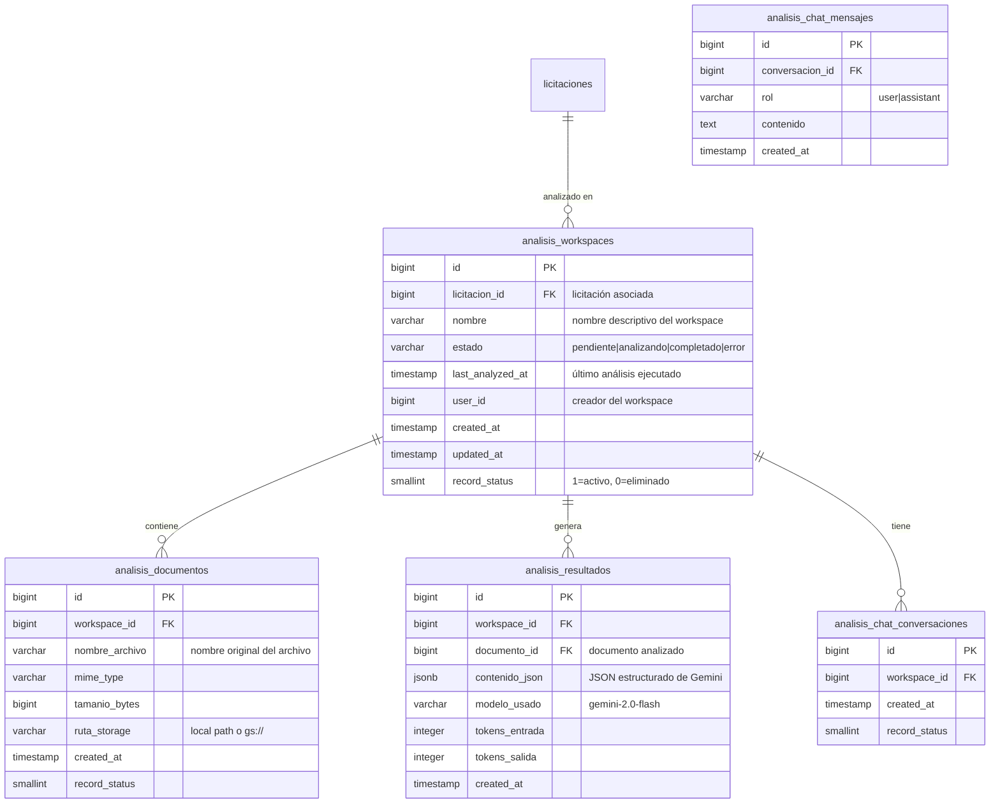
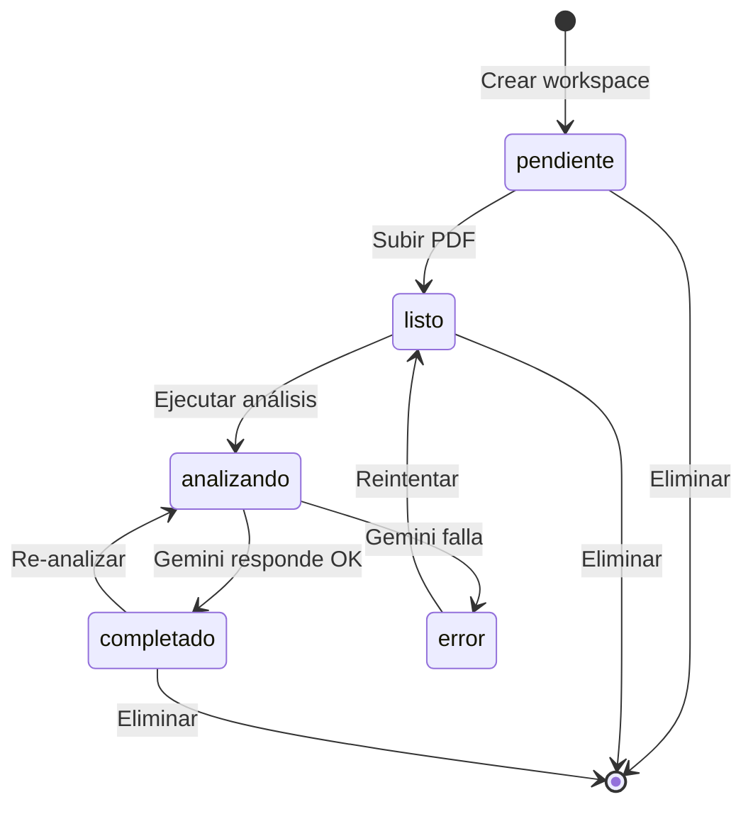

# API Specification: Analisis

## 1. Scope

### Included
- Workspaces de análisis asociados a licitaciones donde TIVIT perdió
- Subida de documentos PDF por workspace (hasta 10MB)
- Análisis automático de PDFs usando Gemini API (Vertex AI)
- Dashboard visual con KPIs, tablas comparativas y conclusiones ejecutivas
- Chat contextual sobre el análisis y contenido del PDF
- Historial de mensajes del chat por workspace
- Almacenamiento de PDFs en Cloud Storage (GCS) o local

### Excluded
- Análisis de otros formatos (DOCX, XLSX) — solo PDF
- Exportación de dashboard a PDF/Excel (futuro)
- Análisis batch de múltiples PDFs simultáneamente
- Notificaciones automáticas al completar análisis
- Edición de análisis generado por IA

## 2. Data Model



### Column Details

#### analisis_workspaces.estado
| Valor | Significado |
|-------|-------------|
| `pendiente` | Creado, sin documentos aún |
| `listo` | Documentos subidos, listo para analizar |
| `analizando` | Gemini procesando el PDF |
| `completado` | Análisis finalizado |
| `error` | Falló el análisis |

## 3. Required Catalogs

| Catálogo | Fuente | Uso |
|----------|--------|-----|
| `licitaciones` | Tabla existente | Selección de licitación para workspace |
| `analisis_workspaces.estado` | Hardcoded | Estados del workspace |

## 4. State Flow



## 5. REST Endpoints

### 5.1 Workspaces

#### POST /api/v1/analisis/workspaces
Crear un nuevo workspace de análisis.

**Request:**
```json
{
    "licitacionId": 1,
    "nombre": "Análisis Licitación XXX"
}
```

**Response (201):**
```json
{
    "success": true,
    "data": {
        "id": 1,
        "licitacionId": 1,
        "licitacionNombre": "Nombre de la licitación",
        "nombre": "Análisis Licitación XXX",
        "estado": "pendiente",
        "documentosCount": 0,
        "createdAt": "2026-06-03T16:00:00Z"
    }
}
```

**Rules:**
- `licitacionId` debe existir en tabla licitaciones
- `nombre` obligatorio, max 200 caracteres

**DB Objects:** `usp_AnalisisWorkspaces_Crear`

---

#### GET /api/v1/analisis/workspaces
Listar workspaces (paginado).

**Query Params:**
| Param | Type | Default | Description |
|-------|------|---------|-------------|
| page | int | 1 | Número de página |
| pageSize | int | 20 | Tamaño de página |
| search | string | - | Búsqueda por nombre |
| estado | string | - | Filtro por estado |

**Response (200):**
```json
{
    "success": true,
    "data": {
        "items": [{ "id": 1, "licitacionId": 1, "nombre": "...", "estado": "completado", ... }],
        "page": 1,
        "pageSize": 20,
        "totalRecords": 5,
        "totalPages": 1
    }
}
```

**DB Objects:** `usp_AnalisisWorkspaces_Listar`

---

#### GET /api/v1/analisis/workspaces/{id}
Obtener detalle de workspace.

**Response (200):**
```json
{
    "success": true,
    "data": {
        "id": 1,
        "licitacionId": 1,
        "licitacionNombre": "...",
        "nombre": "...",
        "estado": "completado",
        "documentosCount": 2,
        "ultimoAnalisis": {
            "id": 1,
            "documentoId": 1,
            "documentoNombre": "resultado.pdf",
            "createdAt": "2026-06-03T16:00:00Z"
        },
        "createdAt": "2026-06-03T15:00:00Z"
    }
}
```

**DB Objects:** `usp_AnalisisWorkspaces_Obtener`

---

#### DELETE /api/v1/analisis/workspaces/{id}
Eliminar workspace (soft delete).

**Response (200):**
```json
{ "success": true, "data": { "result": true } }
```

**DB Objects:** `usp_AnalisisWorkspaces_Eliminar`

---

### 5.2 Documentos

#### POST /api/v1/analisis/workspaces/{id}/documentos
Subir un PDF al workspace.

**Request:** Multipart form-data con campo `archivo`

**Response (201):**
```json
{
    "success": true,
    "data": {
        "id": 1,
        "nombreArchivo": "resultado_licitacion.pdf",
        "mimeType": "application/pdf",
        "tamanioBytes": 245000,
        "createdAt": "2026-06-03T16:00:00Z"
    }
}
```

**Rules:**
- Solo PDF (`application/pdf`)
- Máximo 10MB
- El workspace cambia a estado `listo` si estaba en `pendiente`

**DB Objects:** `usp_AnalisisDocumentos_Crear`, `usp_AnalisisWorkspaces_ActualizarEstado`

---

#### GET /api/v1/analisis/workspaces/{id}/documentos
Listar documentos del workspace.

**Response (200):**
```json
{
    "success": true,
    "data": {
        "items": [{ "id": 1, "nombreArchivo": "...", "mimeType": "...", "tamanioBytes": 245000, "createdAt": "..." }],
        "totalRecords": 2
    }
}
```

**DB Objects:** `usp_AnalisisDocumentos_Listar`

---

### 5.3 Análisis

#### POST /api/v1/analisis/workspaces/{id}/analizar
Ejecutar análisis con Gemini sobre el último documento.

**Request body (opcional):**
```json
{
    "documentoId": 1
}
```
Si no se envía `documentoId`, analiza el último documento subido.

**Response (200):**
```json
{
    "success": true,
    "data": {
        "id": 1,
        "estado": "analizando",
        "mensaje": "Análisis iniciado"
    }
}
```

El análisis se ejecuta de forma síncrona (el endpoint espera la respuesta de Gemini).

**Response final (200, al completar):**
```json
{
    "success": true,
    "data": {
        "id": 1,
        "estado": "completado",
        "modeloUsado": "gemini-2.0-flash",
        "tokensEntrada": 15000,
        "tokensSalida": 2000,
        "createdAt": "2026-06-03T16:05:00Z"
    }
}
```

**Rules:**
- Debe existir al menos un documento en el workspace
- El documento debe ser PDF
- El endpoint es síncrono (puede tomar 10-30s)
- Los resultados se cachean; re-ejecutar reemplaza el resultado anterior

**DB Objects:** `usp_AnalisisResultados_Crear`, `usp_AnalisisResultados_ObtenerPorWorkspace`

---

#### GET /api/v1/analisis/workspaces/{id}/dashboard
Obtener el dashboard del análisis más reciente.

**Response (200):**
```json
{
    "success": true,
    "data": {
        "analisisId": 1,
        "licitacion": {
            "nombre": "...",
            "codigo": "...",
            "organismo": "...",
            "adjudicatario": { "nombre": "...", "montoAdjudicado": 0 }
        },
        "participacionTivit": {
            "montoOfertado": 0,
            "puntajeTotal": 0,
            "puntajeMaximo": 0
        },
        "analisisPerdida": {
            "motivoPrincipal": "...",
            "factores": [],
            "fortalezasTivit": [],
            "debilidadesTivit": [],
            "comparativaPuntajes": []
        },
        "conclusionEjecutiva": {
            "resumen": "...",
            "leccionesAprendidas": [],
            "recomendaciones": []
        },
        "dashboardKpis": [],
        "metricasClave": {}
    }
}
```

**Error codes:**
| Code | Message | HTTP |
|------|---------|------|
| `ANA_001` | Workspace sin análisis completado | 404 |

**DB Objects:** `usp_AnalisisResultados_ObtenerPorWorkspace`

---

### 5.4 Chat

#### POST /api/v1/analisis/workspaces/{id}/chat
Enviar mensaje al chat contextual del análisis.

**Request:**
```json
{
    "mensaje": "¿Cuál fue el principal factor por el que perdimos?"
}
```

**Response (200):**
```json
{
    "success": true,
    "data": {
        "respuesta": "Según el análisis, el principal factor fue la brecha económica...",
        "conversacionId": 1,
        "mensajes": [
            { "rol": "user", "contenido": "¿Cuál fue el principal factor?", "createdAt": "..." },
            { "rol": "assistant", "contenido": "Según el análisis...", "createdAt": "..." }
        ]
    }
}
```

**Rules:**
- Debe existir un análisis completado
- El contexto incluye el JSON del análisis + historial del chat
- La conversación se crea automáticamente si no existe
- Máximo 50 mensajes en contexto (ventana deslizante)

**DB Objects:** `usp_AnalisisChat_EnviarMensaje`, `usp_AnalisisChat_ObtenerHistorial`

---

#### GET /api/v1/analisis/workspaces/{id}/chat
Obtener historial del chat.

**Response (200):**
```json
{
    "success": true,
    "data": {
        "conversacionId": 1,
        "mensajes": [
            { "rol": "user", "contenido": "...", "createdAt": "..." },
            { "rol": "assistant", "contenido": "...", "createdAt": "..." }
        ]
    }
}
```

**DB Objects:** `usp_AnalisisChat_ObtenerHistorial`

---

## 6. Database Objects (Endpoint → SP mapping)

| Endpoint | SP/Query |
|----------|----------|
| POST /workspaces | `usp_AnalisisWorkspaces_Crear` |
| GET /workspaces | `usp_AnalisisWorkspaces_Listar` |
| GET /workspaces/{id} | `usp_AnalisisWorkspaces_Obtener` |
| DELETE /workspaces/{id} | `usp_AnalisisWorkspaces_Eliminar` |
| POST /workspaces/{id}/documentos | `usp_AnalisisDocumentos_Crear` |
| GET /workspaces/{id}/documentos | `usp_AnalisisDocumentos_Listar` |
| POST /workspaces/{id}/analizar | `usp_AnalisisResultados_Crear`, `usp_AnalisisWorkspaces_ActualizarEstado` |
| GET /workspaces/{id}/dashboard | `usp_AnalisisResultados_ObtenerPorWorkspace` |
| POST /workspaces/{id}/chat | `usp_AnalisisChat_EnviarMensaje`, `usp_AnalisisChat_ObtenerHistorial` |
| GET /workspaces/{id}/chat | `usp_AnalisisChat_ObtenerHistorial` |
| - | `usp_AnalisisChat_CrearConversacion` |

## 7. Shared DTOs

### PaginatedResult\<T\>
```json
{
    "items": [],
    "page": 1,
    "pageSize": 20,
    "totalRecords": 0,
    "totalPages": 0
}
```

### ErrorDetail
```json
{
    "code": "VAL_001",
    "field": "nombre",
    "message": "nombre es requerido"
}
```

## 8. Business Rules

### Validación
| Rule | Código | Descripción |
|------|--------|-------------|
| R01 | VAL_001 | `nombre` requerido al crear workspace |
| R02 | VAL_002 | `nombre` max 200 caracteres |
| R03 | VAL_003 | `archivo` requerido al subir documento |
| R04 | VAL_004 | Solo PDF permitido |
| R05 | VAL_005 | Archivo max 10MB |
| R06 | VAL_006 | `licitacionId` debe existir |

### Workspace
| Rule | Código | Descripción |
|------|--------|-------------|
| R10 | ANA_001 | Workspace no encontrado |
| R11 | ANA_002 | El workspace ya tiene un análisis completado (usar `re-analizar`) |
| R12 | ANA_003 | No hay documentos para analizar |
| R13 | ANA_004 | No hay análisis completado para el dashboard |
| R14 | ANA_005 | No se puede eliminar workspace con análisis en progreso |

## 9. Error Codes

| Code | Message | HTTP | When |
|------|---------|------|------|
| VAL_001 | {campo} es requerido | 400 | Validación de campos obligatorios |
| VAL_002 | {campo} excede el largo máximo de {n} caracteres | 400 | Longitud excedida |
| VAL_003 | archivo es requerido | 400 | Sin archivo en upload |
| VAL_004 | Solo se permiten archivos PDF | 400 | Formato incorrecto |
| VAL_005 | archivo excede el tamaño máximo de 10MB | 400 | Archivo muy grande |
| VAL_006 | licitacionId no encontrado | 404 | Licitación inexistente |
| ANA_001 | Workspace no encontrado | 404 | ID inválido |
| ANA_002 | El workspace ya tiene un análisis en progreso | 422 | Estado actual es `analizando` |
| ANA_003 | No hay documentos para analizar en este workspace | 422 | Sin documentos subidos |
| ANA_004 | No hay análisis completado para este workspace | 404 | Dashboard sin datos |
| ANA_005 | No se puede eliminar un workspace con análisis en progreso | 422 | Estado actual es `analizando` |
| GEM_001 | Error al comunicarse con Gemini API | 502 | Timeout o fallo de red |
| GEM_002 | La respuesta de Gemini no es válida | 500 | JSON mal formado |
| SYS_001 | Error interno del servidor | 500 | Error inesperado |
