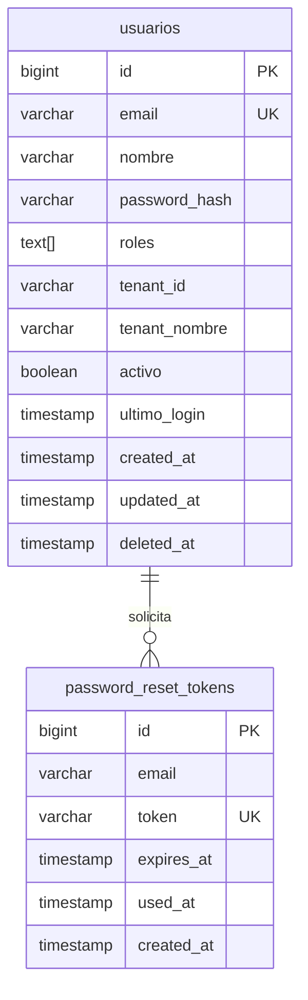

# API Specification: Auth

## 1. Scope

### Included
- Login con credenciales email/password usando bcrypt
- Generación y validación de tokens JWT (HS256, 8 horas de expiración)
- Recuperación de contraseña con token temporal (1 hora de expiración)
- Validación de token de recuperación
- Restablecimiento de contraseña con tokens de un solo uso
- Hash de contraseñas con bcrypt (pgcrypto, factor 11)
- "Recordarme" persistiendo email en localStorage
- Soporte multi-tenant con tenant_id y tenant_nombre en el token
- Invalidación automática de tokens anteriores al solicitar nuevo reset
- Envío de email de recuperación (SMTP o log en desarrollo)
- Seguridad: no revelar existencia de email (same response forgot-password)

### Excluded
- Registro público de usuarios (el alta la hace un Admin/SuperAdmin — ver [admin.md](admin.md))
- Refresh tokens (la sesión dura 8 horas)
- OAuth2/OIDC con proveedores externos (Google, Microsoft)
- Two-factor authentication (2FA)
- Gestión de roles y permisos CRUD (implementado parcialmente en el Centro de
  Administración — ver [admin.md](admin.md))
- Auditoría de sesiones/login history (escritura en `auth_eventos`; consulta en
  el Centro de Administración — ver [admin.md](admin.md))

## 2. Data Model



### Tabla: `usuarios`

| Columna | Tipo | Restricción | Descripción |
|---------|------|------------|-------------|
| `id` | `BIGSERIAL` | PK | Identificador único |
| `email` | `VARCHAR(255)` | NOT NULL, UNIQUE | Email del usuario (login) |
| `nombre` | `VARCHAR(200)` | NOT NULL | Nombre completo |
| `password_hash` | `VARCHAR(255)` | NOT NULL | Hash bcrypt |
| `roles` | `TEXT[]` | NOT NULL, DEFAULT '{}' | Array de roles |
| `tenant_id` | `VARCHAR(100)` | | ID del tenant |
| `tenant_nombre` | `VARCHAR(200)` | | Nombre del tenant |
| `activo` | `BOOLEAN` | NOT NULL, DEFAULT true | Usuario activo/inactivo |
| `ultimo_login` | `TIMESTAMP` | NULL | Último login exitoso |
| `created_at` | `TIMESTAMP` | DEFAULT NOW | Fecha creación |
| `updated_at` | `TIMESTAMP` | DEFAULT NOW | Fecha actualización (trigger) |
| `deleted_at` | `TIMESTAMP` | NULL | Soft delete |

### Tabla: `password_reset_tokens`

| Columna | Tipo | Restricción | Descripción |
|---------|------|------------|-------------|
| `id` | `BIGSERIAL` | PK | Identificador único |
| `email` | `VARCHAR(255)` | NOT NULL | Email del usuario |
| `token` | `VARCHAR(255)` | NOT NULL, UNIQUE | Token UUID sin guiones |
| `expires_at` | `TIMESTAMP` | NOT NULL | Expiración (1 hora) |
| `used_at` | `TIMESTAMP` | NULL | Cuándo se usó (null = pendiente) |
| `created_at` | `TIMESTAMP` | DEFAULT NOW | Fecha creación |

### Datos Semilla: `usuarios`

| email | nombre | password | roles | tenant_id | tenant_nombre |
|-------|--------|----------|------|-----------|---------------|
| admin@tivit.cl | Admin TIVIT | test123 (bcrypt) | SuperAdmin | tenant-001 | TIVIT Chile |
| analista@tivit.cl | Analista TIVIT | test123 (bcrypt) | Analista | tenant-001 | TIVIT Chile |

## 3. State Flow

### Login

```
Email+Password → ValidarUsuario(EMAIL, PASS) → 
  ├─ Éxito: JWT(token, user, roles, tenant) → 200
  └─ Fallo: 401 "Credenciales inválidas"
```

### Password Reset

```
ForgotPassword(EMAIL) → 
  Invalidar tokens previos → Generar nuevo token → 
  Enviar email con link /reset-password/{TOKEN} → 
  200 (siempre éxito, sin revelar existencia)

ValidateResetToken(TOKEN) →
  ├─ Token válido y no expirado → 200 {valid: true}
  ├─ Token usado → 400 "Ya ha sido utilizado"  
  ├─ Token expirado → 400 "Ha expirado"
  └─ Token no existe → 400 "Token inválido"

ResetPassword(TOKEN, NEW_PASSWORD) →
  Validar token → Actualizar password_hash → Marcar token usado → 
  200 "Contraseña restablecida exitosamente"
```

## 4. REST Endpoints

### `POST /api/v1/auth/login` — Iniciar sesión

**Request:**

```json
{
  "email": "admin@tivit.cl",
  "password": "test123"
}
```

**Response `200`:**

```json
{
  "success": true,
  "data": {
    "token": "eyJhbGciOiJIUzI1NiIs...",
    "expiresAt": "2026-05-31T22:00:00Z",
    "user": {
      "userId": "1",
      "nombre": "Admin TIVIT",
      "email": "admin@tivit.cl",
      "roles": ["SuperAdmin"],
      "tenantId": "tenant-001",
      "tenantNombre": "TIVIT Chile"
    }
  }
}
```

**Errors:**

| Code | HTTP | Message | When |
|------|------|---------|------|
| `VAL_001` | 400 | Email y contraseña son requeridos | Campos vacíos |
| `AUTH_001` | 401 | Credenciales inválidas | Email o password incorrecto |
| `AUTH_002` | 401 | Usuario desactivado | Usuario inactivo |

### `POST /api/v1/auth/forgot-password` — Solicitar recuperación

**Request:**

```json
{
  "email": "admin@tivit.cl"
}
```

**Response `200` (siempre éxito por seguridad):**

```json
{
  "success": true,
  "data": {
    "message": "Si el email existe, recibirás instrucciones para restablecer tu contraseña"
  }
}
```

### `GET /api/v1/auth/validate-reset-token/{token}` — Validar token

**Response `200`:**

```json
{
  "success": true,
  "data": { "valid": true }
}
```

**Errors:**

| Code | HTTP | Message | When |
|------|------|---------|------|
| `AUTH_003` | 400 | Token inválido | Token no encontrado |
| `AUTH_004` | 400 | Este token ya ha sido utilizado | Token ya consumido |
| `AUTH_005` | 400 | El token ha expirado | Token expirado (1 hora) |

### `POST /api/v1/auth/reset-password` — Restablecer contraseña

**Request:**

```json
{
  "token": "abc123...",
  "newPassword": "nuevaClave456"
}
```

**Response `200`:**

```json
{
  "success": true,
  "data": {
    "message": "Contraseña restablecida exitosamente"
  }
}
```

**Errors:**

| Code | HTTP | Message | When |
|------|------|---------|------|
| `VAL_001` | 400 | Token y nueva contraseña son requeridos | Campos vacíos |
| `VAL_002` | 400 | La contraseña debe tener al menos 6 caracteres | Password < 6 chars |
| `AUTH_003` | 400 | Token inválido | Token no encontrado |
| `AUTH_004` | 400 | Token ya utilizado | Token ya consumido |
| `AUTH_005` | 400 | Token ha expirado | Token expirado |

### `GET /health/auth` — Health check del módulo Auth

**Response `200`:**

```json
{
  "status": "healthy",
  "module": "auth",
  "totalUsers": 2,
  "timestamp": "2026-05-31T10:00:00Z"
}
```

## 5. Database Objects

| Endpoint | SP/Query | Tipo |
|----------|----------|------|
| `POST /auth/login` | `usp_Auth_ValidarUsuario` | Procedure |
| `POST /auth/forgot-password` | `usp_Auth_ForgotPassword` | Procedure |
| `GET /auth/validate-reset-token/{token}` | Query directa `password_reset_tokens` | Query |
| `POST /auth/reset-password` | `usp_Auth_ActualizarPassword` | Procedure |
| `GET /health/auth` | `SELECT COUNT(*) FROM usuarios WHERE deleted_at IS NULL` | Query |

## 6. Business Rules

| ID | Rule | Category |
|----|------|----------|
| `AUTH_001` | Las contraseñas se hashean con bcrypt (factor 11) usando pgcrypto | Seguridad |
| `AUTH_002` | El token JWT expira en 8 horas | Seguridad |
| `AUTH_003` | Los tokens de reset expiran en 1 hora | Seguridad |
| `AUTH_004` | Al solicitar un nuevo reset, se invalidan los tokens anteriores del mismo email | Seguridad |
| `AUTH_005` | El endpoint forgot-password siempre retorna éxito (no enumera usuarios) | Seguridad |
| `AUTH_006` | El último login se actualiza en cada autenticación exitosa | Auditoría |
| `AUTH_007` | Los usuarios con `activo = false` no pueden autenticarse | Autorización |
| `AUTH_008` | Soft delete: `deleted_at` excluye usuarios eliminados de queries | Integridad |
| `AUTH_009` | Mínimo 6 caracteres para contraseñas | Validación |
| `AUTH_010` | En desarrollo, el token de reset se loguea en vez de enviar por email | Desarrollo |

## 7. Error Codes

| Code | HTTP | Message | When |
|------|------|---------|------|
| `VAL_001` | 400 | Email y contraseña son requeridos | Campos vacíos en login |
| `VAL_002` | 400 | La contraseña debe tener al menos 6 caracteres | Password < 6 chars |
| `AUTH_001` | 401 | Credenciales inválidas | Email o password incorrecto |
| `AUTH_002` | 401 | Usuario desactivado | Usuario inactivo |
| `AUTH_003` | 400 | Token inválido | Token no encontrado |
| `AUTH_004` | 400 | Este token ya ha sido utilizado | Token consumido |
| `AUTH_005` | 400 | El token ha expirado | Token > 1 hora |
| `AUTH_006` | 400 | Usuario no encontrado | En reset password |
| `SYS_001` | 500 | Error interno del servidor | Error no manejado |