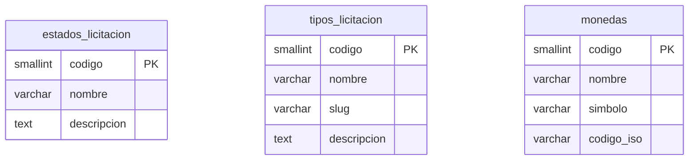

# API Specification: Catalogo

## 1. Scope

### Included
- Catálogos maestros reutilizables por todos los módulos del sistema
- Endpoint único consolidado que retorna todos los catálogos en una sola llamada
- Endpoints individuales por catálogo para uso selectivo
- Consulta de estados de licitación (usado por el módulo de Licitaciones)
- Consulta de tipos de licitación
- Consulta de monedas disponibles
- Datos semilla precargados en migraciones

### Excluded
- CRUD de mantenimiento de catálogos (admin) — fase futura
- Catálogos dinámicos configurables por tenant
- Carga masiva de catálogos vía archivo
- Catálogos de organismos (se obtienen dinámicamente desde datos de licitaciones)

## 2. Data Model



### Tabla: `estados_licitacion`

| Columna | Tipo | Restricción | Descripción |
|---------|------|------------|-------------|
| `codigo` | `SMALLINT` | PK | Código numérico del estado |
| `nombre` | `VARCHAR(50)` | NOT NULL | Nombre del estado |
| `descripcion` | `TEXT` | | Descripción opcional del estado |

### Tabla: `tipos_licitacion`

| Columna | Tipo | Restricción | Descripción |
|---------|------|------------|-------------|
| `codigo` | `SMALLINT` | PK | Código numérico del tipo |
| `nombre` | `VARCHAR(50)` | NOT NULL | Nombre legible del tipo |
| `slug` | `VARCHAR(30)` | NOT NULL, UNIQUE | Identificador URL-friendly para filtros |
| `descripcion` | `TEXT` | | Descripción opcional del tipo |

### Tabla: `monedas`

| Columna | Tipo | Restricción | Descripción |
|---------|------|------------|-------------|
| `codigo` | `SMALLINT` | PK | Código numérico de la moneda |
| `nombre` | `VARCHAR(50)` | NOT NULL | Nombre de la moneda |
| `simbolo` | `VARCHAR(5)` | NOT NULL | Símbolo ($, €, US$) para UI |
| `codigo_iso` | `VARCHAR(3)` | NOT NULL, UNIQUE | Código ISO 4217 (CLP, USD, EUR) |

### Datos Semilla: `estados_licitacion`

| codigo | nombre | descripcion |
|--------|--------|-------------|
| 1 | Publicada | Licitación publicada y en plazo de recepción |
| 2 | Modificada | Licitación modificada durante el proceso |
| 3 | Desierta | Sin oferentes o declarada desierta |
| 4 | Revocada | Revocada por el organismo |
| 5 | Adjudicada | Adjudicada a un proveedor |
| 6 | Cerrada | Proceso cerrado |
| 7 | Con Adjuntos | Requiere revisión de adjuntos |
| 8 | En Espera | Pendiente de evaluación |

### Datos Semilla: `tipos_licitacion`

| codigo | nombre | slug | descripcion |
|--------|--------|------|-------------|
| 1 | Licitación Pública | Licitacion | Proceso de compra pública completo |
| 2 | Trato Directo | TratoDirecto | Contratación directa con proveedor |
| 3 | Convenio Marco | ConvenioMarco | Acuerdo marco con proveedores |
| 4 | Compra Ágil | CompraAgil | Proceso simplificado de compra |

### Datos Semilla: `monedas`

| codigo | nombre | simbolo | codigo_iso |
|--------|--------|---------|------------|
| 1 | Peso Chileno | $ | CLP |
| 2 | Dólar Estadounidense | US$ | USD |
| 3 | Euro | € | EUR |

## 3. REST Endpoints

### `GET /api/v1/catalogos` — Obtener todos los catálogos

Retorna todos los catálogos en una sola llamada para inicializar la UI.

**Response `200`:**

```json
{
  "success": true,
  "data": {
    "estadosLicitacion": [
      { "codigo": 1, "nombre": "Publicada" },
      { "codigo": 2, "nombre": "Modificada" }
    ],
    "tiposLicitacion": [
      { "codigo": 1, "nombre": "Licitación Pública", "slug": "Licitacion" },
      { "codigo": 2, "nombre": "Trato Directo", "slug": "TratoDirecto" }
    ],
    "monedas": [
      { "codigo": 1, "nombre": "Peso Chileno", "simbolo": "$", "codigoIso": "CLP" },
      { "codigo": 2, "nombre": "Dólar Estadounidense", "simbolo": "US$", "codigoIso": "USD" }
    ]
  }
}
```

### `GET /api/v1/catalogos/estados-licitacion` — Obtener estados de licitación

**Response `200`:**

```json
{
  "success": true,
  "data": [
    { "codigo": 1, "nombre": "Publicada" },
    { "codigo": 2, "nombre": "Modificada" }
  ]
}
```

### `GET /api/v1/catalogos/tipos-licitacion` — Obtener tipos de licitación

**Response `200`:**

```json
{
  "success": true,
  "data": [
    { "codigo": 1, "nombre": "Licitación Pública", "slug": "Licitacion" },
    { "codigo": 2, "nombre": "Trato Directo", "slug": "TratoDirecto" },
    { "codigo": 3, "nombre": "Convenio Marco", "slug": "ConvenioMarco" },
    { "codigo": 4, "nombre": "Compra Ágil", "slug": "ComparaAgil" }
  ]
}
```

### `GET /api/v1/catalogos/monedas` — Obtener monedas

**Response `200`:**

```json
{
  "success": true,
  "data": [
    { "codigo": 1, "nombre": "Peso Chileno", "simbolo": "$", "codigoIso": "CLP" },
    { "codigo": 2, "nombre": "Dólar Estadounidense", "simbolo": "US$", "codigoIso": "USD" },
    { "codigo": 3, "nombre": "Euro", "simbolo": "€", "codigoIso": "EUR" }
  ]
}
```

## 4. Database Objects

| Endpoint | Query/Function | Description |
|----------|---------------|-------------|
| `GET /catalogos` | Multiple queries: `usp_Catalogos_EstadosLicitacion()`, `usp_Catalogos_TiposLicitacion()`, `usp_Catalogos_Monedas()` | Consolidado |
| `GET /catalogos/estados-licitacion` | `usp_Catalogos_EstadosLicitacion()` | Ya existe (V037) |
| `GET /catalogos/tipos-licitacion` | `usp_Catalogos_TiposLicitacion()` | Nuevo |
| `GET /catalogos/monedas` | `usp_Catalogos_Monedas()` | Nuevo |

## 5. Shared DTOs

### EstadoItem

```json
{
  "codigo": 1,
  "nombre": "Publicada"
}
```

### TipoLicitacionItem

```json
{
  "codigo": 1,
  "nombre": "Licitación Pública",
  "slug": "Licitacion"
}
```

### MonedaItem

```json
{
  "codigo": 1,
  "nombre": "Peso Chileno",
  "simbolo": "$",
  "codigoIso": "CLP"
}
```

### CatalogosResponse (endpoint consolidado)

```json
{
  "estadosLicitacion": [EstadoItem],
  "tiposLicitacion": [TipoLicitacionItem],
  "monedas": [MonedaItem]
}
```

## 6. Business Rules

| ID | Rule | Category |
|----|------|----------|
| `BUS_CAT_001` | Los catálogos son de solo lectura (GET) | Consulta |
| `BUS_CAT_002` | Los datos semilla se cargan en migraciones | Integridad |
| `BUS_CAT_003` | Los códigos de catálogo no se reutilizan ni reasignan | Estabilidad |
| `BUS_CAT_004` | El endpoint consolidado `/catalogos` cachea resultados por 5 minutos en el cliente | Performance |
| `BUS_CAT_005` | Los slugs de tipo licitación coinciden con los valores del campo `tipo` en la tabla `licitaciones` | Consistencia |

## 7. Error Codes

| Code | HTTP | Message | When |
|------|------|---------|------|
| `SYS_001` | 500 | Error interno del servidor | Error no manejado |