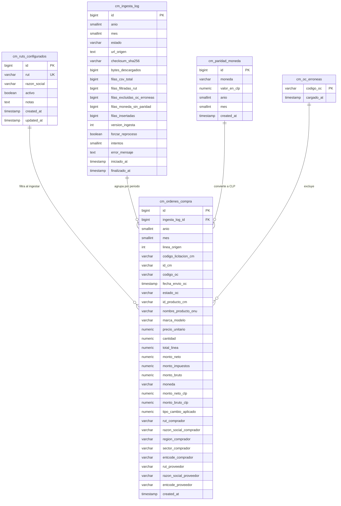

# API Spec — Ingesta Datos Abiertos ChileCompra / Convenios Marco (ING)

**Versión**: 1.0 (TRACK 2 — diseño, sin código de producción)
**Módulo**: Ingesta Datos Abiertos (planillas Convenios Marco)
**Generado por**: api-first-spec (agente DESIGN)
**Fecha**: 2026-08-20
**Origen**: [sprint2-plan.md](sprint2-plan.md) (MPM-S2-001/003, retomado y pivotado) · brecha reportada por cliente: dashboard dice $1.340M vs realidad ~$2.500M (falta Convenios Marco)

> **PIVOTE DE FUENTE (2026-08-20)**: el borrador `sprint2-plan.md` planteaba consumir la API
> `mserv-datos-abiertos.chilecompra.cl/v1`. Tras exploración web verificada, la fuente principal
> pasa a ser las **planillas mensuales CM** (`transparenciachc.blob.core.windows.net/planillas-cm/`),
> que traen el line-item completo (45 columnas) y permiten filtrar por RUT antes de persistir.
> La API mserv queda como fuente futura (Track 3) para resolución RUT↔entcode. Este spec reemplaza
> el modelo `chilecompra_historico` del borrador.

---

## 0. Objetivo de negocio y métrica

Incluir los montos adjudicados vía **Convenios Marco (2016→hoy)** en las estadísticas de
montos ganados del dashboard ejecutivo, cerrando la brecha $1.340M vs ~$2.500M.

### Definición de la métrica ⚠️ HITL-01 (decisión abierta)

| Opción | Fórmula | Pros | Contras |
|--------|---------|------|---------|
| **A (propuesta)** | `SUM(monto_neto_clp)` — neto convertido a CLP con ParidadMoneda | Es la base comparable con cifras oficiales de ChileCompra | Difiere del monto facturado si el cliente piensa en bruto |
| B | `SUM(monto_bruto_clp)` — bruto (neto + impuestos) convertido | Coincide con factura proveedor | No comparable directo con fichas oficiales |

**El modelo guarda AMBOS montos convertidos** (`monto_neto_clp`, `monto_bruto_clp`) para que el
cambio de métrica sea solo configuración, sin re-ingesta. La vista expone ambos.

> **Limitación documentada de la métrica**: una OC es un *compromiso de compra*, no un pago
> efectivo. El monto "ganado" según datos abiertos puede diferir de lo facturado/cobrado. Esta
> limitación debe quedar visible en el tooltip del dashboard (tarea frontend).

---

## 1. Scope

### Included
- Descarga y parseo de las planillas mensuales CM: `https://transparenciachc.blob.core.windows.net/planillas-cm/{anio}-{mes}.zip` (mes **sin** cero inicial; rango válido 2016-1 … mes en curso).
- **Filtro por RUT de proveedor ANTES de persistir**, con lista configurable por admin (seed inicial: TIVIT `76.130.712-6`). Evita almacenar ~7GB ajenos.
- Limpieza con complementos públicos: exclusión de OCs de `hist_OC_erroneas.csv`, conversión a CLP con `ParidadMoneda.csv`.
- Backfill inicial manual 2016→hoy (Cloud Run Job one-shot) + ingesta mensual programada.
- Idempotencia: re-procesar un mes = **replace** (delete+insert transaccional del período).
- Log de ingesta por (año, mes) con checksum, contadores y versión.
- Endpoints admin: estado de ingesta, disparo de reproceso, CRUD de RUTs configurados.
- Integración con estadísticas: vista agregada anual por proveedor consumida por el cálculo de montos ganados.
- Infraestructura compartida diseñada (contratos) para Track 3 (bulk .7z por organismo), **sin implementar**.

### Excluded
- Predicción y análisis de compradores (Track 3 posterior). Las tablas/índices sí quedan preparadas (`rut_comprador`, `rut_proveedor`).
- Descarga masiva por organismo (`chc-lic-files` / `chc-oc-files` .7z) — Track 3.
- Resolución RUT↔entcode vía `mserv-datos-abiertos` — Track 3 (contrato documentado en §11).
- Almacenamiento de planillas crudas completas (solo filas filtradas por RUT).
- UI pública de consulta de OCs CM línea por línea (los datos alimentan estadísticas; drill-down opcional futuro).
- Modificación de datos históricos de licitaciones existentes (módulo Licitaciones no cambia).

---

## 2. Data Model



### Tabla: `cm_ordenes_compra` (line-item filtrado por RUT)

| Columna | Tipo | Nullable | Default | Descripción |
|---------|------|----------|---------|-------------|
| id | BIGSERIAL | NO | — | PK |
| ingesta_log_id | BIGINT | NO | — | FK → `cm_ingesta_log.id` (corrida que la cargó) |
| anio | SMALLINT | NO | — | Año del período de la planilla origen |
| mes | SMALLINT | NO | — | Mes del período (1-12, sin cero) |
| linea_origen | INT | NO | — | N° de fila en el CSV origen (trazabilidad) |
| codigo_licitacion_cm | VARCHAR(50) | YES | NULL | Licitación CM de origen |
| id_cm | VARCHAR(50) | YES | NULL | IdCM del convenio marco |
| codigo_oc | VARCHAR(50) | NO | — | CodigoOC (se repite N veces: una por línea de producto) |
| fecha_envio_oc | TIMESTAMP | YES | NULL | FechaEnvioOC |
| estado_oc | VARCHAR(100) | YES | NULL | EstadoOC tal cual viene |
| id_producto_cm | VARCHAR(50) | YES | NULL | IDProductoCM |
| nombre_producto_onu | VARCHAR(500) | YES | NULL | NombreProductoONU |
| marca_modelo | VARCHAR(300) | YES | NULL | Marca/modelo |
| precio_unitario | NUMERIC(18,4) | YES | NULL | Precio unitario en moneda original |
| cantidad | NUMERIC(18,4) | YES | NULL | Cantidad |
| total_linea | NUMERIC(18,2) | YES | NULL | TotalLinea en moneda original |
| monto_neto | NUMERIC(18,2) | YES | NULL | Monto neto en moneda original |
| monto_impuestos | NUMERIC(18,2) | YES | NULL | Impuestos en moneda original |
| monto_bruto | NUMERIC(18,2) | YES | NULL | Bruto en moneda original |
| moneda | VARCHAR(10) | YES | NULL | Moneda original (CLP, USD, EUR…) |
| monto_neto_clp | NUMERIC(18,2) | YES | NULL | Neto × paridad. NULL si no hubo paridad (contado en log) |
| monto_bruto_clp | NUMERIC(18,2) | YES | NULL | Bruto × paridad. NULL si no hubo paridad |
| tipo_cambio_aplicado | NUMERIC(18,6) | YES | NULL | Factor aplicado (1 para CLP) |
| rut_comprador | VARCHAR(20) | YES | NULL | RutUnidadDeCompra normalizado `XXXXXXXX-X` |
| razon_social_comprador | VARCHAR(300) | YES | NULL | Razón social unidad de compra |
| region_comprador | VARCHAR(100) | YES | NULL | Región |
| sector_comprador | VARCHAR(100) | YES | NULL | Sector |
| entcode_comprador | VARCHAR(50) | YES | NULL | Entcode_Comprador (clave futura Track 3) |
| rut_proveedor | VARCHAR(20) | NO | — | RutProveedor normalizado (siempre ∈ RUTs activos al ingestar) |
| razon_social_proveedor | VARCHAR(300) | YES | NULL | Razón social proveedor |
| entcode_proveedor | VARCHAR(50) | YES | NULL | Entcode_Proveedor (clave futura Track 3) |
| created_at | TIMESTAMPTZ | NO | NOW() | |

**Índices:**

| Índice | Definición | Motivo |
|--------|-----------|--------|
| PK | `id` | — |
| IX | `(rut_proveedor, anio)` | Métrica principal: montos ganados por año/proveedor |
| IX | `(rut_comprador, anio)` | Reuso Track 3 (análisis de compradores) |
| IX | `(anio, mes)` | Replace idempotente del período (DELETE por período) |
| IX | `codigo_oc` | Lookup/drill-down futuro |
| FK | `ingesta_log_id` → `cm_ingesta_log(id)` | Integridad con corrida |

> Sin UNIQUE en `codigo_oc`: es line-item, un mismo CodigoOC aparece N veces (una por producto).
> La unicidad lógica del período la garantiza el replace transaccional por `(anio, mes)`.

### Tabla: `cm_ingesta_log`

| Columna | Tipo | Nullable | Default | Descripción |
|---------|------|----------|---------|-------------|
| id | BIGSERIAL | NO | — | PK |
| anio | SMALLINT | NO | — | Año del período |
| mes | SMALLINT | NO | — | Mes del período (1-12) |
| estado | VARCHAR(20) | NO | 'PENDIENTE' | Ver §4 State Flow |
| url_origen | TEXT | YES | NULL | URL del zip procesado |
| checksum_sha256 | VARCHAR(64) | YES | NULL | SHA-256 del zip descargado |
| bytes_descargados | BIGINT | YES | NULL | Tamaño del zip |
| filas_csv_total | BIGINT | YES | NULL | Filas del CSV completo |
| filas_filtradas_rut | BIGINT | YES | NULL | Filas que pasaron el filtro de RUTs |
| filas_excluidas_oc_erroneas | BIGINT | YES | NULL | Filas descartadas por hist_OC_erroneas |
| filas_moneda_sin_paridad | BIGINT | YES | NULL | Filas con moneda sin paridad disponible |
| filas_insertadas | BIGINT | YES | NULL | Filas finalmente persistidas |
| version_ingesta | INT | NO | 1 | Incrementa en cada re-ingesta exitosa |
| forzar_reproceso | BOOLEAN | NO | false | Flag que setea el endpoint admin |
| intentos | SMALLINT | NO | 0 | Intentos de procesamiento |
| error_mensaje | TEXT | YES | NULL | Detalle del último fallo |
| iniciado_at | TIMESTAMPTZ | YES | NULL | Inicio del procesamiento |
| finalizado_at | TIMESTAMPTZ | YES | NULL | Fin del procesamiento |

**Índices / constraints:**
- PK: `id`
- UK: `(anio, mes)` — un registro por período
- IX: `estado` (el job busca PENDIENTE/FALLIDO/forzar_reproceso)

### Tabla: `cm_ruts_configurados`

| Columna | Tipo | Nullable | Default | Descripción |
|---------|------|----------|---------|-------------|
| id | BIGSERIAL | NO | — | PK |
| rut | VARCHAR(20) | NO | — | Normalizado `XXXXXXXX-X`, UK |
| razon_social | VARCHAR(300) | YES | NULL | Nombre referencia |
| activo | BOOLEAN | NO | true | Solo RUTs activos filtran la ingesta |
| notas | TEXT | YES | NULL | Ej: "Propia", "Competidor" |
| created_at | TIMESTAMPTZ | NO | NOW() | |
| updated_at | TIMESTAMPTZ | NO | NOW() | |

**Seed inicial** ⚠️ HITL-02 (confirmar lista):

```sql
INSERT INTO cm_ruts_configurados (rut, razon_social, notas)
VALUES ('76.130.712-6', 'TIVIT', 'Propia')
ON CONFLICT (rut) DO NOTHING;
```

> El borrador sprint2-plan proponía seedear competidores (SONDA, CLARO, TELEFÓNICA…). El cliente
> confirmó **empezar solo con TIVIT**. Agregar competidores después es un INSERT admin, sin
> re-ingesta obligatoria (ver RN-007).

### Tabla: `cm_paridad_moneda` (snapshot por período procesado)

| Columna | Tipo | Nullable | Default | Descripción |
|---------|------|----------|---------|-------------|
| id | BIGSERIAL | NO | — | PK |
| moneda | VARCHAR(10) | NO | — | Código de moneda del CSV |
| valor_en_clp | NUMERIC(18,6) | NO | — | Cuántos CLP vale 1 unidad de la moneda |
| anio | SMALLINT | NO | — | Período de la ingesta que la cargó |
| mes | SMALLINT | NO | — | Período de la ingesta que la cargó |
| created_at | TIMESTAMPTZ | NO | NOW() | |

- UK: `(moneda, anio, mes)`
- Se refresca (upsert) al inicio de cada corrida desde `ParidadMoneda.csv`.

### Tabla: `cm_oc_erroneas` (cache local de hist_OC_erroneas.csv)

| Columna | Tipo | Nullable | Default | Descripción |
|---------|------|----------|---------|-------------|
| codigo_oc | VARCHAR(50) | NO | — | PK. CodigoOC excluida de cifras oficiales |
| cargado_at | TIMESTAMPTZ | NO | NOW() | |

- Refresh **full-replace transaccional** al inicio de cada corrida (la lista crece; mantenerla
  fresca evita excluir de menos).

### Tabla: `cm_complementos_estado` (estado de complementos globales)

| Columna | Tipo | Nullable | Default | Descripción |
|---------|------|----------|---------|-------------|
| fuente | VARCHAR(30) | NO | — | PK: `PARIDAD_MONEDA` \| `OC_ERRONEAS` |
| ultimo_checksum | VARCHAR(64) | YES | NULL | SHA-256 del archivo complemento |
| filas | BIGINT | YES | NULL | Filas cargadas |
| actualizado_at | TIMESTAMPTZ | NO | NOW() | Última carga exitosa |

---

## 3. Required Catalogs

### Estado de ingesta (`cm_ingesta_log.estado`)

| Valor | Descripción |
|-------|-------------|
| PENDIENTE | Período registrado, aún no procesado (creado por scheduler o endpoint admin) |
| EN_CURSO | Descarga/parseo/upsert en progreso |
| COMPLETADO | Período persistido íntegramente |
| SIN_DATOS | HTTP 403 del blob = no hay planilla ese período (**no es error**) |
| FALLIDO | Error no recuperable en ese período (detalle en `error_mensaje`) |

### Monedas

No se catalogan: se acepta cualquier código de moneda del CSV. Las sin paridad disponible se
persisten con `monto_*_clp = NULL` y se cuentan en `filas_moneda_sin_paridad` ⚠️ HITL-04
(decidir si además se alertan por log WARN — propuesta: sí).

---

## 4. State Flow

### Ciclo de vida de un período (`cm_ingesta_log`)

| Estado actual | Acción | Siguiente | Actor / Condición |
|---------------|--------|-----------|-------------------|
| (nuevo) | Scheduler mensual o backfill crea fila | PENDIENTE | Sistema |
| PENDIENTE | Job toma el período | EN_CURSO | Job (`iniciado_at=NOW()`, `intentos++`) |
| EN_CURSO | Pipeline OK | COMPLETADO | Transacción commit + métricas + `version_ingesta++` |
| EN_CURSO | HTTP 403 en blob | SIN_DATOS | No es error; no bloquea exit code |
| EN_CURSO | Excepción (parse, BD, red agotada) | FALLIDO | `error_mensaje`; **el job sigue con el siguiente mes** |
| FALLIDO | Reproceso (admin o próximo run) | EN_CURSO | Endpoint setea `forzar_reproceso=true` o el modo backfill lo retoma |
| COMPLETADO | Reproceso forzado (admin) | EN_CURSO | `forzar_reproceso=true` → replace con `version_ingesta++` |

### Selección de períodos por corrida (regla determinista)

| Modo del job (`CM_JOB_MODE`) | Períodos que procesa |
|------------------------------|----------------------|
| `mensual` (scheduler) | Mes actual + mes anterior (la planilla incluye el mes en curso y el anterior puede haber cambiado) + cualquier período con `estado IN ('PENDIENTE','FALLIDO')` o `forzar_reproceso=true` |
| `backfill` (manual one-shot) | Rango completo 2016-1 → mes actual, **saltando** `COMPLETADO` salvo `forzar_reproceso=true` |

⚠️ HITL-05: ventana del scheduler. Propuesta: día 5 de cada mes 06:00 `America/Santiago`
(las planillas se actualizan continuamente; día 5 da margen a cierre del mes anterior).
El borrador sprint2 proponía día 20-25 — validar con negocio.

---

## 5. REST Endpoints (Admin)

Todos bajo `/api/v1/admin/ingesta-cm`, requieren **JWT + rol Admin** (`AUTH_002` si no).
Contrato de respuesta del proyecto: éxito `{success:true, data, meta}` · error
`{success:false, error:{code,message,details}, meta}`.

### `GET /api/v1/admin/ingesta-cm/log` — Estado de ingesta

**Query Parameters:**

| Param | Type | Required | Default | Description |
|-------|------|----------|---------|-------------|
| page | int | No | 1 | |
| pageSize | int | No | 20 | Max 100 |
| anio | int | No | — | Filtra por año |
| estado | string | No | — | `PENDIENTE\|EN_CURSO\|COMPLETADO\|SIN_DATOS\|FALLIDO` |
| sortBy | string | No | `anio` | Valores permitidos: `anio`, `mes`, `finalizado_at` |
| sortDir | string | No | `desc` | `asc`/`desc` |

**Response `200`:**

```json
{
  "success": true,
  "data": {
    "items": [
      {
        "id": 128,
        "anio": 2026,
        "mes": 7,
        "estado": "COMPLETADO",
        "checksumSha256": "9f2c…",
        "bytesDescargados": 7340032,
        "filasCsvTotal": 512340,
        "filasFiltradasRut": 187,
        "filasExcluidasOcErroneas": 3,
        "filasMonedaSinParidad": 0,
        "filasInsertadas": 184,
        "versionIngesta": 2,
        "intentos": 1,
        "errorMensaje": null,
        "iniciadoAt": "2026-08-05T09:12:00Z",
        "finalizadoAt": "2026-08-05T09:14:31Z"
      }
    ],
    "page": 1,
    "pageSize": 20,
    "totalRecords": 128,
    "totalPages": 7
  },
  "meta": { "generatedAt": "2026-08-20T15:00:00Z" }
}
```

| DB Object | Type | Description |
|-----------|------|-------------|
| `usp_IngestaCm_LogListar` | Function | Listado paginado con filtros dinámicos |

**Errors:** `VAL_001` (400) parámetro inválido · `AUTH_002` (403)

---

### `POST /api/v1/admin/ingesta-cm/{anio}/{mes}/reprocesar` — Marcar período para re-ingesta

Setea `forzar_reproceso=true` (y `estado='PENDIENTE'` si estaba `FALLIDO`). El próximo run del
job (mensual o manual) lo procesa con replace. **No ejecuta el job inline** — el disparo es vía
Cloud Run Job (ver §7), decisión deliberada para no acoplar latencia HTTP a un pipeline de minutos.

**Response `200`:**

```json
{
  "success": true,
  "data": {
    "anio": 2024,
    "mes": 6,
    "estado": "PENDIENTE",
    "forzarReproceso": true,
    "mensaje": "El período será reprocesado en la próxima ejecución del job ingesta-cm"
  },
  "meta": { "generatedAt": "2026-08-20T15:00:00Z" }
}
```

**Errors:**

| Código | HTTP | Cuando |
|--------|------|--------|
| `ING_001` | 404 | Período fuera del rango con registro (nunca inicializado) |
| `ING_002` | 409 | El período está `EN_CURSO` ahora mismo |
| `ING_003` | 422 | Período fuera de rango válido (antes de 2016-1 o futuro) |

| DB Object | Type | Description |
|-----------|------|-------------|
| `usp_IngestaCm_MarcarReproceso` | Procedure | Setea flag + estado, valida rango y estado |

---

### `GET /api/v1/admin/ingesta-cm/resumen` — Totales por año (verificación rápida)

Para conciliación admin contra fichas oficiales sin abrir el dashboard.

**Query Parameters:** `rut` (string, requerido), `anioDesde` (int, No), `anioHasta` (int, No)

**Response `200`:**

```json
{
  "success": true,
  "data": [
    { "anio": 2026, "montoNetoClp": 1160000000, "montoBrutoClp": 1378800000, "ordenesCompra": 42, "lineas": 184, "lineasSinConversion": 0 },
    { "anio": 2025, "montoNetoClp": 1340000000, "montoBrutoClp": 1594600000, "ordenesCompra": 51, "lineas": 210, "lineasSinConversion": 2 }
  ],
  "meta": { "generatedAt": "2026-08-20T15:00:00Z" }
}
```

| DB Object | Type | Description |
|-----------|------|-------------|
| `usp_CM_ResumenAnual` | Function | Misma función que consume el dashboard (§10) |

**Errors:** `VAL_001` (400) rut faltante o inválido · `AUTH_002` (403)

---

### CRUD `cm_ruts_configurados`

#### `GET /api/v1/admin/ingesta-cm/ruts`

**Response `200`:**

```json
{
  "success": true,
  "data": {
    "items": [
      { "id": 1, "rut": "76.130.712-6", "razonSocial": "TIVIT", "activo": true, "notas": "Propia", "createdAt": "2026-08-20T15:00:00Z" }
    ],
    "page": 1, "pageSize": 50, "totalRecords": 1, "totalPages": 1
  },
  "meta": { "generatedAt": "2026-08-20T15:00:00Z" }
}
```

> Nota de presentación: el API devuelve el RUT con formato puntado `XX.XXX.XXX-X` para lectura;
> el almacenamiento interno es `XXXXXXXX-X` (RN-001).

#### `POST /api/v1/admin/ingesta-cm/ruts`

**Request Body:**

```json
{
  "rut": "76.130.712-6",
  "razonSocial": "TIVIT",
  "notas": "Propia"
}
```

**Response `201`:** item creado (misma forma que GET).

**Errors:** `ING_004` (422) RUT inválido (formato o dígito verificador) · `ING_005` (409) RUT duplicado

| DB Object | Type |
|-----------|------|
| `usp_IngestaCm_RutCrear` | Procedure |

#### `PUT /api/v1/admin/ingesta-cm/ruts/{id}`

Actualiza `razonSocial`, `notas`, `activo`. El `rut` **no es editable** (rompería la trazabilidad
con datos ya ingestados). Desactivar un RUT **no borra** sus datos históricos (RN-008).

**Errors:** `ING_001` (404) · `ING_004` (422) si se intenta cambiar el rut

| DB Object | Type |
|-----------|------|
| `usp_IngestaCm_RutActualizar` | Procedure |

#### `DELETE /api/v1/admin/ingesta-cm/ruts/{id}`

Soft-delete lógico (`activo=false`) + eliminación física solo si el RUT no tiene filas en
`cm_ordenes_compra`. Si tiene datos: responde 200 con advertencia en `data.mensaje` y deja
`activo=false` (los datos persisten para las estadísticas históricas).

**Response `200`:**

```json
{
  "success": true,
  "data": { "id": 2, "eliminado": false, "mensaje": "RUT desactivado: conserva 210 líneas ingestadas. Los datos históricos permanecen." },
  "meta": { "generatedAt": "2026-08-20T15:00:00Z" }
}
```

| DB Object | Type |
|-----------|------|
| `usp_IngestaCm_RutEliminar` | Procedure |

**Errors:** `ING_001` (404)

---

## 6. Database Objects (resumen)

| Endpoint / Consumidor | DB Object | Tipo | Parámetros clave |
|------------------------|-----------|------|------------------|
| GET log | `usp_IngestaCm_LogListar` | Function | `p_page, p_page_size, p_anio, p_estado, p_sort_by, p_sort_dir` |
| POST reprocesar | `usp_IngestaCm_MarcarReproceso` | Procedure | `p_anio, p_mes, p_error_msg OUT` |
| GET resumen / dashboard | `usp_CM_ResumenAnual` | Function | `p_rut, p_anio_desde, p_anio_hasta` |
| CRUD RUTs | `usp_IngestaCm_RutCrear / _Actualizar / _Eliminar` | Procedures | — |
| Job: upsert período | Inline en servicio (transacción `DELETE (anio,mes)` + `INSERT` batch) | Query | — |
| Job: refresh complementos | Inline (upsert paridad, full-replace OC erróneas) | Query | — |
| Lectura agregada | `vw_cm_resumen_anual` | View | GROUP BY `(rut_proveedor, anio)` |

> Convención del proyecto: migraciones versionadas en `src/MPM.Api/Database/Scripts/`.
> **Esta feature usa placeholder `V15X__Ingesta_Cm_Tablas.sql`** (última aplicada: V154);
> numeración definitiva la asigna delivery al momento de crear el archivo.

---

## 7. Arquitectura de ingesta (Cloud Run Job)

### Patrón (existente, reutilizado)

Mismo mecanismo que `sync-job` / `scraper-job` / `backfill-areas` (ver `Program.cs::EjecutarWorkerAsync`):
un nuevo `WORKER_MODE=ingesta-cm` construye el contenedor DI sin Kestrel, ejecuta **un ciclo** y
retorna exit code. No corre `DatabaseInitializer`.

```
┌─────────────────┐   cron día 5 06:00    ┌──────────────────────────────┐
│ Cloud Scheduler │ ────────────────────▶ │ Cloud Run Job ingesta-cm-job │
│ (America/Santiago)│  ejecución manual    │ WORKER_MODE=ingesta-cm       │
└─────────────────┘  (backfill/reproceso) │ CM_JOB_MODE=mensual|backfill │
                                          └──────────────┬───────────────┘
                                                         │
              ┌──────────────────────────────────────────┤
              ▼                      ▼                   ▼
   1. Complementos          2. Por cada período     3. Salida
      ParidadMoneda.csv        HEAD/GET zip            exit 0 si todo
      → cm_paridad_moneda      403 → SIN_DATOS         COMPLETADO/SIN_DATOS
      hist_OC_erroneas.csv     zip → SHA256            exit 1 si algún
      → cm_oc_erroneas         extract → parse CSV     período FALLIDO
                               (Windows-1252, ';')     (dispara reintento/
                               filtro RUT activos      alerta de plataforma)
                               limpieza + CLP
                               TXN: DELETE+INSERT
                               log → COMPLETADO
```

### Configuración (env vars, patrón docker-compose.prod.yml)

```env
# Ingesta CM
CM_ENABLED=true                       # false = worker aborta limpio (patrón SCRAPER_ENABLED)
CM_JOB_MODE=mensual                   # mensual | backfill
CM_BACKFILL_ANIO_DESDE=2016           # para modo backfill
CM_BASE_URL=https://transparenciachc.blob.core.windows.net/planillas-cm
CM_OC_ERRONEAS_URL=https://transparenciachc.blob.core.windows.net/oc-da/hist_OC_erroneas.csv
CM_PARIDAD_URL=https://transparenciachc.blob.core.windows.net/oc-da/ParidadMoneda.csv
CM_HTTP_TIMEOUT_SEG=120
CM_MAX_INTENTOS_PERIODO=3             # reintentos internos por período antes de FALLIDO
```

### Recursos recomendados del Job

| Recurso | Mensual | Backfill (127 meses) |
|---------|---------|----------------------|
| Memoria | 1 GiB | 2 GiB |
| CPU | 1 | 1 |
| Timeout tarea | 30 min | 6 h (max Cloud Run Job: 24 h) |
| Retry de plataforma | 1 | 0 (el checkpointing en `cm_ingesta_log` permite re-ejecutar y retomar donde quedó) |

Justificación de memoria: parseo en **streaming** (CsvHelper no carga el CSV de ~59MB a memoria),
filtrado por RUT antes de buffer, insert por lotes de 500 filas. Disco efímero: zip (~7MB) +
CSV extraído (~59MB) en `/tmp` — dentro del límite de Cloud Run.

### Imagen Docker

- Añadir al Dockerfile de `src/MPM.Api`: `p7zip-full` (binario `7z`). Hoy solo se usa `.zip`
  (ZipArchive nativo de .NET), pero el brief exige dejar la imagen lista para los `.7z` del
  Track 3 sin rebuild.
- Registrar `Encoding.RegisterProvider(CodePagesEncodingProvider.Instance)` en el arranque del
  worker: sin esto, `Windows-1252` lanza `NotSupportedException` en Linux.

### Reintentos y alertas

| Fallo | Manejo |
|-------|--------|
| Red/transitorio al descargar | Retry interno con backoff exponencial (patrón `ApiMpService`: throw → política HttpClient), hasta `CM_MAX_INTENTOS_PERIODO`; luego `FALLIDO` y siguiente período |
| Conexión Cloud SQL intermitente desde Job | Retry de apertura con backoff corto ×5 (patrón probado de `AreasBackfillService`, incidente prod 2026-08-13) |
| Un período FALLIDO | **No aborta la corrida**: se marca y se continúa. Exit code 1 al final si hubo ≥1 FALLIDO → Cloud Run Job retry policy + alerta |
| Job entero caído a mitad del backfill | Checkpointing: períodos `COMPLETADO` se saltan en la re-ejecución; retoma automático |
| Alerta de fallo | Log estructurado `evento=ingesta_cm.job_fallido` (ERROR) + failure notification policy del Cloud Run Job (email/ChatOps según canal existente) |

### Observabilidad mínima (log estructurado)

Eventos JSON por consola (ILogger), uno por hito:

```json
{ "evento": "ingesta_cm.periodo_completado", "anio": 2024, "mes": 6, "checksum": "9f2c…",
  "filas_csv_total": 512340, "filas_filtradas_rut": 187, "filas_excluidas_oc_erroneas": 3,
  "filas_moneda_sin_paridad": 0, "filas_insertadas": 184, "version_ingesta": 2, "duracion_ms": 41233 }
{ "evento": "ingesta_cm.periodo_sin_datos", "anio": 2016, "mes": 1, "http_status": 403 }
{ "evento": "ingesta_cm.periodo_fallido", "anio": 2019, "mes": 3, "error": "…" , "intentos": 3 }
{ "evento": "ingesta_cm.complemento_actualizado", "fuente": "OC_ERRONEAS", "filas": 15234 }
```

---

## 8. Pipeline detallado (por período)

```
descarga → extracción → parse → filtro RUT → limpieza → upsert
```

| Paso | Detalle | Reglas |
|------|---------|--------|
| 1. Descarga | `GET {CM_BASE_URL}/{anio}-{mes}.zip` (mes sin cero). Stream a `/tmp`, SHA-256 en vuelo | HTTP 403 → `SIN_DATOS` (fin limpio del período). Otros 4xx/5xx → retry → `FALLIDO` |
| 2. Extracción | `ZipArchive` nativo (.zip). Validar que el zip contenga exactamente 1 CSV | Zip corrupto → `FALLIDO` |
| 3. Parse | CsvHelper: delimitador `';'`, encoding **Windows-1252**, campos con saltos de línea embebidos (configuración de quoting por defecto lo soporta), trim de cabeceras BOM | Fila malformada → se cuenta `filas_csv_total` vs parseadas; >1% de filas ilegibles → `FALLIDO` (umbral ⚠️ HITL-06, propuesta 1%) |
| 4. Filtro RUT | Normalizar `RutProveedor` (RN-001) y comparar contra `cm_ruts_configurados WHERE activo` | **Antes de persistir** — nunca se almacenan filas ajenas |
| 5a. Exclusión OC erróneas | `codigo_oc ∉ cm_oc_erroneas` | Contadas en `filas_excluidas_oc_erroneas` |
| 5b. Conversión CLP | `moneda='CLP'` → factor 1. Si no: lookup `cm_paridad_moneda (moneda, anio, mes)`; sin paridad → `monto_*_clp=NULL` + contador | Ambas conversiones: neto y bruto (HITL-01) |
| 6. Upsert | Transacción: `DELETE FROM cm_ordenes_compra WHERE anio=@a AND mes=@m` → `INSERT` lotes de 500 → update log `COMPLETADO` + métricas + `version_ingesta++` | Todo-o-nada por período: un crash a mitad deja el estado anterior intacto o `EN_CURSO` huérfano que el próximo run detecta por `iniciado_at` antiguo (>2h) y resetea a `PENDIENTE` |

### Tabla de mapeo CSV → BD (data-migration skill)

> Los nombres de columna origen son los reportados en la exploración web del 2026-08-20.
> **La implementación debe verificar los encabezados reales contra una planilla descargada**
> (tarea T2 fixtures) y ajustar esta tabla si difieren.

| Campo origen (CSV CM) | Campo destino | Transformación |
|------------------------|---------------|----------------|
| (período del archivo `{anio}-{mes}.zip`) | `anio`, `mes` | Derivado del nombre del archivo |
| (n° de fila) | `linea_origen` | Contador del parser |
| Licitación CM / código licitación origen | `codigo_licitacion_cm` | Directo |
| IdCM | `id_cm` | Directo |
| CodigoOC | `codigo_oc` | Trim |
| FechaEnvioOC | `fecha_envio_oc` | Parse fecha (formato a confirmar en fixture) |
| EstadoOC | `estado_oc` | Directo |
| IDProductoCM | `id_producto_cm` | Directo |
| NombreProductoONU | `nombre_producto_onu` | Directo |
| Marca/Modelo | `marca_modelo` | Directo |
| Precio unitario | `precio_unitario` | Decimal con separadores a confirmar en fixture |
| Cantidad | `cantidad` | Decimal |
| TotalLinea | `total_linea` | Decimal |
| Monto neto | `monto_neto` | Decimal |
| Impuestos | `monto_impuestos` | Decimal |
| Monto bruto | `monto_bruto` | Decimal |
| Moneda | `moneda` | Directo |
| — | `monto_neto_clp`, `monto_bruto_clp`, `tipo_cambio_aplicado` | Derivado: ×ParidadMoneda (RN-005) |
| RutUnidadDeCompra | `rut_comprador` | Normalización RUT (RN-001) |
| RazónSocial unidad compra | `razon_social_comprador` | Directo |
| Región | `region_comprador` | Directo |
| Sector | `sector_comprador` | Directo |
| Entcode_Comprador | `entcode_comprador` | Directo (uso Track 3) |
| RutProveedor | `rut_proveedor` | Normalización RUT (RN-001); **filtro de inclusión** |
| RazónSocial proveedor | `razon_social_proveedor` | Directo |
| Entcode_Proveedor | `entcode_proveedor` | Directo (uso Track 3) |
| — | `ingesta_log_id` | FK de la corrida actual |

---

## 9. Business Rules

### Validación
- `ING-R001` (normalización RUT): todo RUT se normaliza a `XXXXXXXX-X` (sin puntos, DV mayúscula,
  con guion) antes de comparar o persistir. Entrada de admin acepta formatos con/sin puntos.
- `ING-R002`: el dígito verificador del RUT ingresado por admin se valida con módulo 11 antes de guardar.
- `ING-R003`: rango de períodos válido: `2016-1 ≤ (anio, mes) ≤ mes en curso`. Fuera de rango → `ING_003`.
- `ING-R004`: `page ≥ 1`, `pageSize ∈ [1,100]`.

### Ingesta / lifecycle
- `ING-R010`: el filtro por RUT ocurre **en memoria, antes de persistir**. En BD solo hay filas de RUTs activos al momento de la corrida.
- `ING-R011`: re-ingesta de un período = replace transaccional (delete+insert). Nunca merge ni append.
- `ING-R012`: HTTP 403 del blob = `SIN_DATOS`, no es error, no afecta exit code.
- `ING-R013`: un período `FALLIDO` no detiene el resto de la corrida.
- `ING-R014`: cada `COMPLETADO` incrementa `version_ingesta`; las filas del período siempre referencian la corrida vigente.
- `ING-R015`: los complementos (paridad, OC erróneas) se refrescan al inicio de cada corrida, antes del primer período.
- `ING-R016`: filas con moneda sin paridad se persisten con `monto_*_clp=NULL` y se cuentan explícitamente (no se descartan silenciosamente).

### Seguridad
- `ING-R020`: todos los endpoints `/api/v1/admin/ingesta-cm/*` requieren JWT + rol Admin.
- `ING-R021`: el job no expone endpoints HTTP; su única interfaz son env vars + `cm_ingesta_log`.
- `ING-R022`: no se persisten credenciales ni cookies de la fuente (blobs públicos, sin auth).

### Cross-entity / negocio
- `ING-R030`: la métrica de montos ganados del dashboard = suma de licitaciones analizadas (módulo existente) **+** `SUM(monto_{neto|bruto}_clp)` de `vw_cm_resumen_anual` para el RUT del usuario/proyecto. Elección neto/bruto por configuración (HITL-01).
- `ING-R031`: OCs presentes en `hist_OC_erroneas` jamás suman a totales (coherencia con cifras oficiales ChileCompra).
- `ING-R032`: desactivar un RUT no elimina sus datos históricos ni los saca de estadísticas de años cerrados; solo deja de ingestar nuevos períodos.
- `ING-R033`: eliminar físicamente un RUT solo procede si no tiene filas asociadas (si no, soft-disable con mensaje).
- `ING-R034`: la conciliación contra la ficha oficial de datos abiertos se hace sobre **montos netos convertidos** (o brutos, según HITL-01) con tolerancia definida (HITL-03).

---

## 10. Integración con estadísticas (dashboard ejecutivo)

**Decisión de diseño: vista simple, no materializada.** Con datos filtrados por RUT (cientos de
líneas/año, no millones), una VIEW estándar es trivial de calcular en cada consulta, siempre
está fresca tras una re-ingesta y no requiere job de refresh. Alternativa materializada
descartada por complejidad de invalidación sin beneficio medible.

```sql
-- En migración V15X
CREATE VIEW vw_cm_resumen_anual AS
SELECT rut_proveedor,
       MAX(razon_social_proveedor)                    AS razon_social_proveedor,
       anio,
       SUM(monto_neto_clp)                            AS monto_neto_clp,
       SUM(monto_bruto_clp)                           AS monto_bruto_clp,
       COUNT(DISTINCT codigo_oc)                      AS ordenes_compra,
       COUNT(*)                                       AS lineas,
       SUM(CASE WHEN monto_neto_clp IS NULL THEN 1 ELSE 0 END) AS lineas_sin_conversion
FROM cm_ordenes_compra
GROUP BY rut_proveedor, anio;
```

Consumo: `usp_CM_ResumenAnual(p_rut, p_anio_desde, p_anio_hasta)` lee la vista y devuelve una
fila por año. El punto de wiring es el servicio que hoy calcula los montos ganados del dashboard
ejecutivo (familia `AnalisisService` / handlers de estadísticas): el total mostrado pasa a ser
`licitaciones_analizadas + cm_resumen[anio]`, con desglose visible por fuente (licitaciones vs
convenios marco) para que la brecha $1.340M/$2.500M sea explicable en pantalla.

> Nota de alcance: este spec define el **contrato** (función + semántica de suma). La ubicación
> exacta del handler a modificar se verifica en implementación (tarea T10) leyendo el código
> vigente del dashboard; no se asume sin verificar.

---

## 11. FUTURO — Track 3: contratos de infraestructura compartida (NO implementar)

Diseñados hoy para que la v1 no los bloquee. Ningún código en este sprint.

### 11.1 `IDownloaderArchivos` (downloader genérico zip/7z)

```
DescargarAsync(url) → Stream + sha256 + bytes
Soporta: .zip (hoy), .7z (bulk organismo: chc-lic-files.mercadopublico.cl/entcode/{anio}/Sem1|Sem2/{entcode}.7z,
chc-oc-files.mercadopublico.cl/entcode/...)
Requisitos ya cubiertos: binario 7z en imagen (§7), Range requests disponibles en blobs si se
necesita reanudar descargas grandes.
```

### 11.2 `ICsvParserGenerico` (parser configurable)

El parser de la v1 se escribe con configuración externa (delimitador, encoding, mapa de columnas)
para que el bulk por organismo (mismos CSV de datos abiertos, otras planillas) lo reutilice sin
fork. Fixture-driven: cada nueva fuente = nuevo fixture + nuevo mapa.

### 11.3 `IResolvedorEntcode` (RUT ↔ entcode)

Fuente futura: `https://mserv-datos-abiertos.chilecompra.cl/v1/elastic/search/2/{nombre|RUT}`
(API interna **no documentada formalmente**). Contrato propuesto:

```
ResolverPorRut(rut) → entcode?
ResolverPorNombre(nombre) → entcode[]
Política: caché versionada en tabla futura cm_entcode_map (rut, entcode, fuente_query,
resuelto_at) + rate-limit cortés (≥1 req/s, evitar martillar mserv-*) + contacto
datosabiertos@chilecompra.cl para confirmar estabilidad del endpoint antes de depender de él.
```

Las columnas `entcode_comprador` / `entcode_proveedor` ya se persisten en v1 cuando vienen en la
planilla, reduciendo la dependencia futura del resolvedor.

### 11.4 Lo que Track 3 hereda gratis de la v1

- `cm_ingesta_log` admite nuevas fuentes agregando un discriminador (o clonando el patrón por fuente).
- Replace idempotente por período funciona igual para bulk semestral.
- El patrón `WORKER_MODE` admite `ingesta-bulk` sin tocar el web service.

---

## 12. Riesgos y mitigaciones

| # | Riesgo | Impacto | Mitigación |
|---|--------|---------|------------|
| R1 | Encoding Windows-1252 + saltos de línea embebidos corrompen filas | Datos truncados/totales erróneos | CsvHelper con quoting correcto + `CodePagesEncodingProvider` + tests con fixtures reales recortadas (obligatorios, Test Gate) |
| R2 | Encabezados/columnas de la planilla cambian sin aviso (fuente no contractual) | Período FALLIDO en cadena | Validación de cabecera esperada al inicio del parse: mismatch → FALLIDO inmediato con mensaje claro (no insertar basura); alerta por log |
| R3 | `mserv-datos-abiertos` no documentado oficialmente (Track 3) | Dependencia frágil futura | v1 no depende de él; contacto `datosabiertos@chilecompra.cl`; ingesta versionada permite re-procesar si cambia el resolvedor |
| R4 | Volumen backfill: 127 meses × ~66MB (zip+csv) | Timeout / costo | Streaming, filtro pre-persist, checkpointing por período, timeout 6h, re-ejecución retoma pendientes |
| R5 | Conexión Cloud SQL intermitente desde Jobs (incidente prod 2026-08-13) | Corrida abortada | Retry apertura ×5 con backoff (patrón AreasBackfillService) + checkpointing |
| R6 | Monedas sin paridad en ParidadMoneda.csv | Subconteo silencioso de montos | Persistir con NULL + contador visible `filas_moneda_sin_paridad` + log WARN (HITL-04) |
| R7 | Semántica de 403 cambia (algún día 403 = error real) | Períodos marcados SIN_DATOS incorrectamente | Heurística defensiva: si ≥3 meses consecutivos recientes dan 403 siendo meses con datos conocidos → log ERROR de advertencia para revisión humana |
| R8 | OC ≠ pago efectivo | Expectativa de negocio sobre la métrica | Limitación documentada y visible en UI (tooltip); conciliación contra ficha oficial como criterio de aceptación |
| R9 | Doble ejecución concurrente del job (manual + scheduler) | Replace simultáneo del mismo período | Guard: al tomar un período, `UPDATE … SET estado='EN_CURSO' WHERE id=@id AND estado<>'EN_CURSO'` — si 0 filas afectadas, otro worker lo tiene; skip |

---

## 13. Criterios de aceptación (trazables)

| # | Criterio | Verificación |
|---|----------|--------------|
| CA-01 | Monto ganado 2026 mostrado en dashboard ≈ ficha oficial de datos abiertos para el RUT configurado, dentro de la tolerancia definida ⚠️ HITL-03 (propuesta: ±1% por redondeos y fecha de corte de paridad) | Conciliación manual documentada en tarea T11: query `usp_CM_ResumenAnual` vs ficha oficial |
| CA-02 | Un mes corrupto no rompe el resto | Test de integración: fixture con 1 zip corrupto entre 3 válidos → 2 COMPLETADO + 1 FALLIDO, exit code 1, sin datos parciales del corrupto |
| CA-03 | Re-ingesta de un mes es idempotente | Test: ejecutar 2× el mismo período → misma cantidad de filas, `version_ingesta=2`, totales idénticos, cero duplicados por `codigo_oc+linea_origen` |
| CA-04 | Solo se persisten filas de RUTs configurados activos | Test unitario filtro: fixture con RUT ajeno → 0 filas ajenas en BD |
| CA-05 | 403 → SIN_DATOS sin fallar la corrida | Test con handler HTTP mock que responde 403 |
| CA-06 | OCs de hist_OC_erroneas excluidas de totales y contadas | Test unitario limpieza con fixture de OC errónea |
| CA-07 | Conversión CLP con paridad; monedas sin paridad quedan NULL y contadas | Test unitario conversión (CLP, USD con paridad, XYZ sin paridad) |
| CA-08 | Endpoints admin cumplen contrato `{success,data,meta}` / `{success:false,error}` | Tests de integración API (happy path + 404/409/422/403) |
| CA-09 | El job es re-ejecutable tras crash sin duplicar ni perder períodos | Test: simular interrupción a mitad → re-run completa los pendientes, COMPLETADO previos intactos |

---

## 14. Error Codes

| Código | HTTP | Descripción | Cuando |
|--------|------|-------------|--------|
| `ING_001` | 404 | Período o RUT no encontrado | id/rut inexistente, período nunca inicializado |
| `ING_002` | 409 | Reproceso en conflicto | Período EN_CURSO ahora mismo |
| `ING_003` | 422 | Período fuera de rango | < 2016-1 o > mes en curso |
| `ING_004` | 422 | RUT inválido | Formato o dígito verificador incorrecto |
| `ING_005` | 409 | RUT duplicado | Ya existe en `cm_ruts_configurados` |
| `VAL_001` | 400 | Parámetro inválido | Paginación, enums, rut faltante en resumen |
| `AUTH_002` | 403 | Permisos insuficientes | No-Admin en endpoints admin |
| `SYS_001` | 500 | Error interno | Fallas no contempladas |

---

## 15. Post-Creation Tasks (pendientes, fuera de este artefacto)

- [ ] Actualizar `docs/api-first/README.md` (índice de módulos) con entrada `ingesta-datos-abiertos`
- [ ] Actualizar `docs/API_CATALOG.md` con los endpoints admin (skill `api-catalog`)
- [ ] Marcar `sprint2-plan.md` como superseded por este spec (pivot de fuente mserv → planillas CM)
- [ ] CHANGELOG al implementar (skill `pull-request`)
- [ ] Resolver HITL-01…06 antes de iniciar delivery (ver resumen de decisiones abiertas)

---

## Anexo A — Decisiones abiertas para HITL

| ID | Decisión | Propuesta del diseño | Quién decide |
|----|----------|---------------------|--------------|
| HITL-01 | Métrica de montos: neto vs bruto CLP | **Neto CLP** (comparable con cifras oficiales). Modelo guarda ambos | Cliente/negocio |
| HITL-02 | RUTs iniciales del seed | Solo TIVIT `76.130.712-6`; competidores después vía admin | Cliente |
| HITL-03 | Tolerancia de conciliación CA-01 | ±1% (redondeos + fecha de corte de paridad) | Cliente + verificación empírica en T11 |
| HITL-04 | Tratamiento de monedas sin paridad | Persistir con NULL + contador visible + log WARN | Cliente |
| HITL-05 | Ventana del scheduler mensual | Día 5, 06:00 `America/Santiago`, procesando mes actual + anterior | Cliente/ops |
| HITL-06 | Umbral de filas ilegibles que invalida un período | 1% → FALLIDO | Técnico, confirmable |
