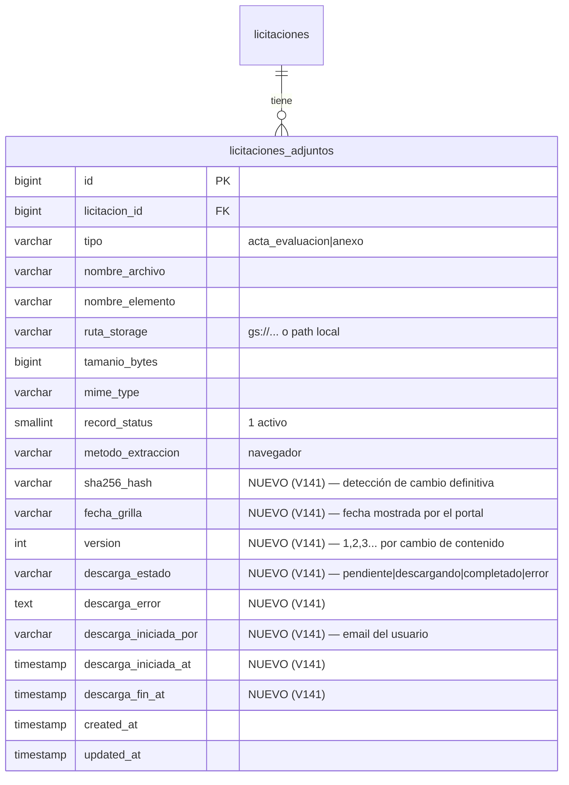

# API Spec — Documentos de Licitación (DOC)

**Versión**: 1.0
**Módulo**: Licitaciones — Documentos (descarga + cache por hash)
**Generado por**: api-first-spec
**Fecha**: 2026-08-15
**Rama**: `036-flujo-comercial-ofertas`
**Diseño origen**: [docs/design/flujo-ofertas.md](../design/flujo-ofertas.md) (Fase 1)
**HUs de origen**: Pendientes — se generan con hu-template al aprobar esta spec

---

## 1. Scope

### Included
- Listar los documentos (adjuntos) de una licitación guardados en el sistema,
  con su estado de descarga y hash.
- Descargar los documentos de una licitación desde Mercado Público **bajo
  demanda** (botón en la ficha), reutilizando la sesión existente.
- **Cache por versión**: si los documentos ya fueron descargados y no cambiaron
  (hash SHA-256), no se re-descarga ni se vuelve a gastar el cupo de
  "Ver Adjuntos" ni credenciales.
- Cálculo y persistencia de `sha256_hash`, `fecha_grilla`, `version` y
  `descarga_estado` por adjunto.
- Descarga binaria de un documento guardado (para bajar a PC/Drive).

### Excluded
- Clasificación fina (administrativo / técnico / preguntas y respuestas):
  la asigna la IA en la zona de análisis (Fase 1.3), no el extractor.
- Zona IA / análisis on-demand: spec separada (`analisis-comercial`).
- Generador de propuestas, GO/NO GO y avisos: fases 2-3.
- Integración con Google Drive: fase 3 (en dev/local se usa storage local).
- Re-sync masivo de adjuntos para todas las licitaciones: prohibido por cupo.

---

## 2. Data Model

Se **extiende la tabla existente** `licitaciones_adjuntos` (V062 — la usa el
scraper Node vía `usp_Licitaciones_Adjuntos_Upsert` y el extractor .NET), en
lugar de crear una tabla nueva: evita duplicar la fuente de adjuntos y mantiene
compatibilidad con el scraper.



### Tabla: licitaciones_adjuntos (columnas nuevas en V141)

| Column | Type | Nullable | Default | Description |
|--------|------|----------|---------|-------------|
| sha256_hash | VARCHAR(64) | YES | NULL | SHA-256 del contenido del archivo (hex) — NULL para adjuntos previos hasta auditoría |
| fecha_grilla | VARCHAR(100) | YES | NULL | Texto de la columna fecha de la grilla "Ver Adjuntos" del portal |
| version | INT | NO | 1 | Se incrementa cuando el hash cambia respecto a la versión previa |
| descarga_estado | VARCHAR(20) | NO | 'pendiente' | `pendiente\|descargando\|completado\|error` |
| descarga_error | TEXT | YES | NULL | Motivo si `descarga_estado = 'error'` (cupo, captcha, sin adjuntos) |
| descarga_iniciada_por | VARCHAR(200) | YES | NULL | Email del usuario que disparó la descarga |
| descarga_iniciada_at | TIMESTAMP | YES | NULL | Inicio de la extracción |
| descarga_fin_at | TIMESTAMP | YES | NULL | Fin de la extracción |

Indexes:
- IX: `licitacion_id` (ya existe de V062) — se conserva.
- IX: `sha256_hash` (nuevo, útil para cache de análisis por conjunto en Fase 1.3).

---

## 3. Required Catalogs

### Enum: DescargaEstado (application-level)

| Code | Description |
|------|-------------|
| pendiente | Nunca se ha descargado ni auditado |
| descargando | Extracción en curso (job in-process) |
| completado | Adjunto guardado con hash |
| error | Falló la extracción (cupo de "Ver Adjuntos", reCAPTCHA, sin adjuntos) |

### Nota sobre tipos de documento

El campo `tipo` conserva los valores del portal (`acta_evaluacion` / `anexo`).
La clasificación comercial (administrativo/técnico/P&R) **no** se introduce en
esta spec: la asigna la IA al analizar (Fase 1.3) y se persiste en el resultado
del análisis, no en la tabla de adjuntos.

---

## 4. State Flow

Estados de un adjunto (campo `descarga_estado`):

| From → To | Action | Allowed by |
|-----------|--------|------------|
| pendiente → descargando | `POST /documentos/descargar` | Usuario autenticado |
| descargando → completado | Job de extracción | Sistema |
| descargando → error | Job de extracción (cupo/captcha/fallo) | Sistema |
| error → descargando | `POST /documentos/descargar` (reintento) | Usuario autenticado |
| completado → descargando | `POST /documentos/descargar?forzar=true` | Usuario autenticado |
| completado → completado (version+1) | Job detecta hash distinto del portal | Sistema |

Regla: una sola extracción simultánea por licitación (guard en memoria tipo
`HashSet<long>`, patrón de `AnalisisBackgroundService`). Mientras
`descarga_estado = 'descargando'`, un segundo POST devuelve
`DOC_006` (ya en curso).

---

## 5. REST Endpoints — `[Authorize]`

### GET /api/v1/licitaciones/{codigoExterno}/documentos — Estado de documentos

**Description**: Listado de documentos guardados de la licitación + estado del
conjunto (para que el frontend sepa si hay que descargar o ya está todo listo).

**Path Parameters**:
| Param | Type | Required | Description |
|-------|------|----------|-------------|
| codigoExterno | string | Sí | Código de licitación (ej. `729-134-LE26`) |

**Response (200)**:
```json
{
  "data": {
    "estadoConjunto": "completado",
    "descargaError": null,
    "conjuntoHash": "a1b2...c3",
    "documentos": [
      {
        "id": 101,
        "tipo": "anexo",
        "nombreArchivo": "Bases_Administrativas.pdf",
        "tamanioBytes": 2457600,
        "mimeType": "application/pdf",
        "sha256Hash": "9f86d081884c7d659a2feaa0c55ad015a3bf4f1b2b0b822cd15d6c15b0f00a08",
        "fechaGrilla": "05-08-2026",
        "version": 1,
        "esActa": false,
        "descargaEstado": "completado",
        "descargadoAt": "2026-08-15T10:00:00Z"
      }
    ]
  }
}
```

**DB Object**: `usp_Adjuntos_ListarPorLicitacion` (nuevo, V141)
**Rules**: `LIC_001` si la licitación no existe. `conjuntoHash` se calcula en el
servicio: `SHA256(concat(sha256_hash ordenados por nombre))` — no se persiste.
**Error Codes**: `LIC_001`, `AUTH_001`.

### POST /api/v1/licitaciones/{codigoExterno}/documentos/descargar — Descarga bajo demanda

**Description**: Dispara la extracción de adjuntos desde Mercado Público
(sesión existente). Si ya hay adjuntos guardados con hash y **forzar=false**,
compara los metadatos de la grilla (tamaño + fecha) con lo guardado: si nada
cambió → devuelve sin re-descargar (`accion = reutilizados`). Si algún adjunto
cambió o falta → descarga, calcula hash y versiona. La extracción se ejecuta en
background (puede tardar minutos por el navegador/cupo).

**Request Body**:
```json
{ "forzar": false }
```
`forzar=true` re-descarga todos los adjuntos aunque los metadatos coincidan.

**Response (202 Accepted)** — se devuelve inmediatamente con el estado inicial:
```json
{
  "data": {
    "estadoConjunto": "descargando",
    "accion": "descargando",
    "descargados": 0,
    "reutilizados": 0,
    "actualizados": 0,
    "errores": 0,
    "conjuntoHash": null
  }
}
```

**Post-condición**: el frontend hace polling a `GET .../documentos` hasta que
`estadoConjunto` sea `completado` o `error` (patrón usado por los workspaces de
análisis).

**DB Objects**:
- `usp_Adjuntos_MarcarDescargaIniciada` (nuevo) — estado descargando + quien/cuándo
- `usp_Adjuntos_UpsertConHash` (nuevo) — insert/update con `sha256_hash`, `fecha_grilla`, `version` (incrementa si hash distinto)
- `usp_Adjuntos_MarcarDescargaFinalizada` (nuevo) — completado/error + fin

**Rules**:
- `DOC_006` si ya hay una extracción en curso para la licitación.
- Comparación de cambio: por adjunto `(nombre_elemento, tamanio_bytes, fecha_grilla)`
  contra lo guardado; si coincide → reutilizar (no gasta cupo de descarga del
  archivo; la grilla sí se abre, es 1 visita por request).
- Tras descargar: hash SHA-256 del contenido. Si el hash difiere del guardado →
  `version = version + 1` y se conserva el historial (fila nueva con version+1).
- Si la extracción falla por cupo/captcha (`403`, `robot.png`, reCAPTCHA) →
  `descarga_estado = 'error'` con mensaje accionable ("cupo agotado, reintente más
  tarde").
- El detalle de extracción se registra además en `extraccion_documentos_log`
  (reutiliza `usp_ExtraccionLog_Registrar`).
**Error Codes**: `LIC_001`, `DOC_006`, `AUTH_001`.

### GET /api/v1/licitaciones/{codigoExterno}/documentos/{documentoId}/archivo — Descarga binaria

**Description**: Devuelve el archivo guardado (patrón existente de
`MensajeController`): `File(stream, mimeType, nombreArchivo)` sin wrapper.

**Response (200)**: binario (application/pdf u otro según `mime_type`).

**DB Object**: `IStorageService.DownloadAsync(ruta_storage)`.
**Rules**: `DOC_004` (404) si el documento no existe o `record_status != 1`.
**Error Codes**: `DOC_004`, `AUTH_001`.

---

## 6. Database Objects

| Endpoint | DB Object | Type | Params |
|----------|-----------|------|--------|
| GET .../documentos | `usp_Adjuntos_ListarPorLicitacion` | SP (nuevo) | @licitacion_id |
| POST .../documentos/descargar (inicio) | `usp_Adjuntos_MarcarDescargaIniciada` | SP (nuevo) | @licitacion_id, @iniciada_por |
| POST .../documentos/descargar (por adjunto) | `usp_Adjuntos_UpsertConHash` | SP (nuevo) | @licitacion_id, @tipo, @nombre_archivo, @nombre_elemento, @ruta_storage, @tamanio_bytes, @mime_type, @es_acta, @sha256_hash, @fecha_grilla |
| POST .../documentos/descargar (fin) | `usp_Adjuntos_MarcarDescargaFinalizada` | SP (nuevo) | @licitacion_id, @estado, @error |
| GET .../archivo | `IStorageService.DownloadAsync` | Service | ruta_storage |

**Migración**: `V141__Adjuntos_Hash_Version_Descarga.sql` (nueva) — ADD COLUMNs
de la §2 + 3 SPs nuevos + índice `sha256_hash`.

---

## 7. Shared DTOs

```json
{
  "LicitacionDocumentoDto": {
    "id": "long",
    "tipo": "string",
    "nombreArchivo": "string",
    "tamanioBytes": "long?",
    "mimeType": "string?",
    "sha256Hash": "string?",
    "fechaGrilla": "string?",
    "version": "int",
    "esActa": "bool",
    "descargaEstado": "string",
    "descargadoAt": "datetime?"
  },
  "EstadoDocumentosDto": {
    "estadoConjunto": "string",
    "descargaError": "string?",
    "conjuntoHash": "string?",
    "documentos": "LicitacionDocumentoDto[]"
  },
  "DescargarDocumentosRequest": { "forzar": "bool" },
  "DescargarDocumentosResultDto": {
    "estadoConjunto": "string",
    "accion": "string",
    "descargados": "int",
    "reutilizados": "int",
    "actualizados": "int",
    "errores": "int",
    "conjuntoHash": "string?"
  }
}
```

---

## 8. Business Rules

### Validation rules
- `DOC-R001`: `codigoExterno` debe existir en `licitaciones` (si no, `LIC_001`).
- `DOC-R002`: `documentoId` debe pertenecer a la licitación del path.

### Lifecycle rules
- `DOC-R010`: una sola extracción simultánea por licitación (`DOC_006`).
- `DOC-R011`: con `forzar=false`, si los metadatos de la grilla (tamaño/fecha)
  coinciden con lo guardado → no se re-descarga (señal rápida, no definitiva).
- `DOC-R012`: el **hash SHA-256** es la señal definitiva de cambio: si difiere →
  nueva versión (fila nueva con `version+1`, la anterior queda `record_status=1`
  como historial).
- `DOC-R013`: adjuntos existentes sin hash (previos a V141) se auditan la primera
  vez que se consulta/descarga: se calcula el hash sin re-descargar del portal.
- `DOC-R014`: `forzar=true` re-descarga todo y recalcula hashes.

### Security rules
- `DOC-R020`: todos los endpoints requieren JWT (`[Authorize]`); cualquier rol
  autenticado (Usuario/Analista/Admin) — consistente con el módulo Licitaciones.
- `DOC-R021`: se registra quién disparó cada extracción (`descarga_iniciada_por`).
- `DOC-R022`: la ruta `ruta_storage` interna NO se expone en DTOs.

### Cross-entity rules
- `DOC-R030`: el registro de extracción se refleja en `extraccion_documentos_log`
  (trazabilidad existente).
- `DOC-R031`: el scraper Node sigue escribiendo con `usp_Licitaciones_Adjuntos_Upsert`
  (columnas nuevas quedan NULL hasta que el servicio .NET las calcule).

---

## 9. Error Codes

| Code | HTTP | Description | When |
|------|------|-------------|------|
| LIC_001 | 404 | Licitación no encontrada | Código inexistente |
| DOC_004 | 404 | Documento no encontrado | documentoId inválido o eliminado |
| DOC_006 | 409 | Extracción ya en curso | Segundo POST mientras `descargando` |
| DOC_005 | 422 | Falló la extracción por portal (cupo/captcha) | Estado `error` con `descarga_error` accionable |
| VAL_001 | 400 | Campo requerido faltante | Params inválidos |
| AUTH_001 | 401 | No autenticado | Token faltante/expirado |
| AUTH_002 | 403 | Sin permisos | Rol sin acceso (no aplica hoy: todos autenticados) |
