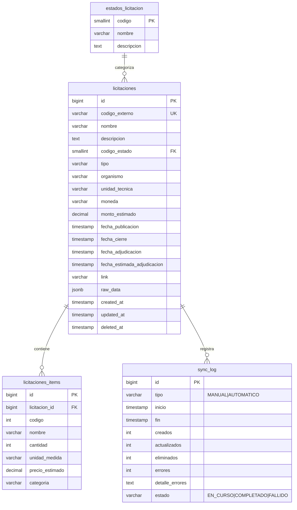

# API Specification: Licitaciones

## 1. Scope

### Included
- Sincronización automática de licitaciones desde la API pública de Mercado Público (ChileCompra)
- Listado paginado de licitaciones con filtros múltiples (estado, tipo, organismo, fechas, búsqueda textual)
- Detalle completo de licitación con items, fechas y montos
- Búsqueda rápida por código o nombre (autocomplete)
- Motor de sincronización programado cada 24 horas (SyncEngineService)
- Sincronización manual vía endpoint
- Enriquecimiento bajo demanda de detalle desde API externa
- Historial de sincronización con métricas (creados, actualizados, errores)

### Excluded
- Integración con otros portales de compras públicas
- Notificaciones automáticas de cambios de estado (futuro)
- Análisis predictivo de licitaciones
- Comparación histórica de montos
- Suscripción a términos de búsqueda

## 2. Data Model



### Tables

| Entity | Description | Key Fields |
|--------|-------------|------------|
| `estados_licitacion` | Catálogo de estados posibles de una licitación | `codigo` (PK), `nombre` |
| `licitaciones` | Licitaciones obtenidas de Mercado Público | `id` (PK), `codigo_externo` (UK), `codigo_estado` (FK), `tipo` |
| `licitaciones_items` | Items/partidas de cada licitación | `id` (PK), `licitacion_id` (FK), `nombre`, `cantidad` |
| `sync_log` | Historial de ejecuciones del motor de sincronización | `id` (PK), `tipo`, `inicio`, `estado` |

## 3. Required Catalogs

### Estado de Licitación

| Código | Nombre | Descripción |
|--------|--------|-------------|
| 1 | Publicada | Licitación publicada y en plazo de recepción |
| 2 | Modificada | Licitación modificada durante el proceso |
| 3 | Desierta | Sin oferentes o declarada desierta |
| 4 | Revocada | Revocada por el organismo |
| 5 | Adjudicada | Adjudicada a un proveedor |
| 6 | Cerrada | Proceso cerrado |
| 7 | Con Adjuntos | Requiere revisión de adjuntos |
| 8 | En Espera | Pendiente de evaluación |

### Tipo de Licitación

| Código | Nombre | Descripción |
|--------|--------|-------------|
| `Licitacion` | Licitación Pública | Licitación pública estándar |
| `TratoDirecto` | Trato Directo | Contratación directa sin licitación |
| `ConvenioMarco` | Convenio Marco | Compra mediante convenio marco |
| `CompraAgil` | Compra Ágil | Compra agil de baja complejidad |

## 4. State Flow

### Licitación

| Estado | Acción | Siguiente | Condiciones |
|--------|--------|-----------|-------------|
| (nueva) | Publicar (API MP) | Publicada | Fecha publicación ≤ hoy |
| Publicada | Modificar (API MP) | Modificada | Organismo modifica la licitación |
| Publicada | Cerrar plazo | Cerrada | Fecha cierre vencida sin oferentes |
| Publicada | Adjudicar | Adjudicada | Organismo adjudica |
| Cualquiera | Revocar | Revocada | Organismo revoca el proceso |
| Cualquiera | Declarar desierta | Desierta | Sin oferentes válidos |

> **Nota:** Los cambios de estado provienen de la API de Mercado Público. El módulo refleja el estado actual sin alterarlo.

### Sincronización (Sync Log)

| Estado | Acción | Siguiente | Condiciones |
|--------|--------|-----------|-------------|
| (nueva) | Iniciar sync | EN_CURSO | Se comienza a consultar API MP |
| EN_CURSO | Completar | COMPLETADO | Todas las fechas procesadas |
| EN_CURSO | Fallar | FALLIDO | Error crítico no recuperable |

## 5. REST Endpoints

### `GET /api/v1/licitaciones` — Listar licitaciones

| Param | Type | Required | Description |
|-------|------|----------|-------------|
| `page` | int | No | Página (default: 1) |
| `pageSize` | int | No | Items por página (default: 20, max: 100) |
| `search` | string | No | Búsqueda por nombre o código |
| `estado` | short | No | Filtrar por código de estado |
| `tipo` | string | No | Filtrar por tipo (`Licitacion`, `TratoDirecto`, etc.) |
| `organismo` | string | No | Filtrar por nombre de organismo |
| `fechaDesde` | string | No | Fecha publicación desde (ISO 8601) |
| `fechaHasta` | string | No | Fecha publicación hasta (ISO 8601) |
| `montoDesde` | decimal | No | Filtrar licitaciones con monto estimado >= valor (CLP) |
| `montoHasta` | decimal | No | Filtrar licitaciones con monto estimado <= valor (CLP) |
| `sortBy` | string | No | Campo de ordenamiento (default: `fecha_publicacion`). Valores permitidos: `fecha_publicacion`, `fecha_cierre`, `monto_estimado`, `nombre`, `organismo` |
| `sortDir` | string | No | Dirección: `asc`/`desc` (default: `desc`) |

**Response `200`:**

```json
{
  "success": true,
  "data": {
    "items": [
      {
        "codigoExterno": "LE-1234-1234",
        "nombre": "Adquisición de equipos computacionales",
        "tipo": "Licitacion",
        "estado": { "codigo": 1, "nombre": "Publicada" },
        "organismo": "Municipalidad de Santiago",
        "fechaPublicacion": "2026-05-15T10:00:00Z",
        "fechaCierre": "2026-06-15T15:00:00Z",
        "montoEstimado": 45000000.00,
        "moneda": "CLP",
        "itemsCount": 5
      }
    ],
    "page": 1,
    "pageSize": 20,
    "totalRecords": 150,
    "totalPages": 8
  }
}
```

**Errors:**
- `VAL_001` (400) — Parámetro de filtro inválido

| DB Object | Type | Description |
|-----------|------|-------------|
| `usp_Licitaciones_Listar` | Function | Listado paginado con filtros dinámicos y ordenamiento seguro |

### `GET /api/v1/licitaciones/{codigoExterno}` — Obtener detalle

| Param | Type | Required | Description |
|-------|------|----------|-------------|
| `codigoExterno` | string | Yes | Código externo de la licitación (ej: `LE-1234-1234`) |

**Response `200`:**

```json
{
  "success": true,
  "data": {
    "codigoExterno": "LE-1234-1234",
    "nombre": "Adquisición de equipos computacionales",
    "tipo": "Licitacion",
    "estado": { "codigo": 1, "nombre": "Publicada" },
    "organismo": "Municipalidad de Santiago",
    "unidadTecnica": "Departamento de Informática",
    "moneda": "CLP",
    "montoEstimado": 45000000.00,
    "descripcion": "Adquisición de 50 equipos computacionales para renovación de parque tecnológico...",
    "fechaPublicacion": "2026-05-15T10:00:00Z",
    "fechaCierre": "2026-06-15T15:00:00Z",
    "fechaAdjudicacion": null,
    "fechaEstimadaAdjudicacion": "2026-07-15T00:00:00Z",
    "link": "https://www.mercadopublico.cl/Procurement/Modules/RFB/DetailsAcquisition.aspx?qs=/LE-1234-1234",
    "items": [
      {
        "codigo": 1,
        "nombre": "Computador Escritorio",
        "cantidad": 50,
        "unidadMedida": "Unidad",
        "precioEstimado": 850000.00,
        "categoria": "Equipos Informáticos"
      }
    ]
  }
}
```

**Errors:**
- `LIC_001` (404) — Licitación no encontrada

| DB Object | Type | Description |
|-----------|------|-------------|
| `usp_Licitaciones_ObtenerPorCodigo` | Function | Detalle con items en JSONB |

> **Comportamiento:** Si el detalle está incompleto (sin descripción o fecha de publicación), el sistema intenta enriquecerlo consultando la API de Mercado Público bajo demanda.

### `GET /api/v1/licitaciones/buscar` — Búsqueda rápida

| Param | Type | Required | Description |
|-------|------|----------|-------------|
| `q` | string | Yes | Término de búsqueda (mín. 3 caracteres) |
| `limit` | int | No | Máximo de resultados (default: 10, max: 50) |

**Response `200`:**

```json
{
  "success": true,
  "data": [
    {
      "codigoExterno": "LE-1234-1234",
      "nombre": "Adquisición de equipos computacionales",
      "tipo": "Licitacion",
      "organismo": "Municipalidad de Santiago"
    }
  ]
}
```

**Errors:**
- `VAL_001` (400) — Búsqueda debe tener al menos 3 caracteres

| DB Object | Type | Description |
|-----------|------|-------------|
| `usp_Licitaciones_Buscar` | Function | Búsqueda full-text con ranking |

### `POST /api/v1/licitaciones/sync` — Forzar sincronización manual

**Response `200`:**

```json
{
  "success": true,
  "data": {
    "syncId": 42,
    "status": "COMPLETADO",
    "startedAt": "2026-05-30T14:00:00Z"
  }
}
```

**Errors:**
- `SYS_001` (500) — Error interno durante la sincronización

| DB Object | Type | Description |
|-----------|------|-------------|
| `usp_SyncLog_Iniciar` | Procedure | Registra inicio de sync |
| `usp_SyncLog_Finalizar` | Procedure | Actualiza sync con métricas |
| `usp_SyncEngine_MergeLicitaciones` | Procedure | Merge masivo de datos desde API |

## 6. Database Objects

| Endpoint | SP/Query | Parameters |
|----------|----------|------------|
| Listar licitaciones | `usp_Licitaciones_Listar` | `p_page`, `p_page_size`, `p_search`, `p_estado`, `p_tipo`, `p_organismo`, `p_fecha_desde`, `p_fecha_hasta`, `p_monto_desde`, `p_monto_hasta`, `p_sort_by`, `p_sort_dir` |
| Obtener detalle | `usp_Licitaciones_ObtenerPorCodigo` | `p_codigo_externo` |
| Buscar licitaciones | `usp_Licitaciones_Buscar` | `p_q`, `p_limit` |
| Iniciar sync | `usp_SyncLog_Iniciar` | `p_tipo`, `p_sync_id` (OUT), `p_error_msg` (OUT) |
| Finalizar sync | `usp_SyncLog_Finalizar` | `p_sync_id`, `p_creados`, `p_actualizados`, `p_eliminados`, `p_errores`, `p_detalle_errores`, `p_error_msg` (OUT) |
| Merge licitaciones | `usp_SyncEngine_MergeLicitaciones` | `p_datos` (JSONB), `p_creados` (OUT), `p_actualizados` (OUT), `p_error_msg` (OUT) |

## 7. Shared DTOs

### LicitacionResumen

```json
{
  "codigoExterno": "LE-1234-1234",
  "nombre": "Adquisición de equipos",
  "tipo": "Licitacion",
  "estado": { "codigo": 1, "nombre": "Publicada" },
  "organismo": "Municipalidad de Santiago",
  "fechaPublicacion": "2026-05-15T10:00:00Z",
  "fechaCierre": "2026-06-15T15:00:00Z",
  "montoEstimado": 45000000.00,
  "moneda": "CLP",
  "itemsCount": 5
}
```

### LicitacionDetalle (hereda de LicitacionResumen)

```json
{
  "codigoExterno": "LE-1234-1234",
  "nombre": "Adquisición de equipos",
  "tipo": "Licitacion",
  "estado": { "codigo": 1, "nombre": "Publicada" },
  "organismo": "Municipalidad de Santiago",
  "descripcion": "Adquisición de 50 equipos...",
  "unidadTecnica": "Departamento de Informática",
  "moneda": "CLP",
  "montoEstimado": 45000000.00,
  "fechaPublicacion": "2026-05-15T10:00:00Z",
  "fechaCierre": "2026-06-15T15:00:00Z",
  "fechaAdjudicacion": null,
  "fechaEstimadaAdjudicacion": "2026-07-15T00:00:00Z",
  "link": "https://...",
  "items": []
}
```

### SyncStatus

```json
{
  "syncId": 42,
  "status": "COMPLETADO",
  "startedAt": "2026-05-30T14:00:00Z"
}
```

## 8. Business Rules

| ID | Rule | Category |
|----|------|----------|
| `BUS_LIC_001` | Una licitación se identifica por su `codigo_externo` único | Unicidad |
| `BUS_LIC_002` | El motor de sync consulta los últimos 7 días en cada ciclo | Sincronización |
| `BUS_LIC_003` | La sincronización automática ocurre cada 24 horas | Sincronización |
| `BUS_LIC_004` | Ante rate limit (HTTP 429), se reintenta hasta 3 veces con backoff progresivo | Resiliencia |
| `BUS_LIC_005` | El detalle se enriquece bajo demanda si faltan datos locales | Optimización |
| `BUS_LIC_006` | Las licitaciones eliminadas (soft delete) no aparecen en listados ni búsquedas | Integridad |
| `BUS_LIC_007` | Los tipos de licitación se normalizan a 4 valores conocidos | Normalización |
| `BUS_LIC_008` | El ordenamiento seguro solo permite columnas predefinidas para evitar SQL injection | Seguridad |
| `BUS_LIC_009` | El filtro por rango de monto (`montoDesde`/`montoHasta`) valida que ambos sean positivos y `montoDesde` ≤ `montoHasta` | Validación |
| `BUS_LIC_010` | El render del presupuesto en tabla usa formato CLP con separador de miles y símbolo de moneda | Presentación |
| `BUS_LIC_011` | La institución se muestra con tooltip en tarjetas, truncando a 1 línea si excede el ancho | Presentación |

### `GET /health/licitaciones` — Health check

Verifica la disponibilidad del módulo de Licitaciones y retorna estadísticas básicas.

**Response `200`:**

```json
{
  "status": "healthy",
  "module": "licitaciones",
  "totalRecords": 1542,
  "lastSync": "2026-05-30T14:00:00Z",
  "timestamp": "2026-05-31T10:00:00Z"
}
```

**Response `503` (unhealthy):**

```json
{
  "status": "unhealthy",
  "module": "licitaciones",
  "error": "Connection refused",
  "timestamp": "2026-05-31T10:00:00Z"
}
```

## 9. Error Codes

| Code | HTTP | Message | When |
|------|------|---------|------|
| `VAL_001` | 400 | {Field} es requerido o inválido | Parámetro de filtro inválido, búsqueda < 3 caracteres |
| `LIC_001` | 404 | Licitación no encontrada | `codigoExterno` no existe en BD |
| `SYS_001` | 500 | Error interno del servidor | Error no manejado |
