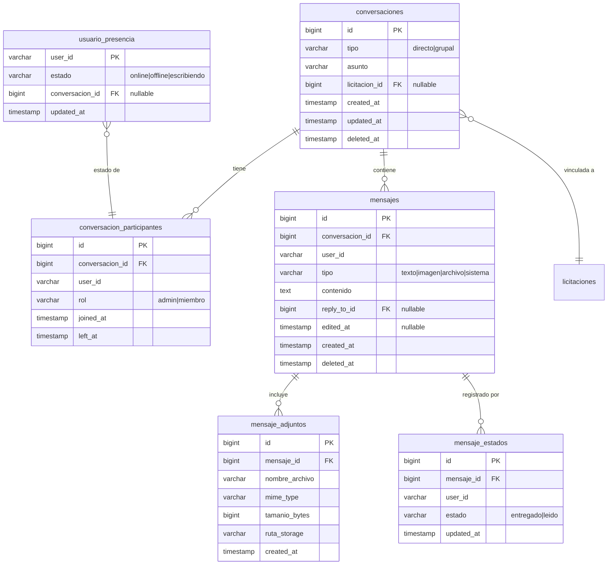

# API Specification: Mensajeria

## 1. Scope

### Included
- Conversaciones 1-a-1 (directas) entre usuarios autenticados
- Conversaciones grupales con múltiples participantes
- Vinculación opcional de conversaciones a una licitación específica
- Envío, edición (ventana de 15 minutos) y eliminación (soft delete) de mensajes
- Soporte de mensajes de texto, imagen, archivo, sistema
- Subida de archivos adjuntos (cualquier tipo, límite configurable de 10MB)
- Indicador de escritura (typing indicator) en tiempo real
- Presencia de usuarios (última conexión, estado online/offline)
- Confirmación de lectura de mensajes por usuario
- Tiempo real vía SignalR con Redis backplane
- Notificaciones internas (eventos publicados para el módulo Notificaciones)

### Excluded
- Integración con canales externos (email, SMS, push móvil)
- Cifrado end-to-end de mensajes
- Mensajes de voz o video
- Búsqueda full-text avanzada en historial (futuro)
- Retención automática de mensajes (política de borrado)
- Moderación de contenido

## 2. Data Model



### Tables

| Entity | Description | Key Fields |
|--------|-------------|------------|
| `conversaciones` | Chat (1-a-1 o grupal), opcionalmente vinculado a licitación | `id` (PK), `tipo`, `asunto`, `licitacion_id` (FK nullable) |
| `conversacion_participantes` | Miembros de la conversación con rol | `id` (PK), `conversacion_id` (FK), `user_id`, `rol` |
| `mensajes` | Mensajes individuales dentro de una conversación | `id` (PK), `conversacion_id` (FK), `user_id`, `tipo`, `contenido` |
| `mensaje_adjuntos` | Archivos adjuntos a un mensaje | `id` (PK), `mensaje_id` (FK), `nombre_archivo`, `ruta_storage` |
| `mensaje_estados` | Estado de lectura/entrega por usuario | `id` (PK), `mensaje_id` (FK), `user_id`, `estado` |
| `usuario_presencia` | Última conexión y estado de escritura | `user_id` (PK), `estado`, `conversacion_id` (FK nullable) |

## 3. Required Catalogs

### Tipo de Conversación

| Code | Name | Description |
|------|------|-------------|
| `directo` | Directa | Chat 1-a-1 entre dos usuarios |
| `grupal` | Grupal | Chat con 3 o más participantes |

### Rol de Participante

| Code | Name | Description |
|------|------|-------------|
| `admin` | Administrador | Puede agregar/quitar participantes y editar asunto |
| `miembro` | Miembro | Puede enviar mensajes y abandonar |

### Tipo de Mensaje

| Code | Name | Description |
|------|------|-------------|
| `texto` | Texto | Mensaje de texto plano |
| `imagen` | Imagen | Mensaje con imagen adjunta |
| `archivo` | Archivo | Mensaje con archivo adjunto |
| `sistema` | Sistema | Mensaje automático (usuario se unió, abandonó, etc.) |

### Estado de Mensaje

| Code | Name | Description |
|------|------|-------------|
| `entregado` | Entregado | Mensaje recibido por el servidor |
| `leido` | Leído | Mensaje visualizado por el usuario |

### Estado de Presencia

| Code | Name | Description |
|------|------|-------------|
| `online` | En línea | Usuario activo |
| `offline` | Desconectado | Usuario inactivo |
| `escribiendo` | Escribiendo | Usuario escribiendo en una conversación |

## 4. State Flow

### Conversación

| Current State | Action | Next State | Conditions |
|---------------|--------|------------|------------|
| (nueva) | Crear | Activa | Al menos 2 participantes |
| Activa | Abandonar (último participante) | Eliminada | Soft delete |
| Activa | Abandonar (no último) | Activa | Participante marcado con `left_at` |
| Activa | Actualizar asunto | Activa | Solo admin en grupal |

### Mensaje

| Current State | Action | Next State | Conditions |
|---------------|--------|------------|------------|
| (nuevo) | Enviar | Enviado | Usuario es participante activo |
| Enviado | Editar | Editado | Dentro de ventana de 15 minutos, mismo autor |
| Enviado | Eliminar | Eliminado | Mismo autor o admin de conversación |
| Enviado | Marcar leído | Leído | Usuario destinatario |

## 5. REST Endpoints

### Conversaciones

#### `GET /api/v1/conversaciones` — Listar conversaciones del usuario

| Param | Type | Required | Description |
|-------|------|----------|-------------|
| `page` | int | No | Página (default: 1) |
| `pageSize` | int | No | Items por página (default: 20, max: 100) |
| `search` | string | No | Buscar por asunto o nombre de participante |
| `sortBy` | string | No | Campo de ordenamiento (default: `updated_at`) |
| `sortDir` | string | No | Dirección: `asc`/`desc` (default: `desc`) |

**Response `200`:**

```json
{
  "success": true,
  "data": {
    "items": [
      {
        "id": 1,
        "tipo": "directo",
        "asunto": null,
        "licitacionId": null,
        "licitacionNombre": null,
        "participantes": [
          { "userId": "user-1", "nombre": "Juan Pérez", "rol": "miembro", "avatarUrl": null },
          { "userId": "user-2", "nombre": "María López", "rol": "miembro", "avatarUrl": null }
        ],
        "ultimoMensaje": {
          "id": 42,
          "userId": "user-1",
          "tipo": "texto",
          "contenido": "Hola, ¿cómo estás?",
          "createdAt": "2026-05-30T14:30:00Z"
        },
        "noLeidos": 3,
        "updatedAt": "2026-05-30T14:30:00Z"
      }
    ],
    "page": 1,
    "pageSize": 20,
    "totalRecords": 5,
    "totalPages": 1
  }
}
```

| DB Object | Type | Description |
|-----------|------|-------------|
| `usp_Conversaciones_Listar` | Function | Listado paginado con último mensaje y conteo de no-leídos |

#### `POST /api/v1/conversaciones` — Crear conversación

**Request:**

```json
{
  "tipo": "grupal",
  "asunto": "Evaluación licitación L-1234",
  "licitacionId": null,
  "participanteIds": ["user-2", "user-3"]
}
```

**Response `201`:**

```json
{
  "success": true,
  "data": {
    "id": 1,
    "tipo": "grupal",
    "asunto": "Evaluación licitación L-1234",
    "licitacionId": null,
    "participantes": [
      { "userId": "user-1", "nombre": "Admin TIVIT", "rol": "admin" },
      { "userId": "user-2", "nombre": "Usuario 2", "rol": "miembro" },
      { "userId": "user-3", "nombre": "Usuario 3", "rol": "miembro" }
    ],
    "createdAt": "2026-05-30T14:00:00Z"
  }
}
```

**Errors:**
- `VAL_001` (400) — `participanteIds` es requerido y debe tener al menos 1 elemento
- `VAL_008` (400) — `asunto` excede largo máximo (200 caracteres)
- `MSG_002` (409) — Ya existe una conversación directa entre estos usuarios
- `MSG_004` (422) — `licitacionId` no corresponde a una licitación válida

| DB Object | Type | Description |
|-----------|------|-------------|
| `usp_Conversaciones_Crear` | Procedure | Inserta conversación y participantes |

#### `GET /api/v1/conversaciones/{id}` — Obtener conversación

| Param | Type | Required | Description |
|-------|------|----------|-------------|
| `id` | long | Yes | ID de la conversación |

**Response `200`:**

```json
{
  "success": true,
  "data": {
    "id": 1,
    "tipo": "grupal",
    "asunto": "Evaluación licitación L-1234",
    "licitacionId": 42,
    "licitacionNombre": "Adquisición de equipos",
    "participantes": [
      { "userId": "user-1", "nombre": "Admin TIVIT", "rol": "admin", "joinedAt": "2026-05-30T14:00:00Z" },
      { "userId": "user-2", "nombre": "Usuario 2", "rol": "miembro", "joinedAt": "2026-05-30T14:00:00Z" }
    ],
    "createdAt": "2026-05-30T14:00:00Z",
    "updatedAt": "2026-05-30T14:30:00Z"
  }
}
```

**Errors:**
- `MSG_001` (404) — Conversación no encontrada
- `AUTH_001` (403) — Usuario no es participante de la conversación

| DB Object | Type | Description |
|-----------|------|-------------|
| `usp_Conversaciones_Obtener` | Function | Detalle con participantes |

#### `PUT /api/v1/conversaciones/{id}` — Actualizar conversación

**Request:**

```json
{
  "asunto": "Nuevo asunto actualizado"
}
```

**Response `200`:** Retorna la conversación actualizada

**Errors:**
- `MSG_001` (404) — Conversación no encontrada
- `AUTH_001` (403) — Usuario no es admin de la conversación
- `MSG_003` (422) — No se puede actualizar el asunto de una conversación directa

| DB Object | Type | Description |
|-----------|------|-------------|
| `usp_Conversaciones_Actualizar` | Procedure | Actualiza asunto |

#### `DELETE /api/v1/conversaciones/{id}` — Abandonar conversación

**Response `200`:**

```json
{
  "success": true,
  "data": { "result": true }
}
```

**Errors:**
- `MSG_001` (404) — Conversación no encontrada
- `AUTH_001` (403) — Usuario no es participante

| DB Object | Type | Description |
|-----------|------|-------------|
| `usp_Conversaciones_Abandonar` | Procedure | Marca `left_at` del participante; soft delete si es el último |

### Participantes

#### `POST /api/v1/conversaciones/{id}/participantes` — Agregar participante

**Request:**

```json
{
  "userId": "user-4",
  "rol": "miembro"
}
```

**Response `201`:**

```json
{
  "success": true,
  "data": {
    "userId": "user-4",
    "nombre": "Nuevo Usuario",
    "rol": "miembro",
    "joinedAt": "2026-05-30T15:00:00Z"
  }
}
```

**Errors:**
- `MSG_001` (404) — Conversación no encontrada
- `AUTH_001` (403) — Usuario no es admin
- `MSG_002` (409) — Usuario ya es participante activo
- `MSG_003` (422) — No se pueden agregar participantes a una conversación directa

| DB Object | Type | Description |
|-----------|------|-------------|
| `usp_ConversacionParticipantes_Agregar` | Procedure | Inserta participante |

#### `POST /api/v1/conversaciones/{id}/participantes/{userId}/remove` — Quitar participante

**Response `200`:**

```json
{
  "success": true,
  "data": { "result": true }
}
```

**Errors:**
- `MSG_001` (404) — Conversación no encontrada
- `AUTH_001` (403) — Usuario no es admin
- `MSG_003` (422) — No se puede quitar al último participante (usar abandonar)
- `MSG_005` (404) — Usuario no es participante de la conversación

| DB Object | Type | Description |
|-----------|------|-------------|
| `usp_ConversacionParticipantes_Quitar` | Procedure | Marca `left_at` del participante |

### Mensajes

#### `GET /api/v1/conversaciones/{id}/mensajes` — Listar mensajes

| Param | Type | Required | Description |
|-------|------|----------|-------------|
| `id` | long | Yes | ID de la conversación |
| `page` | int | No | Página (default: 1) |
| `pageSize` | int | No | Items por página (default: 50, max: 100) |
| `before` | long | No | ID de mensaje (cargar anteriores a este) |

**Response `200`:**

```json
{
  "success": true,
  "data": {
    "items": [
      {
        "id": 42,
        "userId": "user-1",
        "userName": "Admin TIVIT",
        "tipo": "texto",
        "contenido": "Hola, ¿cómo estás?",
        "replyTo": null,
        "adjuntos": [],
        "estados": [
          { "userId": "user-2", "estado": "leido", "updatedAt": "2026-05-30T14:31:00Z" }
        ],
        "editedAt": null,
        "createdAt": "2026-05-30T14:30:00Z"
      }
    ],
    "page": 1,
    "pageSize": 50,
    "totalRecords": 120,
    "totalPages": 3
  }
}
```

**Errors:**
- `MSG_001` (404) — Conversación no encontrada
- `AUTH_001` (403) — Usuario no es participante

| DB Object | Type | Description |
|-----------|------|-------------|
| `usp_Mensajes_Listar` | Function | Listado paginado con adjuntos y estados |

#### `POST /api/v1/conversaciones/{id}/mensajes` — Enviar mensaje

**Request:**

```json
{
  "tipo": "texto",
  "contenido": "Hola, ¿cómo estás?",
  "replyToId": null
}
```

**Response `201`:**

```json
{
  "success": true,
  "data": {
    "id": 43,
    "userId": "user-1",
    "userName": "Admin TIVIT",
    "tipo": "texto",
    "contenido": "Hola, ¿cómo estás?",
    "replyTo": null,
    "adjuntos": [],
    "estados": [],
    "editedAt": null,
    "createdAt": "2026-05-30T14:32:00Z"
  }
}
```

**Errors:**
- `MSG_001` (404) — Conversación no encontrada
- `AUTH_001` (403) — Usuario no es participante activo
- `VAL_001` (400) — `contenido` es requerido para tipo `texto`
- `VAL_008` (400) — `contenido` excede largo máximo (5000 caracteres)

| DB Object | Type | Description |
|-----------|------|-------------|
| `usp_Mensajes_Enviar` | Procedure | Inserta mensaje y notifica |

#### `PUT /api/v1/conversaciones/{id}/mensajes/{msgId}` — Editar mensaje

**Request:**

```json
{
  "contenido": "Texto editado del mensaje"
}
```

**Response `200`:**

```json
{
  "success": true,
  "data": {
    "id": 42,
    "contenido": "Texto editado del mensaje",
    "editedAt": "2026-05-30T14:35:00Z"
  }
}
```

**Errors:**
- `MSG_001` (404) — Conversación no encontrada
- `MSG_006` (404) — Mensaje no encontrado
- `AUTH_001` (403) — Usuario no es el autor del mensaje
- `MSG_003` (422) — Ventana de edición de 15 minutos expirada

| DB Object | Type | Description |
|-----------|------|-------------|
| `usp_Mensajes_Editar` | Procedure | Actualiza contenido y `edited_at` (valida ventana de 15 min) |

#### `DELETE /api/v1/conversaciones/{id}/mensajes/{msgId}` — Eliminar mensaje

**Response `200`:**

```json
{
  "success": true,
  "data": { "result": true }
}
```

**Errors:**
- `MSG_001` (404) — Conversación no encontrada
- `MSG_006` (404) — Mensaje no encontrado
- `AUTH_001` (403) — Usuario no es el autor ni admin de la conversación

| DB Object | Type | Description |
|-----------|------|-------------|
| `usp_Mensajes_Eliminar` | Procedure | Soft delete (`deleted_at`) |

#### `POST /api/v1/conversaciones/{id}/mensajes/{msgId}/leido` — Marcar como leído

**Response `200`:**

```json
{
  "success": true,
  "data": { "result": true }
}
```

**Errors:**
- `MSG_001` (404) — Conversación no encontrada
- `MSG_006` (404) — Mensaje no encontrado
- `AUTH_001` (403) — Usuario no es participante

| DB Object | Type | Description |
|-----------|------|-------------|
| `usp_Mensajes_MarcarLeido` | Procedure | Upsert estado `leido` para el usuario |

### Adjuntos

#### `POST /api/v1/conversaciones/{id}/mensajes/{msgId}/adjuntos` — Subir archivo adjunto

**Request:** `multipart/form-data`

| Field | Type | Required | Description |
|-------|------|----------|-------------|
| `archivo` | file | Yes | Archivo a subir (máx 10MB) |

**Response `201`:**

```json
{
  "success": true,
  "data": {
    "id": 1,
    "mensajeId": 42,
    "nombreArchivo": "documento.pdf",
    "mimeType": "application/pdf",
    "tamanioBytes": 1048576,
    "downloadUrl": "/api/v1/conversaciones/1/mensajes/42/adjuntos/1",
    "createdAt": "2026-05-30T14:33:00Z"
  }
}
```

**Errors:**
- `MSG_001` (404) — Conversación no encontrada
- `MSG_006` (404) — Mensaje no encontrado
- `AUTH_001` (403) — Usuario no es el autor del mensaje
- `VAL_007` (400) — Archivo excede tamaño máximo (10MB)
- `VAL_001` (400) — Archivo es requerido

| DB Object | Type | Description |
|-----------|------|-------------|
| `usp_MensajeAdjuntos_Crear` | Procedure | Registra metadata del adjunto |

#### `GET /api/v1/conversaciones/{id}/mensajes/{msgId}/adjuntos/{attId}` — Descargar adjunto

**Response `200`:** `application/octet-stream` con header `Content-Disposition: attachment`

**Errors:**
- `MSG_001` (404) — Conversación no encontrada
- `MSG_006` (404) — Mensaje no encontrado
- `MSG_007` (404) — Adjunto no encontrado
- `AUTH_001` (403) — Usuario no es participante

| DB Object | Type | Description |
|-----------|------|-------------|
| `usp_MensajeAdjuntos_Obtener` | Function | Obtiene metadata del adjunto (ruta de storage) |

### Presencia

#### `GET /api/v1/presencia` — Obtener presencia de usuarios

| Param | Type | Required | Description |
|-------|------|----------|-------------|
| `userIds` | string[] | Yes | Lista de IDs de usuario (query string, comma-separated) |

**Response `200`:**

```json
{
  "success": true,
  "data": [
    { "userId": "user-1", "estado": "online", "updatedAt": "2026-05-30T14:30:00Z" },
    { "userId": "user-2", "estado": "offline", "updatedAt": "2026-05-29T18:00:00Z" }
  ]
}
```

| DB Object | Type | Description |
|-----------|------|-------------|
| `usp_Presencia_Obtener` | Function | Obtiene presencia por lista de usuarios |

#### `POST /api/v1/presencia/typing` — Notificar escritura

**Request:**

```json
{
  "conversacionId": 1,
  "escribiendo": true
}
```

**Response `200`:**

```json
{
  "success": true,
  "data": { "result": true }
}
```

**Errors:**
- `MSG_001` (404) — Conversación no encontrada
- `AUTH_001` (403) — Usuario no es participante

| DB Object | Type | Description |
|-----------|------|-------------|
| `usp_Presencia_Actualizar` | Procedure | Upsert estado de presencia/typing |

## 6. Database Objects

| Endpoint | SP/Query | Parameters |
|----------|----------|------------|
| Listar conversaciones | `usp_Conversaciones_Listar` | `p_user_id`, `p_page`, `p_page_size`, `p_search`, `p_sort_by`, `p_sort_dir` |
| Crear conversación | `usp_Conversaciones_Crear` | `p_tipo`, `p_asunto`, `p_licitacion_id`, `p_participante_ids` (JSONB), `p_creador_id`, `p_id` (OUT), `p_error_msg` (OUT) |
| Obtener conversación | `usp_Conversaciones_Obtener` | `p_id`, `p_user_id` |
| Actualizar conversación | `usp_Conversaciones_Actualizar` | `p_id`, `p_asunto`, `p_user_id`, `p_error_msg` (OUT) |
| Abandonar conversación | `usp_Conversaciones_Abandonar` | `p_id`, `p_user_id`, `p_error_msg` (OUT) |
| Agregar participante | `usp_ConversacionParticipantes_Agregar` | `p_conversacion_id`, `p_user_id`, `p_rol`, `p_solicitante_id`, `p_error_msg` (OUT) |
| Quitar participante | `usp_ConversacionParticipantes_Quitar` | `p_conversacion_id`, `p_user_id`, `p_solicitante_id`, `p_error_msg` (OUT) |
| Listar mensajes | `usp_Mensajes_Listar` | `p_conversacion_id`, `p_user_id`, `p_page`, `p_page_size`, `p_before` |
| Enviar mensaje | `usp_Mensajes_Enviar` | `p_conversacion_id`, `p_user_id`, `p_tipo`, `p_contenido`, `p_reply_to_id`, `p_id` (OUT), `p_error_msg` (OUT) |
| Editar mensaje | `usp_Mensajes_Editar` | `p_id`, `p_user_id`, `p_contenido`, `p_error_msg` (OUT) |
| Eliminar mensaje | `usp_Mensajes_Eliminar` | `p_id`, `p_user_id`, `p_error_msg` (OUT) |
| Marcar leído | `usp_Mensajes_MarcarLeido` | `p_mensaje_id`, `p_user_id` |
| Crear adjunto | `usp_MensajeAdjuntos_Crear` | `p_mensaje_id`, `p_nombre_archivo`, `p_mime_type`, `p_tamanio_bytes`, `p_ruta_storage`, `p_id` (OUT), `p_error_msg` (OUT) |
| Obtener adjunto | `usp_MensajeAdjuntos_Obtener` | `p_id`, `p_conversacion_id`, `p_user_id` |
| Actualizar presencia | `usp_Presencia_Actualizar` | `p_user_id`, `p_estado`, `p_conversacion_id` |
| Obtener presencia | `usp_Presencia_Obtener` | `p_user_ids` (JSONB) |

## 7. Shared DTOs

### PaginatedResult (reutiliza existente)

```json
{
  "items": [],
  "page": 1,
  "pageSize": 20,
  "totalRecords": 100,
  "totalPages": 5
}
```

### ApiResponse (reutiliza existente)

```json
{
  "success": true,
  "message": null,
  "data": {},
  "errors": null,
  "pagination": {}
}
```

### ParticipanteItem

```json
{
  "userId": "user-1",
  "nombre": "Admin TIVIT",
  "rol": "admin",
  "avatarUrl": null,
  "joinedAt": "2026-05-30T14:00:00Z",
  "leftAt": null
}
```

### MensajeItem

```json
{
  "id": 42,
  "userId": "user-1",
  "userName": "Admin TIVIT",
  "tipo": "texto",
  "contenido": "Hola",
  "replyTo": null,
  "adjuntos": [],
  "estados": [],
  "editedAt": null,
  "createdAt": "2026-05-30T14:30:00Z"
}
```

### AdjuntoItem

```json
{
  "id": 1,
  "mensajeId": 42,
  "nombreArchivo": "documento.pdf",
  "mimeType": "application/pdf",
  "tamanioBytes": 1048576,
  "downloadUrl": "/api/v1/conversaciones/1/mensajes/42/adjuntos/1",
  "createdAt": "2026-05-30T14:33:00Z"
}
```

## 8. Business Rules

| ID | Rule | Category |
|----|------|----------|
| `BUS_001` | Una conversación directa solo puede existir entre un par único de usuarios | Unicidad |
| `BUS_002` | Solo participantes activos pueden enviar mensajes | Autorización |
| `BUS_003` | Solo el autor puede editar su mensaje, dentro de ventana de 15 minutos | Edición |
| `BUS_004` | El autor o un admin de la conversación pueden eliminar un mensaje | Autorización |
| `BUS_005` | Solo admins pueden agregar/quitar participantes en conversaciones grupales | Autorización |
| `BUS_006` | No se pueden agregar participantes a una conversación directa | Validación |
| `BUS_007` | El asunto solo se puede actualizar en conversaciones grupales | Validación |
| `BUS_008` | Archivos adjuntos no pueden exceder 10MB (configurable) | Validación |
| `BUS_009` | Al abandonar el último participante, la conversación se marca como eliminada | Estado |
| `BUS_010` | El creador de la conversación es automáticamente admin | Default |
| `BUS_011` | Mensajes de tipo `sistema` son generados automáticamente (no por usuarios) | Sistema |
| `BUS_012` | El estado `escribiendo` expira automáticamente tras 5 segundos sin actividad | Presencia |
| `BUS_013` | Un usuario se considera `offline` si no actualiza presencia en 5 minutos | Presencia |

## 9. Error Codes

| Code | HTTP | Message | When |
|------|------|---------|------|
| `VAL_001` | 400 | {Field} es requerido | Campo obligatorio ausente |
| `VAL_007` | 400 | {Field} excede el valor máximo permitido | Tamaño de archivo > 10MB |
| `VAL_008` | 400 | {Field} excede el largo máximo ({max} caracteres) | Campo muy largo |
| `MSG_001` | 404 | Conversación no encontrada | ID de conversación inválido |
| `MSG_002` | 409 | Ya existe una conversación con estos participantes | Conversación directa duplicada |
| `MSG_003` | 422 | Operación no permitida en el estado actual | Ventana de edición expirada, acción en directa |
| `MSG_004` | 422 | Licitación no válida | `licitacionId` no existe |
| `MSG_005` | 404 | Participante no encontrado | `userId` no es participante |
| `MSG_006` | 404 | Mensaje no encontrado | `msgId` inválido |
| `MSG_007` | 404 | Adjunto no encontrado | `attId` inválido |
| `AUTH_001` | 403 | No tiene permisos para realizar esta acción | Usuario no es participante/autor/admin |
| `SYS_001` | 500 | Error interno del servidor | Error no manejado |

## SignalR Hub

### Endpoint: `/hubs/mensajeria`

**Autenticación:** Token JWT via query string `?access_token={token}`

### Métodos del servidor (cliente invoca)

| Método | Parámetros | Descripción |
|--------|-----------|-------------|
| `UnirseConversacion` | `conversacionId: long` | Une al usuario al grupo SignalR de la conversación |
| `SalirConversacion` | `conversacionId: long` | Remueve al usuario del grupo |
| `NotificarTyping` | `conversacionId: long, escribiendo: bool` | Broadcast de estado de escritura |

### Eventos del cliente (servidor emite)

| Evento | Payload | Descripción |
|--------|---------|-------------|
| `RecibirMensaje` | `MensajeItem` | Nuevo mensaje en la conversación |
| `MensajeEditado` | `{ id, contenido, editedAt }` | Mensaje editado |
| `MensajeEliminado` | `{ id, conversacionId }` | Mensaje eliminado |
| `TypingIndicator` | `{ conversacionId, userId, userName, escribiendo }` | Usuario escribiendo |
| `PresenceUpdate` | `{ userId, estado, updatedAt }` | Cambio de presencia |
| `MensajeLeido` | `{ mensajeId, userId, updatedAt }` | Confirmación de lectura |
| `ParticipanteAgregado` | `ParticipanteItem` | Nuevo participante en conversación |
| `ParticipanteQuitado` | `{ conversacionId, userId }` | Participante removido |
