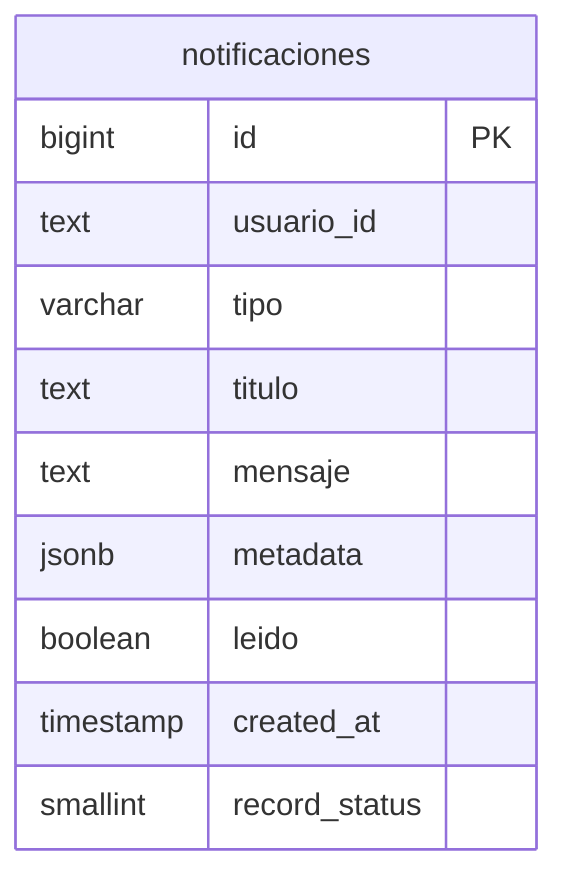

# API Specification: Notificaciones

> Módulo `MPM.Modules.Notificaciones` — centro de notificaciones in-app.
> Tabla base: V064. Broadcast de eventos del scraper restringido a admin
> (V117) — hoy identifica al admin por email (`admin@tivit.cl`) o rol
> SuperAdmin (la UI usa ambos criterios).

## 1. Scope

### Included
- Listado de notificaciones del usuario con paginación
- Conteo de no leídas (badge de la campanita)
- Marcar una notificación como leída
- Marcar todas como leídas
- Eliminación de notificaciones (una o todas las leídas)

### Excluded
- Notificaciones push / email desde este módulo (la entrega multicanal vive en Alertas)
- Suscripciones por tipo de notificación (todos los tipos llegan al usuario)

## 2. Data Model

### Tipos de notificación

| Tipo | Origen | Descripción |
|------|--------|-------------|
| `alerta_disparada` | Alertas | Una regla calzó con una licitación |
| `aclaracion_detectada` | Licitaciones | Aclaración nueva en una licitación seguida |
| `scraper_started` | Scraper | Inicio de corrida del scraper (broadcast admin) |
| `scraper_error` | Scraper | Error en corrida (broadcast admin) |
| `scraper_config_error` | Scraper | Error de configuración del scraper (broadcast admin) |
| `sincronizacion_*` | Sync | Resultados de sincronización (broadcast admin) |

## 3. Endpoints — `[Authorize]`

| Método | Ruta | Descripción |
|--------|------|-------------|
| GET | `/api/v1/notificaciones` | Lista (filtros por tipo/tab, paginado) |
| GET | `/api/v1/notificaciones/no-leidas/count` | Conteo para el badge |
| PUT | `/api/v1/notificaciones/{id}/leer` | Marca una como leída |
| PUT | `/api/v1/notificaciones/leer-todas` | Marca todas como leídas |
| DELETE | `/api/v1/notificaciones/{id}` | Elimina una |
| DELETE | `/api/v1/notificaciones` | Elimina todas las leídas |

## 4. Reglas de negocio

- Las notificaciones son por usuario (`usuario_id`); el broadcast (scraper/sync)
  solo llega a `admin@tivit.cl` o SuperAdmin (regla en V117 + UI).
- `record_status` maneja el soft delete; el listado filtra activas.
- El badge se actualiza vía polling del `no-leidas/count` en `NotificationBell`.
