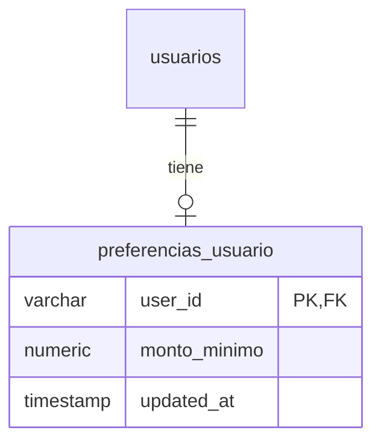

# API Spec — Preferencias de Usuario: Monto Mínimo por Defecto

**Versión**: 1.0
**Módulo**: Licitaciones — Preferencias de listado por usuario
**Generado por**: api-first-spec (agente design)
**Fecha**: 2026-08-20
**Origen funcional**: Reunión con cliente 14-08-2026 — cada usuario tiene un umbral mínimo persistente (ej. César no quiere ver licitaciones < $50M) aplicado por defecto al listar.
**Estado**: Pendiente validación HITL de supuestos marcados `[HITL]`

---

## 1. Scope

### Included

- Persistencia por usuario de un monto mínimo (CLP) como preferencia del listado de licitaciones.
- Endpoints GET/PUT para leer y actualizar la preferencia del usuario autenticado (`/me`).
- Aplicación de la preferencia como **valor por defecto del filtro** `montoDesde` en la UI del listado, con override temporal desde el filtro existente (`LicitacionFilterBar.tsx`, query params `montoDesde`/`montoHasta` ya operativos según V151).
- Precarga opcional del umbral al crear una regla de alerta (solo conveniencia de UI; las reglas siguen siendo independientes).

### Excluded

- Preferencias genéricas multi-módulo (tema, idioma, etc.) → la tabla se diseña extensible pero v1 solo gestiona `monto_minimo`.
- Modificación del SP `usp_Licitaciones_Listar` ni de `GET /api/v1/licitaciones` → el backend del listado NO cambia (ver §5 decisión D2).
- Cambio en la lógica de matching de alertas (`AlertasMatchingService`) → los umbrales por regla (`p_monto_minimo`/`p_monto_maximo` en `usp_Alertas_Crear`, V079) permanecen independientes.
- Preferencias por tenant o por rol → es por usuario individual.

## 2. Data Model



### Table: `preferencias_usuario`

| Column | Type | Nullable | Default | Description |
|--------|------|----------|---------|-------------|
| user_id | VARCHAR(200) | NO | — | PK. Id del usuario autenticado (mismo formato que `censo_preferencias.user_id`, V143). FK lógica a usuarios. |
| monto_minimo | NUMERIC(18,2) | SÍ | NULL | Umbral mínimo CLP por defecto para el listado. NULL = sin preferencia (no filtrar). CHECK >= 0. |
| updated_at | TIMESTAMPTZ | NO | NOW() | Última actualización (trigger/on-update). |

> **Precedente verificado**: no existe tabla de preferencias de usuario fuera de `censo_preferencias` (V143) en `MPM.Modules.Auth` ni `MPM.Modules.Administracion`. Esta spec replica ese patrón probado (tabla dedicada + SP Obtener/Upsert + ruta `/usuarios/me/preferencias-*`) en lugar de inventar un store genérico.

**Migración**: `V15X__Preferencias_Usuario_Monto_Minimo.sql` (número exacto a asignar al implementar; siguiente disponible ≥ V155).

## 3. Required Catalogs

No aplica.

## 4. State Flow

No aplica: recurso singleton upsert (existe o no; PUT crea o reemplaza).

## 5. REST Endpoints

### `GET /api/v1/usuarios/me/preferencias-licitaciones` — Obtener preferencia

**Descripción**: Devuelve la preferencia del usuario autenticado. Si nunca la configuró, devuelve defaults (patrón idéntico a `CensoPreferenciasController.Obtener`: sin fila → respuesta con valores vacíos, no 404).

**Response `200`** (con preferencia):

```json
{
  "success": true,
  "data": { "montoMinimo": 50000000.00 }
}
```

**Response `200`** (sin preferencia previa):

```json
{
  "success": true,
  "data": { "montoMinimo": null }
}
```

| DB Object | Type |
|-----------|------|
| `usp_PreferenciasUsuario_Obtener(@p_user_id)` | Function |

---

### `PUT /api/v1/usuarios/me/preferencias-licitaciones` — Guardar preferencia

**Request Body**:

```json
{ "montoMinimo": 50000000.00 }
```

| Campo | Type | Required | Reglas |
|-------|------|----------|--------|
| `montoMinimo` | decimal \| null | Sí (puede ser null explícito) | null borra la preferencia; si viene valor: >= 0 y <= 999999999999.99 |

**Response `200`**:

```json
{
  "success": true,
  "data": { "montoMinimo": 50000000.00 }
}
```

**Comportamiento**: Upsert idempotente (INSERT ... ON CONFLICT DO UPDATE, mismo patrón `usp_CensoPreferencias_Upsert`). El `user_id` SIEMPRE sale del JWT — nunca del body.

| DB Object | Type |
|-----------|------|
| `usp_PreferenciasUsuario_Upsert(@p_user_id, @p_monto_minimo, @p_error_msg)` | Procedure |

**Errors**:

| Code | HTTP | When |
|------|------|------|
| VAL_001 | 400 | `montoMinimo` negativo o fuera de rango |
| AUTH_002 | 403 | Sin token válido (heredado) |

## 6. Database Objects

| Endpoint | DB Object | Type | Parameters |
|----------|-----------|------|------------|
| GET /api/v1/usuarios/me/preferencias-licitaciones | usp_PreferenciasUsuario_Obtener | Function | @p_user_id |
| PUT /api/v1/usuarios/me/preferencias-licitaciones | usp_PreferenciasUsuario_Upsert | Procedure | @p_user_id, @p_monto_minimo, @p_error_msg |

Ambos objetos se crean en la migración V15X junto con la tabla.

## 7. Shared DTOs

```json
{
  "PreferenciasLicitacionesDto": { "montoMinimo": "decimal | null" },
  "PreferenciasLicitacionesUpdateDto": { "montoMinimo": "decimal | null" }
}
```

## 8. Business Rules

### Decisión de diseño D1 — Dónde vive la preferencia

- **Elegida — tabla dedicada `preferencias_usuario` en módulo Licitaciones** (consumidor del default), replicando el patrón censo. Extensible por columnas cuando aparezcan más preferencias.
- Rechazada — columna en tabla de usuarios (Auth): acopla Auth a dominio de licitaciones y requiere tocar módulo ajeno.
- Rechazada — tabla genérica clave/valor: over-engineering para una preferencia; pierde tipado y constraints.

### Decisión de diseño D2 — Quién aplica el default al listar `[HITL]`

- **Elegida — aplicación en frontend**: al cargar `/licitaciones` sin `montoDesde` en la URL, el front precarga la preferencia y la usa como valor inicial del filtro (y del request). El usuario puede overridear temporalmente editando el filtro (queda en URL, comportamiento actual intacto). Al recargar sin filtros, la preferencia vuelve a aplicar — coherente con "por defecto".
  - *Por qué*: cero cambios en SP/controller del listado (que recién se estabilizó en V151), override trivial, y evita la ambigüedad HTTP entre "param ausente" y "usuario limpió el filtro".
- Rechazada — backend aplica preferencia cuando `montoDesde` está ausente: hace imposible distinguir "sin filtro" de "usuario quitó el filtro" → tras limpiar, el usuario volvería a ver filtrado el listado sin poder desactivarlo salvo hacks (`montoDesde=0`).
- Alternativa futura documentada — flag explícito `usarPreferenciaMonto=true|false`: solo si aparece un consumidor API (no UI) que necesite defaults server-side. No se implementa en v1.

### Reglas funcionales

- **PREF-R001**: La preferencia es por usuario y aplica solo como DEFAULT inicial del listado; nunca bloquea un override explícito del usuario en sesión.
- **PREF-R002**: `montoMinimo = null` significa "sin umbral" (comportamiento actual del listado).
- **PREF-R003**: El PUT acepta `null` explícito para eliminar la preferencia (upsert a NULL).
- **PREF-R004**: La preferencia NO modifica reglas de alertas existentes ni su evaluación (`AlertasMatchingService` lee umbrales de cada regla, V079).
- **PREF-R005**: `[HITL]` Al crear una NUEVA regla de alerta, la UI puede precargar `monto_minimo` desde esta preferencia (solo valor inicial editable). Confirmar con cliente si quiere este puente o mantener 100% independientes.
- **PREF-R006**: Un usuario sin preferencia no percibe ningún cambio (listado idéntico al actual).

### Reglas de seguridad

- **PREF-R010**: `user_id` siempre del JWT (`tenant.UserId`, patrón `CensoPreferenciasController`). Nunca aceptar user_id por ruta/body.
- **PREF-R011**: Solo el dueño lee/escribe su preferencia; no hay endpoint administrativo en v1.

## 9. Error Codes

| Code | HTTP | Description | When |
|------|------|-------------|------|
| VAL_001 | 400 | Monto inválido | Negativo, no numérico o fuera de rango |
| AUTH_002 | 403 | No autenticado | Token ausente/inválido (middleware global) |

## 10. Criterios de aceptación (trazables a la reunión 14-08-2026)

- [ ] César configura $50M → recarga `/licitaciones` sin filtros en URL → el filtro "Monto desde" aparece precargado en 50.000.000 y la lista llega ya filtrada.
- [ ] César limpia el filtro y busca → ve TODAS las licitaciones (override temporal funciona; la preferencia persistida no cambia).
- [ ] César recarga sin filtros → la preferencia vuelve a aplicar.
- [ ] Otro usuario (sin preferencia) → listado sin ningún filtro automático.
- [ ] PUT con `null` → GET posterior devuelve `montoMinimo: null`.
- [ ] PUT con -1 → 400 `VAL_001`; nada se persiste.
- [ ] Las reglas de alerta existentes disparan igual que antes de la feature (regresión).

## 11. Notas de implementación (orientativas)

- Backend: nuevo controller en `MPM.Modules.Licitaciones/Controllers` siguiendo la estructura mínima de `CensoPreferenciasController` (handler + SPs constantes + DTOs).
- Frontend: hook `usePreferenciasLicitaciones` (React Query); en `useLicitaciones.ts`, si la URL no trae `montoDesde`, sembrar desde preferencia antes del primer fetch; indicador discreto "filtro por tu preferencia" cuando el default esté activo (para que el usuario entienda por qué "faltan" licitaciones).
