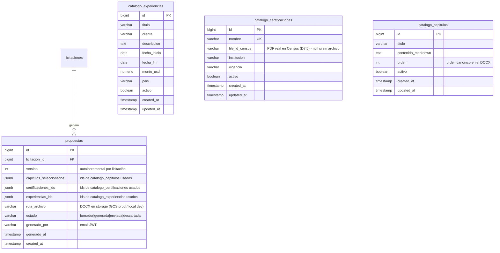

# API Spec — Módulo Propuestas (PRO)

**Versión**: 1.0
**Módulo**: Propuestas (PRO) — `MPM.Modules.Propuestas`
**Generado por**: api-first-spec
**Fecha**: 2026-08-16
**Rama**: `036-flujo-comercial-ofertas`
**Diseño origen**: [docs/design/flujo-ofertas.md](../design/flujo-ofertas.md) (§7 Fase 3, §5, D9, D7.3, D7.5, D7.6, D7.11)
**HUs de origen**:
- `HU-PRO-001`: Consulta y mantenimiento de catálogos corporativos (capítulos, experiencias, certificaciones).
- `HU-PRO-002`: Sincronización de certificaciones con API Census y descarga de PDFs.
- `HU-PRO-003`: Recomendación inteligente de certificaciones (determinística) y experiencias (IA).
- `HU-PRO-004`: Generación de propuesta DOCX de 10 capítulos condicionada a decisión GO.
- `HU-PRO-005`: Historial versionado, descarga DOCX y ciclo de vida (`generada` → `enviada` | `descartada`).
- `HU-PRO-006`: Avisos in-app de decisiones GO/NO GO a personas seleccionadas a mano.
- `HU-PRO-007`: Exportación de propuestas y pliegos a Google Drive corporativo.

---

## 1. Scope

### Included
- Catálogos corporativos de la propuesta:
  - `catalogo_experiencias` — experiencias de TIVIT **manual** (D7.6: `professional-experience/*` de
    Census NO accesible con rol service → catálogo manual como en la base PRJ-001).
  - `catalogo_certificaciones` — certificaciones TIVIT **sembradas desde Census con archivo**
    (`file_id_census` desde `intellectual-capital/user-certifications`, D7.11; PDF real vía
    `services/knowledge/certifications/file/{fileId}`, D7.5) + mantenimiento manual ligero.
  - `catalogo_capitulos` — bloques teóricos de la propuesta (semilla: 10 capítulos canónicos de la
    base PRJ-001, `datosnesesariodelrfp.md`).
- Generador de propuesta DOCX: 10 capítulos canónicos, plantilla corporativa
  (`tivit_proposal_template.docx` copiada de la base PRJ-001), certificaciones con sus PDFs
  inyectados como secciones, experiencias desde catálogo manual.
- Recomendación IA de certificaciones y experiencias para la licitación (umbrales 0.8/0.5/0.3,
  prompt `experience_relevance.txt` de la base adaptado).
- Historial de propuestas generadas por licitación (versionado).
- Avisos GO/NO GO a personas elegidas a mano: completa `notificados` de `licitaciones_interes`
  (V144, spec decisiones.md) y reusa el servicio de notificaciones existente
  (MPM.Modules.Notificaciones, V064).
- Exportación a Google Drive (Bundle D): almacenamiento y exportación de la propuesta DOCX y documentos asociados.

### Excluded
- Carátula con razón social por país dinámica → **Census `companies` devuelve 401 con rol service
  (D7.3)**: la carátula usa texto fijo "TIVIT" (anexo manual para razón social por país — backlog).
- Chat sobre la propuesta → backlog.
- Conversión DOCX → PDF → backlog (el endpoint de archivo sirve lo almacenado).
- Datos de personal de Census (nombres/emails de personas) embebidos en el DOCX → **nunca**
  (regla transversal del diseño §2: Census va aparte del documento).

---

## 2. Data Model



### Table: catalogo_experiencias (V145)

| Column | Type | Nullable | Default | Description |
|--------|------|----------|---------|-------------|
| id | BIGSERIAL | NO | — | PK |
| titulo | VARCHAR(250) | NO | — | Título de la experiencia (ej: "Mantención App Banco X") |
| cliente | VARCHAR(250) | NO | — | Cliente donde se ejecutó |
| descripcion | TEXT | YES | NULL | Descripción libre (alcance, tecnología, resultados) |
| fecha_inicio | DATE | YES | NULL | Inicio del proyecto |
| fecha_fin | DATE | YES | NULL | Fin del proyecto |
| monto_usd | NUMERIC(16,2) | YES | NULL | Monto referencial (USD) |
| pais | VARCHAR(100) | YES | NULL | País de ejecución |
| activo | BOOLEAN | NO | TRUE | Soft delete |
| created_at / updated_at | TIMESTAMP | NO | CURRENT_TIMESTAMP | Auditoría |

Indexes: PK `id` · IX `activo`.

### Table: catalogo_certificaciones (V145)

| Column | Type | Nullable | Default | Description |
|--------|------|----------|---------|-------------|
| id | BIGSERIAL | NO | — | PK |
| nombre | VARCHAR(250) | NO | — | Nombre normalizado de la certificación (UK, upsert en sync) |
| file_id_census | VARCHAR(200) | YES | NULL | `fileId` del PDF real en Census (D7.5) — null si no hay archivo representativo |
| institucion | VARCHAR(200) | YES | NULL | Institución emisora |
| vigencia | VARCHAR(100) | YES | NULL | Vigencia (texto: "2024-2027", "vigente") |
| activo | BOOLEAN | NO | TRUE | Soft delete |
| created_at / updated_at | TIMESTAMP | NO | CURRENT_TIMESTAMP | Auditoría |

Indexes: PK `id` · UK `nombre` · IX `activo`.

### Table: catalogo_capitulos (V145)

| Column | Type | Nullable | Default | Description |
|--------|------|----------|---------|-------------|
| id | BIGSERIAL | NO | — | PK |
| titulo | VARCHAR(250) | NO | — | Título del capítulo |
| contenido_markdown | TEXT | YES | NULL | Contenido base en Markdown (semilla corporativa; se completa en generación) |
| orden | INT | NO | 0 | Orden canónico en el DOCX (1-10) |
| activo | BOOLEAN | NO | TRUE | Soft delete |
| created_at / updated_at | TIMESTAMP | NO | CURRENT_TIMESTAMP | Auditoría |

Indexes: PK `id` · IX `orden` · IX `activo`.

### Table: propuestas (V145)

| Column | Type | Nullable | Default | Description |
|--------|------|----------|---------|-------------|
| id | BIGSERIAL | NO | — | PK |
| licitacion_id | BIGINT | NO | — | FK → licitaciones(id) |
| version | INT | NO | 1 | Versión de la propuesta (máx+1 por licitación) |
| capitulos_seleccionados | JSONB | NO | '[]' | `[capitulo_id, ...]` usados (default: todos los activos) |
| certificaciones_ids | JSONB | NO | '[]' | `[certificacion_id, ...]` incluidos en la sección 4 |
| experiencias_ids | JSONB | NO | '[]' | `[experiencia_id, ...]` incluidos en la sección 5 |
| ruta_archivo | VARCHAR(500) | YES | NULL | Ruta del DOCX en storage (GCS prod / local dev) |
| estado | VARCHAR(20) | NO | 'borrador' | `borrador\|generada\|enviada\|descartada` |
| generado_por | VARCHAR(200) | YES | NULL | Email del JWT que generó |
| generado_at | TIMESTAMP | YES | NULL | Momento de generación |
| created_at / updated_at | TIMESTAMP | NO | CURRENT_TIMESTAMP | Auditoría |

Indexes: PK `id` · UK `(licitacion_id, version)` · IX `licitacion_id` · IX `estado`.

**Evolución de V144 (spec decisiones.md)**: `ALTER TABLE licitaciones_interes ADD COLUMN notificado_at TIMESTAMP NULL`
— la spec de decisiones dejó explícito que `notificado_at` se define en Fase 3 con el envío real de avisos
(nota 2 de decisiones.md).

---

## 3. Required Catalogs

### Enum: EstadoPropuesta (application-level, no se almacena como catálogo)

| Value | Description |
|-------|-------------|
| `borrador` | Fila creada sin documento materializado (reservado; la generación es síncrona) |
| `generada` | DOCX generado y almacenado (`ruta_archivo` no null) |
| `enviada` | Propuesta marcada como enviada al cliente (transición manual) |
| `descartada` | Propuesta descartada (transición manual) |

### Enum: CategoriaRecomendacion (application-level)

| Value | Descripción |
|-------|-------------|
| `recomendado` | score ≥ 0.8 (match directo — prompt experience_relevance.txt) |
| `posible` | 0.5 ≤ score < 0.8 (match parcial) |
| `descartado` | 0.3 ≤ score < 0.5 (se devuelve informativo, no se auto-selecciona) |
| (no se devuelve) | score < 0.3 (irrelevante, se omite) |

### Catálogo semilla: Capítulos canónicos (10, base PRJ-001 `datosnesesariodelrfp.md`)

| orden | titulo | contenido |
|-------|--------|-----------|
| 1 | Carátula | Texto fijo "TIVIT" (D7.3: `companies` 401 → sin razón social dinámica; anexo manual por país — backlog) |
| 2 | Declaración de confidencialidad | Texto semilla corporativo |
| 3 | Resumen ejecutivo | Semilla + se completa con `resumen_ejecutivo` del análisis comercial si existe (V142) |
| 4 | Certificaciones TIVIT | Dinámico: catálogo de certificaciones + PDFs (fileId Census) |
| 5 | Experiencias TIVIT | Dinámico: catálogo manual de experiencias |
| 6 | Alcance del servicio | Semilla + requisitos del análisis (si existe) |
| 7 | Organigrama | Semilla corporativo |
| 8 | Aportes de las partes | Semilla corporativo |
| 9 | Listado de entregables | Semilla corporativo |
| 10 | Capítulos teóricos | Semilla (técnicos + RRHH + metodología) |

> Semilla: la migración V145 inserta los 10 capítulos con contenido base corporativo adaptado de la base PRJ-001.

### Catálogo: Tipos de notificación (extensión de V064, spec notificaciones.md)

| Value | Descripción |
|-------|-------------|
| `decision_avisada` | Nuevo: aviso GO/NO GO a persona elegida (creado por el endpoint de avisar) |

### Fuentes Census (no son tablas — configuración `config_census`, nunca en el repo)

| Fuente | Uso |
|--------|-----|
| `GET intellectual-capital/user-certifications` (200, ~5,2 MB) | Sincronizar catálogo: nombre + primer `fileId` representativo por certificación (D7.11) |
| `GET services/knowledge/certifications/file/{fileId}` (200, PDF real, D7.5) | Descargar el PDF de cada certificación seleccionada en la generación |

---

## 4. State Flow

### Propuesta (por licitación, versionada)

| Estado | Acción | Siguiente | Condiciones |
|--------|--------|-----------|-------------|
| (sin fila) | `POST /propuestas/generar` | generada | Decisión `go` vigente (PRO-R004); generación síncrona OK |
| (sin fila) | `POST /propuestas/generar` | (rechazado) | Sin decisión `go` → PRO_003; plantilla no encontrada → PRO_010 |
| generada | `PATCH .../propuestas/{id}/estado` | enviada | Body `{estado: "enviada"}` — transición manual |
| generada | `PATCH .../propuestas/{id}/estado` | descartada | Body `{estado: "descartada"}` — transición manual |
| enviada | `PATCH .../propuestas/{id}/estado` | descartada | Body `{estado: "descartada"}` |
| enviada / descartada | `PATCH .../estado` | (rechazado) | Transición inválida → PRO_008 |
| cualquier | `POST /propuestas/generar` (otra vez) | generada (nueva versión) | Crea `version = máx+1`; las anteriores conservan su estado |

### Avisos (completa `notificados` de la decisión, V144)

| Estado | Acción | Siguiente |
|--------|--------|-----------|
| decisión sin `notificados` | `POST /decision/{decisionId}/avisar` | `notificados` = destinatarios, `notificado_at` = now |
| decisión con `notificados` | `POST /decision/{decisionId}/avisar` (re-avisar) | Reemplaza `notificados` + re-envía (idempotente por diseño, decisión manda) |

---

## 5. REST Endpoints — `[Authorize]`

### Catálogos — patrón común (3 catálogos)

> CRUD ligero por catálogo. **Lectura** (GET): cualquier JWT autenticado. **Escritura**
> (POST/PUT/DELETE): roles `Admin,SuperAdmin` (catálogos corporativos TIVIT — misma política de
> administración que el refresco de catálogo de Censo, QA Fase 2).

| Método | Ruta | Descripción |
|--------|------|-------------|
| GET | `/api/v1/propuestas/catalogos/experiencias` | Lista paginada (filtros: `q`, `activo`) |
| POST | `/api/v1/propuestas/catalogos/experiencias` | Crear experiencia (manual — D7.6) |
| PUT | `/api/v1/propuestas/catalogos/experiencias/{id}` | Actualizar experiencia |
| DELETE | `/api/v1/propuestas/catalogos/experiencias/{id}` | Soft delete (`activo=false`) |
| GET | `/api/v1/propuestas/catalogos/certificaciones` | Lista paginada (filtros: `q`, `activo`, `conArchivo`) |
| POST | `/api/v1/propuestas/catalogos/certificaciones` | Crear certificación manual (upsert por nombre normalizado) |
| PUT | `/api/v1/propuestas/catalogos/certificaciones/{id}` | Actualizar certificación (ej: completar `file_id_census` a mano) |
| DELETE | `/api/v1/propuestas/catalogos/certificaciones/{id}` | Soft delete |
| GET | `/api/v1/propuestas/catalogos/capitulos` | Lista paginada (filtros: `q`, `activo`) |
| POST | `/api/v1/propuestas/catalogos/capitulos` | Crear capítulo teórico |
| PUT | `/api/v1/propuestas/catalogos/capitulos/{id}` | Actualizar capítulo (contenido/orden) |
| DELETE | `/api/v1/propuestas/catalogos/capitulos/{id}` | Soft delete |

**GET — parámetros comunes**:

| Param | Type | Required | Default | Description |
|-------|------|----------|---------|-------------|
| page | int | No | 1 | Página |
| size | int | No | 20 | Tamaño (máx 100) |
| q | string | No | — | Búsqueda por nombre/título (case-insensitive) |
| activo | bool | No | true | Filtro por activo |
| conArchivo | bool | No | — | Solo certificaciones con `file_id_census` (GET certificaciones) |

**POST — body por catálogo** (mismo DTO del item; sin `id`/`activo` en create):

```json
// POST /catalogos/experiencias
{ "titulo": "Mantención App Banco X", "cliente": "Banco X", "descripcion": "...",
  "fechaInicio": "2023-01-01", "fechaFin": "2024-12-31", "montoUsd": 1500000, "pais": "Chile" }

// POST /catalogos/certificaciones
{ "nombre": "ISO/IEC 27001", "fileIdCensus": null, "institucion": "BSI", "vigencia": "2024-2027" }

// POST /catalogos/capitulos
{ "titulo": "Capítulos teóricos", "contenidoMarkdown": "# ...", "orden": 10 }
```

**Response (200 / 201)**:
```json
{
  "success": true,
  "data": {
    "item": { "id": 7, "titulo": "Mantención App Banco X", "cliente": "Banco X", "...": "..." }
  }
}
```

**DB Objects**: `usp_CatalogoExperiencias_Listar/_Insertar/_Actualizar/_Eliminar`,
`usp_CatalogoCertificaciones_Listar/_Insertar/_Actualizar/_Eliminar`,
`usp_CatalogoCapitulos_Listar/_Insertar/_Actualizar/_Eliminar`.

**Error Codes**: `PRO_001` (404), `PRO_002` (409 — nombre de certificación duplicado en create),
`VAL_001`, `AUTH_001`, `AUTH_002` (403 escritura sin rol), `SYS_001`.

### POST /api/v1/propuestas/catalogos/certificaciones/sincronizar-census — Sembrar catálogo desde Census

**Description**: Consume `GET intellectual-capital/user-certifications` (200, D7.3/D7.11 — única
fuente de `fileId`), agrupa por certificación y hace **upsert** en `catalogo_certificaciones`:
`nombre` (normalizado, UK), `file_id_census` (primer archivo disponible para ese nombre),
`institucion`/`vigencia` (si el payload los trae). No elimina certificaciones existentes sin
contraparte en Census (pueden tener archivo cargado a mano).

**Request Body**: Ninguno.

**Response (200)**:
```json
{
  "success": true,
  "data": {
    "procesadas": 420,
    "insertadas": 210,
    "actualizadas": 200,
    "sinArchivo": 10,
    "durationMs": 8500
  }
}
```

**DB Object**: `usp_CatalogoCertificaciones_SincronizarCensus` (batch upsert) vía `CensusClient`
(existente, Fase 2 — token manager + retry 401, CEN-R011).
**Rules**: Requiere `[Authorize(Roles = "Admin,SuperAdmin")]` (patrón QA Fase 2 del refresco de
catálogo de Censo). Las certificaciones sin `fileId` en Census quedan `file_id_census = NULL`
(visibles, marcadas para carga manual). Antes de sincronizar por primera vez, la recomendación y
la generación responden PRO_006 (catálogo vacío).
**Error Codes**: `CEN_002` (502 — Census inalcanzable), `AUTH_001`, `AUTH_002` (403), `SYS_001`.

### POST /api/v1/propuestas/recomendaciones — Recomendación IA de certificaciones y experiencias

**Description**: Recomienda certificaciones y experiencias del catálogo para la licitación con
score y categoría (umbrales 0.8/0.5/0.3). Si se pasa `codigoExterno`, los requisitos se toman del
último análisis comercial completado (`analisis_licitacion_comercial.resultado_json.requisitos`,
V142 — certificaciones + tecnologías + industria); el body `requisitos` tiene precedencia si viene.

**Path Parameters**: Ninguno (ruta global).

**Request Body** — `RecomendacionRequest`:
```json
{
  "codigoExterno": "1425525-3-LE26",
  "requisitos": {
    "certificaciones": ["ISO 27001", "ISO 9001"],
    "tecnologias": ["SIEM", "React"],
    "industria": "Ciberseguridad"
  }
}
```

**Response (200)**:
```json
{
  "success": true,
  "data": {
    "fuente": "analisis",
    "requisitosUsados": { "certificaciones": ["ISO 27001"], "tecnologias": ["SIEM"], "industria": "Ciberseguridad" },
    "certificaciones": [
      { "id": 12, "nombre": "ISO/IEC 27001", "institucion": "BSI", "score": 0.93,
        "categoria": "recomendado", "tieneArchivo": true },
      { "id": 31, "nombre": "ISO 9001", "institucion": "DNV", "score": 0.62,
        "categoria": "posible", "tieneArchivo": true }
    ],
    "experiencias": [
      { "id": 7, "titulo": "Mantención App Banco X", "cliente": "Banco X",
        "score": 0.85, "categoria": "recomendado", "motivo": "Misma industria y stack (SIEM)" },
      { "id": 9, "titulo": "Soporte App Retail Y", "cliente": "Retail Y",
        "score": 0.54, "categoria": "posible", "motivo": "Industria similar, stack parcial" }
    ],
    "resumen": { "recomendados": 1, "posibles": 2, "descartados": 1 }
  }
}
```

**DB Objects**: `usp_AnalisisComercial_ObtenerUltimo` (V142, requisitos si `codigoExterno`),
`usp_CatalogoCertificaciones_Listar` / `usp_CatalogoExperiencias_Listar` (catálogos a evaluar).
**Rules**:
- **Certificaciones: score determinístico** — coincidencia por substring normalizado entre
  `requisitos.certificaciones` y `catalogo_certificaciones.nombre` (canonicalización ligera
  D7.11: "ISO/IEC 27001" ≈ "ISO 27001" ≈ "27001"), mapeado a los umbrales 0.8/0.5/0.3. **$0 en
  tokens** (decisión de spec: no hay prompt de IA para certificaciones en la base; el prompt
  `experience_relevance.txt` solo cubre experiencias).
- **Experiencias: IA** — prompt `experience_relevance.txt` de la base adaptado al proveedor MPM
  (D5): `{rfp_summary}` = resumen del análisis (o `requisitos` si no hay análisis), `{experiences_text}`
  = catálogo activo; salida JSON `[{experience_id, score, reason}]`, solo score > 0.3.
- Categorías: `recomendado` ≥ 0.8 · `posible` 0.5–0.8 · `descartado` 0.3–0.5 (informativo) · < 0.3 omitido.
- `codigoExterno` sin análisis completado y sin `requisitos` → PRO_004.
- Catálogo de certificaciones vacío → PRO_006 (sincronizar primero); experiencias vacío → PRO_006.
- No persiste nada (la selección final la hace el usuario al generar).

**Error Codes**: `LIC_001` (404), `PRO_004` (422), `PRO_006` (422), `AUTH_001`, `SYS_001`.

### POST /api/v1/licitaciones/{codigoExterno}/propuestas/generar — Generar propuesta DOCX

**Description**: Genera el DOCX de propuesta (10 capítulos canónicos, plantilla corporativa,
certificaciones con PDFs inyectados, experiencias del catálogo manual). Síncrono. **Requisito
previo: decisión `go` vigente** (PRO-R004). Los ids ausentes se interpretan así: `capitulosIds`
ausente → todos los activos; `certificacionesIds`/`experienciasIds` ausentes → sección vacía
(omitida del documento).

**Path Parameters**:
| Param | Type | Required | Description |
|-------|------|----------|-------------|
| `codigoExterno` | string | Yes | Código externo de la licitación (ej: `1425525-3-LE26`) |

**Request Body** — `GenerarPropuestaRequest` (todo opcional):
```json
{
  "capitulosIds": [1, 2, 3, 4, 5, 6, 7, 8, 9, 10],
  "certificacionesIds": [12, 31],
  "experienciasIds": [7, 9]
}
```

**Response (200)**:
```json
{
  "success": true,
  "data": {
    "propuestaId": 42,
    "version": 1,
    "estado": "generada",
    "rutaDescarga": "/api/v1/licitaciones/1425525-3-LE26/propuestas/42/archivo",
    "generadoPor": "gerente@tivit.cl",
    "generadoAt": "2026-08-16T17:00:00Z",
    "resumen": {
      "capitulos": 10,
      "certificaciones": 2,
      "certificacionesSinPdf": 0,
      "experiencias": 2,
      "archivosStorage": "GCS"
    }
  }
}
```

**DB Objects**: `usp_Propuestas_Generar` (insert + `version = máx+1` + estado `generada`),
`usp_LicitacionesDecision_Obtener` (V144 — validar `decision='go'`),
`usp_CatalogoCapitulos_Listar` / `usp_CatalogoCertificaciones_Listar` / `usp_CatalogoExperiencias_Listar`.
**Rules**:
- Solo con decisión `go` vigente → PRO_003 (excepción anotada: permitir generar sin decisión es
  decisión de negocio — backlog).
- Orden del documento = `orden` de `catalogo_capitulos` (canónico 1-10); capítulos 4 y 5 se
  llenan con los catálogos seleccionados; capítulo 3 se completa con `resumen_ejecutivo` del
  análisis si existe; capítulo 1 usa texto fijo "TIVIT" (D7.3).
- **Census aparte del documento**: los datos de personal de Census (nombres/emails) NUNCA van
  embebidos; solo se inyectan los PDFs de certificaciones (D7.5, D9) y texto del catálogo.
- Descarga de PDFs de certificaciones en paralelo (reutiliza `CensusClient.DownloadCertificationFileAsync`,
  Fase 2; semáforo máx 4 — patrón CEN-R005). Si un PDF falla: la certificación se incluye como
  texto, se registra advertencia en el documento y en `resumen.certificacionesSinPdf` (no falla la
  generación completa — resiliencia).
- Plantilla `src/MPM.Api/Templates/tivit_proposal_template.docx` (PRO-R001); procesamiento con la
  librería de OpenXML que decida delivery (supuesto).
- Generar de nuevo crea una **nueva versión** (las anteriores conservan estado).
- Tiempo objetivo < 10 s (10 capítulos + ≤ 5 PDFs).

**Error Codes**: `LIC_001` (404), `PRO_002` (409 — ids de catálogo inexistentes o inactivos),
`PRO_003` (422), `PRO_006` (422 — catálogo de certificaciones vacío), `PRO_010` (500 — plantilla),
`CEN_002` (502 — Census inalcanzable en descarga de PDFs), `AUTH_001`, `SYS_001`.

### GET /api/v1/licitaciones/{codigoExterno}/propuestas/{propuestaId}/archivo — Descargar DOCX

**Description**: Sirve el binario del documento generado. **Content-Type**:
`application/vnd.openxmlformats-officedocument.wordprocessingml.document` · **Content-Disposition**:
`attachment; filename="Propuesta_{codigoExterno}_v{version}.docx"`. Si el almacén tuviera PDF
(conversión futura), se sirve con su content-type (el contrato es "lo que esté en `ruta_archivo`").

**Path Parameters**:
| Param | Type | Required | Description |
|-------|------|----------|-------------|
| `codigoExterno` | string | Yes | Código externo de la licitación |
| `propuestaId` | bigint | Yes | Id de la propuesta |

**Response (200)**: binario (stream). **404**: `PRO_001` (propuesta inexistente o sin `ruta_archivo`).

**DB Object**: `usp_Propuestas_Obtener`.
**Rules**: Requiere JWT. No valida estado (se puede descargar cualquier versión con archivo).
**Error Codes**: `LIC_001` (404), `PRO_001` (404), `AUTH_001`.

### GET /api/v1/licitaciones/{codigoExterno}/propuestas — Historial de propuestas

**Description**: Historial versionado de propuestas de la licitación (más reciente primero).

**Query Parameters**:
| Param | Type | Required | Default | Description |
|-------|------|----------|---------|-------------|
| page | int | No | 1 | Página |
| size | int | No | 20 | Tamaño (máx 100) |
| estado | string | No | — | Filtro por estado |

**Response (200)**:
```json
{
  "success": true,
  "data": {
    "items": [
      { "propuestaId": 42, "version": 1, "estado": "generada",
        "capitulos": 10, "certificaciones": 2, "experiencias": 2,
        "generadoPor": "gerente@tivit.cl", "generadoAt": "2026-08-16T17:00:00Z",
        "rutaDescarga": "/api/v1/licitaciones/1425525-3-LE26/propuestas/42/archivo" }
    ],
    "pagination": { "page": 1, "size": 20, "totalItems": 1, "totalPages": 1 }
  }
}
```

**DB Object**: `usp_Propuestas_Listar`.
**Rules**: Requiere JWT.
**Error Codes**: `LIC_001` (404), `AUTH_001`.

### PATCH /api/v1/licitaciones/{codigoExterno}/propuestas/{propuestaId}/estado — Transición de estado

**Description**: Transición manual del ciclo de vida (enviada/descartada). Derivado del state flow
(no listado en §7 del diseño — misma lógica que el refresco de catálogo en censo.md, nota 2).

**Request Body**:
```json
{ "estado": "enviada" }
```

**Response (200)**:
```json
{
  "success": true,
  "data": { "propuestaId": 42, "version": 1, "estado": "enviada" }
}
```

**DB Object**: `usp_Propuestas_ActualizarEstado`.
**Rules**: Solo transiciones válidas de la matriz (§4): `generada → enviada|descartada`,
`enviada → descartada`. Otras → PRO_008.
**Error Codes**: `LIC_001` (404), `PRO_001` (404), `PRO_008` (422), `VAL_001`, `AUTH_001`.

### POST /api/v1/licitaciones/{codigoExterno}/decision/{decisionId}/avisar — Avisar a personas elegidas

**Description**: Notifica a las personas elegidas a mano (GO y NO GO — DEC-R009 de decisiones.md),
completa `notificados` (JSONB, V144) + `notificado_at` (V145) en la decisión, y crea una
notificación in-app por destinatario reusando **MPM.Modules.Notificaciones** (V064 — inyección
conceptual del servicio existente; no se diseña mensajería desde cero). Re-avisar reemplaza la
lista y re-envía.

**Path Parameters**:
| Param | Type | Required | Description |
|-------|------|----------|-------------|
| `codigoExterno` | string | Yes | Código externo de la licitación |
| `decisionId` | bigint | Yes | Id de la fila de decisión (`licitaciones_interes`) — debe corresponder a la licitación (validatorio; la tabla es UK por licitación) |

**Request Body** — `AvisarRequest`:
```json
{ "destinatarios": ["maria.gonzalez@tivit.com", "juan.perez@tivit.com"] }
```

**Response (200)**:
```json
{
  "success": true,
  "data": {
    "decisionId": 7,
    "codigoExterno": "1425525-3-LE26",
    "decision": "go",
    "notificados": ["maria.gonzalez@tivit.com", "juan.perez@tivit.com"],
    "notificadoAt": "2026-08-16T18:00:00Z",
    "enviados": 2
  }
}
```

**DB Objects**: `usp_LicitacionesDecision_Obtener` (V144 — validar decisión y `decisionId`),
`usp_LicitacionesDecision_ActualizarNotificados` (V145 — set `notificados` + `notificado_at`),
servicio `Notificaciones` existente (V064).
**Rules**:
- `destinatarios`: lista de emails válidos, 1-50 items → PRO_007 si vacía/inválida.
- Solo avisa si existe decisión registrada (`go` o `no_go`) → PRO_011; `decisionId` que no
  corresponde a la licitación → PRO_012.
- `notificados` **solo** guarda las personas elegidas (nunca "todos") — PRO-R008.
- Tipo de notificación creado: `decision_avisada` (extensión V064); metadata con `codigoExterno`
  y `decision`.
- La entrega multicanal (email real) depende del canal existente (hoy in-app — ver notas).

**Error Codes**: `LIC_001` (404), `PRO_007` (422), `PRO_011` (404), `PRO_012` (422),
`AUTH_001`, `SYS_001`.

---

## 6. Database Objects

| Endpoint | DB Object | Type | Params |
|----------|-----------|------|--------|
| GET /catalogos/experiencias | `usp_CatalogoExperiencias_Listar` | Function | `p_page`, `p_size`, `p_q`, `p_activo` |
| POST /catalogos/experiencias | `usp_CatalogoExperiencias_Insertar` | Procedure | `p_titulo`, `p_cliente`, `p_descripcion`, `p_fecha_inicio`, `p_fecha_fin`, `p_monto_usd`, `p_pais`, `p_id` (OUT), `p_error_msg` (OUT) |
| PUT /catalogos/experiencias/{id} | `usp_CatalogoExperiencias_Actualizar` | Procedure | `p_id` + mismos campos |
| DELETE /catalogos/experiencias/{id} | `usp_CatalogoExperiencias_Eliminar` | Procedure | `p_id` (soft delete) |
| GET /catalogos/certificaciones | `usp_CatalogoCertificaciones_Listar` | Function | `p_page`, `p_size`, `p_q`, `p_activo`, `p_con_archivo` |
| POST /catalogos/certificaciones | `usp_CatalogoCertificaciones_Insertar` | Procedure | `p_nombre`, `p_file_id_census`, `p_institucion`, `p_vigencia`, `p_id` (OUT), `p_error_msg` (OUT) — upsert por `nombre` |
| PUT /catalogos/certificaciones/{id} | `usp_CatalogoCertificaciones_Actualizar` | Procedure | `p_id` + mismos campos |
| DELETE /catalogos/certificaciones/{id} | `usp_CatalogoCertificaciones_Eliminar` | Procedure | `p_id` |
| POST /catalogos/certificaciones/sincronizar-census | `usp_CatalogoCertificaciones_SincronizarCensus` | Procedure (batch) | `p_json_certificaciones` (array nombre/fileId/institucion/vigencia) |
| GET /catalogos/capitulos | `usp_CatalogoCapitulos_Listar` | Function | `p_page`, `p_size`, `p_q`, `p_activo` |
| POST /catalogos/capitulos | `usp_CatalogoCapitulos_Insertar` | Procedure | `p_titulo`, `p_contenido_markdown`, `p_orden`, `p_id` (OUT), `p_error_msg` (OUT) |
| PUT /catalogos/capitulos/{id} | `usp_CatalogoCapitulos_Actualizar` | Procedure | `p_id` + mismos campos |
| DELETE /catalogos/capitulos/{id} | `usp_CatalogoCapitulos_Eliminar` | Procedure | `p_id` |
| POST /recomendaciones | `usp_AnalisisComercial_ObtenerUltimo` | Function (V142) | `p_licitacion_id` (requisitos si `codigoExterno`) |
| POST /recomendaciones | `usp_CatalogoCertificaciones_Listar` / `usp_CatalogoExperiencias_Listar` | Function | Catálogos a evaluar |
| POST /propuestas/generar | `usp_Propuestas_Generar` | Procedure | `p_licitacion_id`, `p_capitulos_json`, `p_certificaciones_json`, `p_experiencias_json`, `p_ruta_archivo`, `p_generado_por`, `p_version` (OUT), `p_id` (OUT), `p_error_msg` (OUT) |
| POST /propuestas/generar (validación) | `usp_LicitacionesDecision_Obtener` | Function (V144) | `p_licitacion_id` (exige `decision='go'`) |
| GET /propuestas | `usp_Propuestas_Listar` | Function | `p_licitacion_id`, `p_page`, `p_size`, `p_estado` |
| GET /propuestas/{id}/archivo | `usp_Propuestas_Obtener` | Function | `p_id` |
| PATCH /propuestas/{id}/estado | `usp_Propuestas_ActualizarEstado` | Procedure | `p_id`, `p_estado`, `p_error_msg` (OUT) |
| POST /decision/{id}/avisar (validación) | `usp_LicitacionesDecision_Obtener` | Function (V144) | `p_licitacion_id`, `p_id` (coherencia `decisionId`) |
| POST /decision/{id}/avisar | `usp_LicitacionesDecision_ActualizarNotificados` | Procedure (V145) | `p_id`, `p_notificados_json`, `p_error_msg` (OUT) |

**Migración**: `V145__Propuestas.sql`:
1. `catalogo_experiencias`, `catalogo_certificaciones`, `catalogo_capitulos`, `propuestas`.
2. Semilla de los 10 capítulos canónicos (`catalogo_capitulos`, contenido base adaptado de la base PRJ-001).
3. `ALTER TABLE licitaciones_interes ADD COLUMN notificado_at TIMESTAMP NULL` (completa V144 — nota 2 de decisiones.md).

---

## 7. Shared DTOs

```json
{
  "CatalogoExperienciaDto": {
    "id": "bigint", "titulo": "string", "cliente": "string", "descripcion": "string?",
    "fechaInicio": "date?", "fechaFin": "date?", "montoUsd": "decimal?", "pais": "string?",
    "activo": "bool"
  },
  "CatalogoCertificacionDto": {
    "id": "bigint", "nombre": "string", "fileIdCensus": "string?", "institucion": "string?",
    "vigencia": "string?", "activo": "bool", "tieneArchivo": "bool (derivado)"
  },
  "CatalogoCapituloDto": {
    "id": "bigint", "titulo": "string", "contenidoMarkdown": "string?", "orden": "int", "activo": "bool"
  },
  "RecomendacionRequest": {
    "codigoExterno": "string?", "requisitos": "RequisitosDto?"
  },
  "RequisitosDto": {
    "certificaciones": ["string"], "tecnologias": ["string"], "industria": "string?"
  },
  "RecomendacionItemDto": {
    "id": "bigint", "score": "decimal (0-1)", "categoria": "string (recomendado|posible|descartado)",
    "motivo": "string? (solo experiencias)"
  },
  "RecomendacionCertificacionDto": "RecomendacionItemDto + nombre, institucion, tieneArchivo",
  "RecomendacionExperienciaDto": "RecomendacionItemDto + titulo, cliente",
  "GenerarPropuestaRequest": {
    "capitulosIds": ["bigint?"], "certificacionesIds": ["bigint?"], "experienciasIds": ["bigint?"]
  },
  "GenerarPropuestaResponse": {
    "propuestaId": "bigint", "version": "int", "estado": "string",
    "rutaDescarga": "string", "generadoPor": "string", "generadoAt": "datetime",
    "resumen": { "capitulos": "int", "certificaciones": "int", "certificacionesSinPdf": "int",
                 "experiencias": "int", "archivosStorage": "string (GCS|local)" }
  },
  "PropuestaHistorialDto": {
    "propuestaId": "bigint", "version": "int", "estado": "string",
    "capitulos": "int", "certificaciones": "int", "experiencias": "int",
    "generadoPor": "string", "generadoAt": "datetime", "rutaDescarga": "string?"
  },
  "AvisarRequest": { "destinatarios": ["string (email)"] },
  "AvisarResponse": {
    "decisionId": "bigint", "codigoExterno": "string", "decision": "string",
    "notificados": ["string"], "notificadoAt": "datetime", "enviados": "int"
  },
  "PaginationDto": { "page": "int", "size": "int", "totalItems": "int", "totalPages": "int" }
}
```

---

## 8. Business Rules

### Plantilla y documento
- `PRO-R001`: la plantilla corporativa vive en `src/MPM.Api/Templates/tivit_proposal_template.docx`
  (copiada de la base PRJ-001 y adaptada — decisión de copia del orchestrator). Procesamiento con
  la librería OpenXML que decida delivery (supuesto técnico).
- `PRO-R002`: **Census va aparte del documento** — los datos de personal (nombres/emails de
  personas de Census) NUNCA se embeben en el DOCX; solo se inyectan los PDFs de certificaciones
  (D7.5/D9) y texto de los catálogos.
- `PRO-R003`: carátula con texto fijo "TIVIT" (D7.3: `companies` 401); razón social por país →
  anexo manual, backlog.

### Catálogos
- `PRO-R004`: los catálogos son **corporativos globales** (no por tenant) — el contenido de la
  propuesta es de TIVIT entera; la propuesta sí es por licitación (tenant).
- `PRO-R005`: escritura de catálogos y sincronización requieren roles `Admin,SuperAdmin`; lectura
  cualquier JWT autenticado.
- `PRO-R006`: `catalogo_certificaciones` se siembra desde `intellectual-capital/user-certifications`
  (D7.11 — única fuente de `fileId`); el upsert es por `nombre` normalizado (canonicalización
  ligera D7.11: "ISO/IEC 27001" ≈ "ISO 27001").
- `PRO-R007`: certificación sin `fileId` en Census → `file_id_census = NULL` (se mantiene en el
  catálogo, marcada para carga manual).

### Recomendación IA
- `PRO-R008`: umbrales 0.8/0.5/0.3 — `recomendado` ≥ 0.8 (match directo), `posible` 0.5–0.8,
  `descartado` 0.3–0.5 (informativo, nunca auto-seleccionado), < 0.3 omitido.
- `PRO-R009`: certificaciones con **score determinístico** por substring normalizado contra
  requisitos ($0 en tokens — no hay prompt IA de certificaciones en la base); experiencias con
  **IA** (prompt `experience_relevance.txt` adaptado al proveedor MPM, D5).
- `PRO-R010`: la recomendación es insumo, no decisión — la selección final la hace el usuario al
  generar (la IA recomienda, el humano decide — regla transversal del flujo).

### Generación
- `PRO-R011`: **no se genera propuesta sin decisión `go` vigente** (licitaciones_interes.decision =
  'go'). Excepción anotada: permitir generar sin decisión formal es decisión de negocio → backlog.
- `PRO-R012`: ids de catálogo referenciados deben existir y estar activos → PRO_002.
- `PRO-R013`: listas ausentes = defaults (`capitulosIds` → todos activos; certificaciones/experiencias
  ausentes → sección omitida, nunca auto-rellenada con la recomendación).
- `PRO-R014`: cada `generar` crea una nueva versión (`máx+1`); el historial conserva todas.
- `PRO-R015`: si un PDF de certificación falla al descargar, la certificación se incluye como
  texto y se registra advertencia — la generación no falla completa (resiliencia).

### Avisos
- `PRO-R016`: solo se avisa si existe decisión registrada (`go` o `no_go`); `decisionId` debe
  corresponder a la licitación (UK V144).
- `PRO-R017`: `notificados` **solo** contiene las personas elegidas a mano (nunca "todos" los
  involucrados); re-avisar reemplaza la lista y re-envía.
- `PRO-R018`: el envío reusa `MPM.Modules.Notificaciones` (V064) — inyección conceptual del
  servicio existente; la Fase 3 no diseña mensajería nueva.

---

## 9. Error Codes

| Code | HTTP | Description | When |
|------|------|-------------|------|
| `PRO_001` | 404 | Propuesta no encontrada | `propuestaId` inexistente o sin `ruta_archivo` |
| `PRO_002` | 409 | Ítem de catálogo inválido | Id de catálogo inexistente/inactivo en `generar`; nombre de certificación duplicado en create manual |
| `PRO_003` | 422 | Sin decisión GO vigente | Generar propuesta sin `licitaciones_interes.decision = 'go'` |
| `PRO_004` | 422 | Sin requisitos para recomendar | `codigoExterno` sin análisis completado y `requisitos` ausente/vacío |
| `PRO_005` | 404 | Archivo de certificación no disponible | `fileId` de Census inválido o descarga fallida persistente (manejo: texto + advertencia, PRO-R015) |
| `PRO_006` | 422 | Catálogo vacío | Recomendar/generar con `catalogo_certificaciones` o `catalogo_experiencias` sin filas activas (sincronizar primero) |
| `PRO_007` | 422 | Destinatarios inválidos | `destinatarios` vacío, > 50 items o con emails no válidos |
| `PRO_008` | 422 | Transición de estado inválida | PATCH estado con transición fuera de la matriz (§4) |
| `PRO_009` | 500 | Fallo de generación del documento | Error de OpenXML/escritura del DOCX (sin relación con Census) |
| `PRO_010` | 500 | Plantilla corporativa no disponible | `tivit_proposal_template.docx` ausente en `src/MPM.Api/Templates/` |
| `PRO_011` | 404 | Decisión no registrada | Avisar sin fila de decisión para la licitación |
| `PRO_012` | 422 | `decisionId` no corresponde a la licitación | Coherencia ruta vs. fila (UK V144) |
| `LIC_001` | 404 | Licitación no encontrada | `codigoExterno` inexistente (reutilizado) |
| `CEN_002` | 502 | Census inalcanzable | Sincronizar catálogo o descarga de PDFs: fallo de red/auth persistente (reutilizado) |
| `DEC_002` | 422 | Decisión inválida | Reutilizado de decisiones.md (validación de decisión en flujos cruzados) |
| `VAL_001` | 400 | Campo requerido o inválido | Validación de body (emails, paginación, enums) |
| `AUTH_001` | 401 | No autenticado | Token MPM faltante/expirado |
| `AUTH_002` | 403 | Permisos insuficientes | Escritura de catálogos / sincronizar sin rol Admin/SuperAdmin |
| `SYS_001` | 500 | Error interno | Error no manejado |

---

## Notas de consistencia (diseño vs. borrador técnico)

1. **`notificado_at`**: decisiones.md (nota 2) dejó la columna "para Fase 3 con el envío real de
   avisos" → V145 agrega `notificado_at` a `licitaciones_interes`. `notificados` se completa
   aquí (JSONB, V144 — spec manda).
2. **`decisionId` en la ruta de avisar**: la tabla de decisión es UK por licitación (V144), así
   que el id es derivable de `codigoExterno`; se mantiene en el contrato como validación
   explícita (PRO_012) — decisión de spec para un contrato auto-descriptivo.
3. **Recomendación de certificaciones determinística (no IA)**: no existe prompt de IA de
   certificaciones en la base (solo `experience_relevance.txt` para experiencias) y el match por
   substring normalizado (D7.11) es $0 y determinista → decisión de spec: certificaciones
   determinísticas, experiencias con IA. Si el negocio quiere scoring semántico de
   certificaciones → backlog.
4. **Estados JSONB** en `propuestas` (`capitulos_seleccionados`, `certificaciones_ids`,
   `experiencias_ids`): el diseño §5 los declaraba `varchar`; JSONB es consistente con la
   evolución de `notificados` (decisiones.md, nota 1) → spec manda JSONB.
5. **PATCH de estado** (enviada/descartada): no está en §7 del diseño (que solo lista generar +
   archivo + historial); se deriva del state flow para que el ciclo de vida sea operable — misma
   lógica que el refresco de catálogo en censo.md (nota 2).
6. **Copia de la plantilla** (supuesto del orchestrator): `tivit_proposal_template.docx` de la
   base PRJ-001 se copia a `src/MPM.Api/Templates/` y se adapta; la librería de procesamiento
   OpenXML la decide delivery (contrato: la plantilla vive en esa ruta — PRO-R001).
7. **Catálogo de certificaciones sembrado desde Census** (supuesto): se consume
   `intellectual-capital/user-certifications` (5,2 MB, 200 — D7.3) y se toma el primer `fileId`
   por nombre como representativo; si la certificación no tiene archivo → `file_id_census = NULL`
   (PRO-R007). Sync manual Admin/SuperAdmin + la generación asume catálogo sembrado.
8. **Drive diferido**: la exportación a Google Drive queda fuera de la spec (Fase 3.5/backlog);
   el DOCX se almacena en el storage existente (GCS prod / local dev, D4) y se sirve por
   `GET /archivo`.
9. **Carátula fija "TIVIT"**: `companies` de Census devuelve 401 con rol service (D7.3) → la
   razón social por país queda como anexo manual (backlog); la carátula es texto fijo.
10. **`CensusClient.DownloadCertificationFileAsync`** (Fase 2, adelanto — nota QA censo.md) se
    expone ahora por el generador (descarga de PDFs, semáforo máx 4).
11. **Envío de avisos**: hoy el módulo de Notificaciones es in-app (V064); el tipo
    `decision_avisada` se agrega a su catálogo. Si el negocio exige email real para los avisos,
    se conecta el canal existente (Alertas/email) en implementación — no se diseña mensajería
    nueva (PRO-R018).
