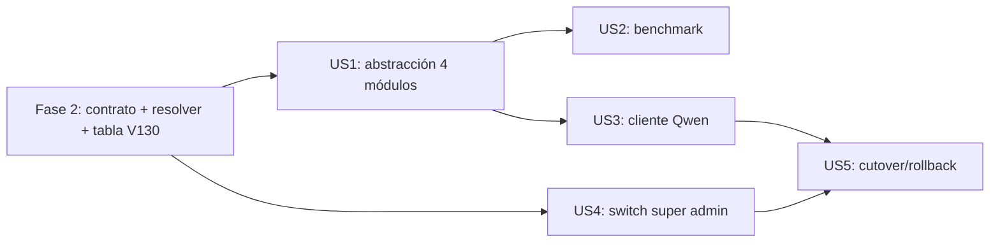

# Tasks: Migración Gemini → Qwen

**Spec**: [spec.md](spec.md) | **Plan**: [plan.md](plan.md) | **Date**: 2026-08-11

> **Clarificaciones resueltas (2026-08-11)**: Q1 → umbral ≥ 90% + revisión manual (montos/criterios primero). Q2 → migran los 4 usos, sin Google a futuro. Q3 → URL entregada por el equipo (placeholder dev hasta entonces). Nuevo alcance: switch super admin gcloud/qwen (US4).
>
> **Estado del MVP (Fase 1-3)**: implementado y verificado por compilación + tests unitarios (12/12 GeminiService, 28/28 Shared, 18/18 Core, 12/12 CompetidorGemini, 10/10 ConsultaSemantica). T023 pendiente de entorno: requiere DB local en `localhost:5433` (el contenedor local expone 5432) y validación manual con UI.

## Fase 1 — Setup

- [X] T001 Crear rama `033-migracion-qwen-g4` desde `dev`
- [X] T002 [P] Verificar con `docker compose up -d` que el stack local de referencia sigue funcionando antes de tocar código (baseline) — stack `cu01v2-*` corriendo (api/web healthy; db en puerto 5432, no 5433)
- [X] T003 [P] Documentar las variables `AI:Provider`, `AI:Endpoint`, `AI:Model`, `AI:ApiKey` y la precedencia BD > env > default en `docs/infraestructura-cu010-v6.md` (borrador, se completa en US5)

## Fase 2 — Fundacional: contrato ILlmClient, resolver y configuración persistida

- [X] T004 Crear `LlmModels.cs` en `src/MPM.Shared/Services/` con `LlmRequest`, `LlmPart`/`LlmTextPart`/`LlmPdfPart`, `LlmResult`, `LlmUsage` (contrato en `contracts/llm-client.md`)
- [X] T005 Crear `ILlmClient` en `src/MPM.Shared/Services/ILlmClient.cs` con `ModelName` y `GenerarContenidoAsync(LlmRequest, CancellationToken)`
- [X] T006 Adaptar `src/MPM.Shared/Services/VertexGeminiClient.cs` para implementar `ILlmClient` (traducción `LlmRequest` → body Gemini `contents[]`/`fileData`/`inlineData`; mantener `DefaultMaxOutputTokens` y `GeminiRespuestaBloqueadaException` intactos)
- [X] T007 Crear migración `src/MPM.Api/Database/Scripts/V130__Add_System_AI_Provider.sql` (tabla `system_ai_provider` con `provider`, `endpoint`, `model`, `updated_by_user_id`, `updated_by_username`, `updated_at`, `record_status`; unique parcial sobre fila activa — ver `data-model.md`)
- [X] T008 Crear SPs `usp_SystemConfig_ObtenerAiProvider` y `usp_SystemConfig_ActualizarAiProvider` (UPSERT atómico con auditoría) en la migración V130 (constitución II)
- [X] T009 Crear `src/MPM.Core/Data/SystemConfigData.cs` (Dapper + `DbConnectionFactory`, `MatchNamesWithUnderscores`) para ejecutar los SPs de T008
- [X] T010 Crear `src/MPM.Core/SystemConfig/AiProviderSettings.cs` y `SystemConfigService.cs`: resolución con precedencia BD > env > default, cache en memoria TTL 30s + invalidación explícita, y `AiProviderInfo` para el GET (incluye `resolvedFrom`)
- [X] T011 Crear `src/MPM.Core/SystemConfig/LlmClientResolver.cs`: consulta `SystemConfigService` (proveedor activo + endpoint + modelo) y devuelve el `ILlmClient` registrado por key (`gemini`/`openai`); proveedor desconocido → excepción clara
- [X] T012 Registrar en `src/MPM.Api/Program.cs`: clientes por key (`gemini` → `VertexGeminiClient`), `LlmClientResolver` scoped, `SystemConfigService`/`SystemConfigData`, `AddMemoryCache` (servicio web + worker)
- [X] T013 [P] Crear unit tests en `tests/MPM.Core.Tests/SystemConfig/` para el resolver y `SystemConfigService` (precedencia BD/env/default, fallback BD caída, TTL, invalidación, proveedor no registrado)
- [X] T014 [P] Crear tests del contrato `LlmRequest` → body Gemini en `tests/MPM.Shared.Tests/Services/LlmClientContractTests.cs` (JSON mode, fileData/inlineData, roles)
- [X] T015 Correr `dotnet build` + `dotnet test` → suite de servicios 100% verde (gate de fundacional; con `DOTNET_ROLL_FORWARD=Major` por SDK 9 en la máquina)

## Fase 3 — US1: abstracción aplicada a los 4 usos (P1)

- [X] T016 [US1] Refactorizar `src/MPM.Modules.Analisis/Services/GeminiService.cs` para inyectar `LlmClientResolver` en vez de `VertexGeminiClient` (traducción del prompt actual a `LlmRequest`; `ModelName` ahora viene del cliente resuelto; expone `GetModelNameAsync` y `GeminiResponse.ModelName`)
- [X] T017 [US1] Refactorizar `src/MPM.Modules.Analisis/Services/AnalisisService.cs` y `AnalisisBackgroundService.cs` para resolver el cliente por request (persistencia de `modelo_usado` desde el modelo real)
- [X] T018 [P] [US1] Refactorizar `src/MPM.Modules.Competidores/Services/CompetidorGeminiService.cs` y `CompetidorAnalysisService.cs` a `LlmClientResolver`
- [X] T019 [P] [US1] Refactorizar `src/MPM.Modules.Licitaciones/Services/ConsultaSemanticaService.cs` para eliminar el HTTP crudo a Vertex y usar el resolver (mismo prompt/parseo)
- [X] T020 [P] [US1] Refactorizar `src/MPM.Modules.Alertas/Services/SinonimosIaService.cs` para eliminar el HTTP crudo a Vertex y usar el resolver
- [X] T021 [US1] Actualizar unit tests de `tests/MPM.Modules.Analisis.Tests/`, `tests/MPM.Modules.Competidores.Tests/` y `tests/MPM.Modules.Licitaciones.Tests/` al resolver mockeado (12/12, 12/12 y 10/10 de los tests de servicio respectivos)
- [X] T022 [US1] Agregar test de integración en `tests/MPM.Tests/Integration/LlmProviderIntegrationTests.cs` (wiring completo: tabla vacía + env gemini → cliente gemini; switch en BD → error claro si el proveedor no está registrado)
- [ ] T023 [US1] Ejecutar quickstart Escenario 1 (regresión completa) y Escenario 2 (resolución por env) → verificar `modelo_usado` = `gemini-2.5-pro` — **pendiente de entorno**: requiere DB local en `localhost:5433` y validación manual con UI (el contenedor local expone 5432)

**Criterio de US1**: suite completa verde, cero cambios de comportamiento con Gemini, resolución dinámica por configuración funcional. — ✅ verificado por tests unitarios; validación manual con DB/UI pendiente (T023).

## Fase 4 — US2: benchmark de calidad (P1)

- [X] T024 [US2] Crear proyecto consola `tools/BenchmarkLlm/BenchmarkLlm.csproj` (net8.0, referencia MPM.Shared) que: lea lista de documentos (ruta local o GCS), corra el prompt de análisis contra dos proveedores vía el resolver, normalice y compare JSON campo a campo (fechas, montos, criterios, puntuaciones), mida latencia p50/p95, tasa de JSON válido y de truncamiento
- [X] T025 [US2] Implementar emisión del informe markdown (paridad por campo ordenada por criticidad, tabla comparativa, veredicto contra umbral ≥ 90% y lista de discrepancias para revisión manual) en `tools/BenchmarkLlm/`
- [X] T026 [US2] Documentar en `tools/BenchmarkLlm/README.md` el uso, prerrequisitos (servidor Qwen, documentos fuera del repo) y criterio de muestra (≥ 10 documentos, incluir PDF escaneado y multi-documento)
- [ ] T027 [US2] Ejecutar el benchmark con Gemini vs Qwen 3.7 G4 (endpoint de staging/URL entregada) y archivar el informe como evidencia (path de referencia en docs; sin documentos reales en el repo)

**Criterio de US2**: informe reproducible con paridad campo a campo y veredicto go/no-go contra el 90%.

## Fase 5 — US3: cliente OpenAI-compatible y análisis con Qwen (P2, depende de US1 + URL del equipo)

- [X] T028 [US3] Crear `src/MPM.Shared/Services/OpenAiCompatClient.cs` implementando `ILlmClient` (POST `{endpoint}/chat/completions`, `Authorization: Bearer AI:ApiKey` opcional, traducción `LlmRequest` → `messages[]` con PDF base64 data URI, `response_format: json_object`, `max_tokens` desde `LlmRequest.MaxOutputTokens`, parseo `choices[0].message.content` + `finish_reason`/`usage`; errores tipados con la misma semántica de hoy)
- [X] T029 [US3] Registrar `OpenAiCompatClient` por key `openai` y unit tests en `tests/MPM.Shared.Tests/` (request/response mapeados con `HttpMessageHandler` fake, incl. timeout y body anómalo)
- [ ] T030 [US3] Validar humo del servidor Qwen real (URL entregada o placeholder dev) contra `contracts/openai-compat-api.md`; ajustar el contrato si el servidor difiere (formato PDF/JSON mode) y documentarlo
- [ ] T031 [US3] Ejecutar quickstart Escenario 5: análisis completo de licitación nueva con Qwen (`modelo_usado=qwen3.7-g4`), incluyendo caso PDF escaneado y caso fallo/recuperación del servidor
- [ ] T032 [US3] Correr E2E Playwright (`cd src/mpm-web && npm run test:e2e`) para confirmar que el frontend existente no cambió

**Criterio de US3**: análisis con Qwen persiste JSON válido, UI sin cambios, errores con contrato de hoy.

## Fase 6 — US4: switch del super admin en la UI (P2, depende de Fase 2 + US1)

- [X] T033 [US4] Crear `src/MPM.Api/Controllers/SystemConfigController.cs` con `GET /api/system/ai-provider` y `PUT /api/system/ai-provider` (validaciones del contrato `contracts/ai-provider-admin-api.md`; errores `INVALID_PROVIDER`/`INVALID_ENDPOINT`/`INVALID_MODEL`; `updated_by_*` desde `TenantContext`)
- [X] T034 [US4] Aplicar policy de rol `SuperAdmin` al `SystemConfigController` (autorización por rol JWT, FR-016)
- [X] T035 [US4] Crear tipos y hook en `src/mpm-web/src/types/systemConfig.ts` + `src/mpm-web/src/hooks/useSystemConfig.ts` (useQuery GET + useMutation PUT con invalidación)
- [X] T036 [US4] Crear `src/mpm-web/src/pages/AdminConfiguracionIaPage.tsx`: estado actual (provider, modelo, endpoint, `resolvedFrom`, último cambio), switch antd gcloud/qwen, `Modal.confirm` antes de cambiar, feedback de error
- [X] T037 [US4] Agregar ruta `/admin/ia` en `src/mpm-web/src/App.tsx` y item de menú en `src/mpm-web/src/components/AppLayout.tsx` visible solo con rol SuperAdmin (patrón `isAdmin` de NotificacionesPage)
- [X] T038 [US4] Tests de integración en `tests/MPM.Tests/`: GET/PUT del endpoint con rol SuperAdmin (200 + persistencia + auditoría) y sin rol (403)
- [X] T039 [US4] E2E en `src/mpm-web/e2e/` (spec nueva): login admin → cambiar switch a qwen → verificar estado → login usuario normal → 403/oculto
- [ ] T040 [US4] Ejecutar quickstart Escenario 4 completo (alternancia gcloud/qwen sin reinicio, persistencia entre reinicios, auditoría)

**Criterio de US4**: switch solo SuperAdmin, efecto < 1 min sin reinicio, persistente y auditado.

## Fase 7 — US5: cutover a Qwen y rollback garantizado (P2, depende de US2 + US3 + US4)

- [X] T041 [US5] Escribir runbook en `docs/infraestructura-cu010-v6.md`: cutover vía switch (confirmar URL/modelo, verificación post-cambio) y rollback vía switch o fallback por entorno (`AI:Provider=gemini` + reinicio) con objetivo < 30 min
- [ ] T042 [US5] Ejecutar en staging el drill completo: cutover a Qwen → validación 1 día → rollback a gcloud → medir tiempos y ajustar runbook
- [X] T043 [US5] Actualizar la doc de infraestructura: política "sin Google a futuro" (Qwen principal, Gemini como opción gcloud del switch y rollback), variables de entorno, tabla nueva, diagramas si aplica
- [X] T044 [US5] Actualizar `specs/ROADMAP.md` y `CHANGELOG.md` con el resultado de la migración

**Criterio de US5**: cutover por switch, rollback < 30 min probado en staging, documentación al día.

## Fase 8 — Polish y cierre

- [X] T045 Logging del proveedor activo, modelo y `resolvedFrom` en el arranque y en cada análisis (diagnóstico rápido)
- [ ] T046 [P] Auditar `modelo_usado` en BD: históricos conservan `gemini-2.5-pro`, nuevos registran el modelo correcto
- [X] T047 [P] Verificar que no quedan referencias a `VertexGeminiClient` fuera de MPM.Shared (grep en `src/`) ni HTTP crudo duplicado a `aiplatform.googleapis.com` en módulos
- [ ] T048 Correr suite completa (`dotnet test` + E2E) y cerrar `spec.md` (status: Implemented) + actualizar `checklists/requirements.md`

## Dependencias

## Ejecución paralela

- **Fase 2**: T004–T006 y T007–T008 secuenciales (contrato y BD respectivamente); T009–T011 dependientes de esos; T013/T014 paralelos; T015 al final.
- **US1**: T016–T017 (Análisis) en paralelo con T018 (Competidores), T019 (Licitaciones), T020 (Alertas) — archivos disjuntos; T021–T023 después.
- **US2**: T024–T026 paralelos a US1; T027 depende del servidor Qwen.
- **US3**: T028–T029 en paralelo con US2; T030–T032 después (requieren URL del equipo).
- **US4**: T033–T034 (backend) en paralelo con T035 (frontend hooks); T036–T037 después; T038–T040 al final.
- **US5**: T041 → T042 → T043–T044.

## Estrategia de entrega (MVP)

1. **MVP = US1**: con Fase 2 + US1 el sistema ya resuelve el proveedor por configuración (Gemini como único implementado). Valor inmediato, desbloquea todo.
2. **Incremento 2 = US2 + US3**: benchmark (decisión con datos) + cliente Qwen (capacidad).
3. **Incremento 3 = US4**: switch super admin (control operativo de la mudanza a infra privada).
4. **Incremento 4 = US5**: producción sin Google, con rollback garantizado.

## Validación de formato

- [x] Todos los tasks con checkbox + ID + descripción + file path
- [x] Labels [USx] solo en fases de user story
- [x] Tasks de setup/foundational sin label de story
- [x] Fases por prioridad de spec (P1 → P2)
