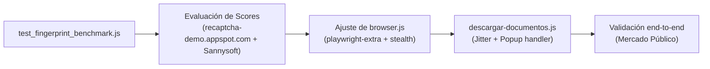

# Implementation Plan: Medición de Scoring reCAPTCHA y Hardening de Descarga de Archivos

**Feature**: [spec.md](./spec.md) | **Branch**: `034-medicion-recaptcha-hardening-descargas`

## Arquitectura y Enfoque Técnico

El objetivo es superar el challenge invisible de **Google reCAPTCHA Enterprise en `ViewAttachment.aspx`** dentro del contenedor de Cloud Run mediante técnicas de browser hardening, elevando el score de confianza del navegador a $\ge 0.7$ sin recurrir a proxies.

## Cambios de Código

1. **`tools/scraper-mp-v2/package.json`**:
   - `playwright-extra`: Wrapper extensible de Playwright.
   - `puppeteer-extra-plugin-stealth`: Plugins de evasión de fingerprint.

2. **`tools/scraper-mp-v2/modulos/browser.js`**:
   - Inicializar `chromium` desde `playwright-extra` con `stealthPlugin()`.
   - Limpieza de flags `--disable-blink-features=AutomationControlled`.
   - Soporte para argumentos de spoofing de WebGL y viewport consistente.

3. **`tools/scraper-mp-v2/descargar-documentos.js` y `modulos/adjuntos.js`**:
   - Incorporar movimiento de cursor suave antes del click de `#imgAdjuntos`.
   - Corregir el fallback de popup para no abrir `newPage()` huérfano sin `window.opener`.

4. **`tools/scraper-mp-v2/test_fingerprint_benchmark.js`**:
   - Script para testear en paralelo y comparar scores numéricos.
